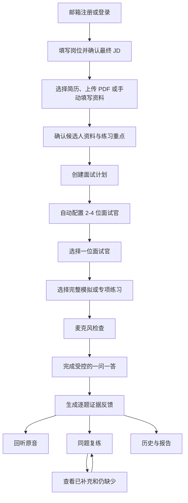

# SpeakUp MS1 产品决策与真实交付说明

> 文档日期：2026-07-16  
> 产品范围基线：以 2026-07-14 更新的《SpeakUp MS1 面试主链路图文 PRD》为准  
> 用途：MS1 路演、验收、产品与架构对齐、后续 Issue 拆分  
> 核心问题：方向和主干成立吗？

## 0. 执行摘要

SpeakUp 是面向外企、出海公司、海外岗位和国际化团队技术候选人的 AI 英文面试陪练产品。

目标用户通常已经能够阅读英文资料，也具备基本英语表达能力，但在真实英文面试里容易出现四类问题：

1. 无法快速把真实项目经历组织成结构化回答；
2. 面对追问时卡词、重复、偏题或缺少关键证据；
3. 通用口语产品偏发音、课程或自由聊天，无法稳定承担技术面试官职责；
4. 练习结束后只得到分数或泛泛建议，不知道下一次应该具体补什么。

SpeakUp 不把“能和 AI 说话”作为核心价值，而是构建以下闭环：

```text
岗位与候选人资料
  -> 自动配置差异化面试官
  -> 受控的一问一答英文面试
  -> 基于用户原话的逐题证据反馈
  -> 原音回听
  -> 同题重复复练
  -> 前后版本对比与完整历史
```

MS1 的产品判断是：

- 选择“外企英文面试陪练”，不做泛英语口语平台；
- 做“教练”，不做没有目标约束的聊天搭子；
- 以岗位、JD、候选人资料和面试官职责约束问题，而不是开放式随机出题；
- 以证据反馈和同题复练为核心，不以裸总分为核心；
- 以最新 PRD 定义的注册、资料、计划、面试、反馈、复练、历史和数据删除为 MS1 真实产品范围；
- 实时连续通话、逐词发音评分、角色练习、会员支付和社交体系不属于 MS1 真实验收。

## 1. Proposal 五个问题

### 1.1 用户是谁？

首期目标用户是准备以下岗位或组织环境的技术相关候选人：

- 外企技术岗位；
- 中国企业出海业务团队；
- 海外岗位；
- 使用英语协作的国际化团队。

优先覆盖：

- 计算机相关专业学生和应届生；
- 0 至 5 年经验的程序员、测试、产品和技术运营人员；
- 能阅读英文文档、能做基础表达，但缺少英文面试实战训练的人；
- 有明确面试、跳槽、海外求职或国际化岗位目标的人。

首期不面向：

- 完全零基础英语学习者；
- 以日常闲聊为主要目标的泛口语用户；
- 只追求考试分数的用户；
- 儿童英语用户；
- 高级商务谈判或专业翻译用户。

### 1.2 问题是什么？

用户的问题不是简单的“英语不好”，而是无法在英文面试的时间压力和追问压力下，把自己真实做过的事情讲清楚。

典型表现包括：

- 能看懂英文技术文档，但难以口头解释项目背景、个人职责和技术取舍；
- 预先背过自我介绍，但问题稍有变化就无法自然组织；
- 回答里只有结论，没有行动、判断依据、协作过程或结果证据；
- 面对追问时容易重复上一轮内容，或编造未经准备的细节；
- 不知道问题主要来自英语表达、内容结构还是面试思路；
- 练习之后得到一个分数，却不知道下一轮应该补充哪段证据。

### 1.3 为什么值得做？

这个方向值得做，不是因为“所有人都要学英语”，而是因为它同时满足以下条件：

1. **用户任务明确**：用户要完成的是具体面试，而不是长期、泛化地“提升英语”；
2. **失败代价明确**：表达失败可能直接影响面试结果、求职和职业机会；
3. **练习可以重复**：同一个项目经历、行为问题和技术方案可以多次练习；
4. **结果可以验收**：可以检查用户是否补全了背景、行动、判断依据和结果证据；
5. **适合 AI 承担高频供给**：AI 可以低成本提供多次模拟、追问、转录、反馈和复练；
6. **两个月可以形成闭环**：不需要先建设完整课程体系，也不需要覆盖所有英语学习场景。

### 1.4 怎么做？

产品采用“准备上下文、受控面试、证据反馈、同题复练”的方式。

#### 准备上下文

用户输入目标岗位和 JD，并选择已有简历、上传 PDF 简历或手动填写候选人资料。系统保存最终 JD、候选人资料和练习重点快照，避免后续修改覆盖历史面试。

#### 配置面试官

系统根据岗位、JD、候选人资料和练习重点，自动配置 2 至 4 位职责和关注点不同的面试官。多面试官表示多场相互独立的面试，不表示多人同时在线。

#### 受控面试

首期默认采用一问一答模式。系统先保存问题，再播放问题；用户提交有效回答后，系统根据目标覆盖、剩余时间和问题上限决定追问、换题或结束。

#### 证据反馈

每个有效回答都生成一张复盘卡，引用用户原话，说明证据完整或缺失，并给出下一次改进目标。系统不为了凑条数制造不存在的问题，也不把反馈包装成录用判断。

#### 同题复练

用户可以针对任意回答重新回答同一问题。新回答只检查原反馈指出的缺口，并保留原回答和全部历史版本，不覆盖旧数据。

### 1.5 怎么验收？

MS1 用七组端到端场景验收：

1. 注册、登录、简历解析和候选人资料；
2. 自动配置多位独立面试官；
3. 动态问题生成、时长和问题数量控制；
4. 逐题证据反馈与原音回听；
5. 同题重复复练和版本保留；
6. 简历解析、回答连接和报告生成失败后的恢复；
7. 用户数据权限、退出登录和账号注销。

## 2. 数据证据与口径

### 2.1 证据分级

本文将数据分成四级，避免把不同可信度的数据混在一起：

| 等级 | 定义 | 本文用法 |
|---|---|---|
| A | 官方统计、官方财报、App Store 原始页面或仓库原始明细 | 可作为核心事实 |
| B | 有明确采样方法的团队调研和可追溯公开内容 | 可支持用户问题与方向判断 |
| C | 权威媒体或研究机构的二次引用 | 作为市场背景和商业参照 |
| D | 品牌自报、单一二手来源或团队推断 | 必须标注，不能直接推算市场规模 |

### 2.2 社媒需求样本：用户确实在具体任务里卡住

团队在 2026-07-08 对小红书、知乎、B 站和豆瓣进行了公开社媒调研，每个平台采集 20 条，共 80 条样本。该调研未执行用户访谈，因此只能代表公开讨论信号，不能直接代表全体市场人群。

| 场景 | 样本数 | 占 80 条样本比例 | 产品含义 |
|---|---:|---:|---|
| 日常与自由表达 | 30 | 37.5% | 泛口语需求最大，但范围宽、差异化困难 |
| 职场、面试与客户沟通 | 22 | 27.5% | 任务明确、结果压力高，适合进一步聚焦 |
| 留学与海外生活 | 11 | 13.8% | 真实语速、开口焦虑和服务沟通明显 |
| App 使用、反馈与付费 | 10 | 12.5% | 信任、反馈和付费透明度影响采用 |
| 考试与备考 | 7 | 8.8% | 可解释反馈重要，但赛道竞争成熟 |

80 条样本中的 Top10 未满足需求显示：

| 排名 | 未满足需求 | 样本数 | 对 SpeakUp 的启示 |
|---:|---|---:|---|
| 1 | 在低压力环境中建立开口信心 | 13 | AI 面试需要允许重复练习和失败恢复 |
| 2 | 自然、地道且适合情境的表达 | 11 | 反馈要结合面试语境，而不是只判语法 |
| 3 | 适应真实语速、连读和口音 | 10 | 后续语音链路需要真实样本验证 |
| 4 | 在几秒内组织回复，减少卡词 | 8 | 产品必须训练即时组织，而不是背答案 |
| 5 | 稳定、可持续的练习机会 | 8 | AI 适合承担高频、低成本供给 |
| 6 | 可信、可解释并能指导复练的反馈 | 8 | 必须引用原话并给出下一次行动 |
| 7 | 与真实任务一致的场景 | 6 | 选择英文面试而不是泛闲聊 |

该调研最重要的结论不是“面试样本最多”，而是：用户需要在明确任务中完成即时表达，并获得可信反馈与复练路径。职场、面试与客户沟通是适合继续收窄的高价值任务集合。

### 2.3 高压场景专项：不支持把“冲突英语”作为独立主方向

团队另收集了 61 条高压或冲突英语窄口径候选：

- 29 条达到第一人称真实经历或具体练习需求的 A/B 级，占 47.5%；
- 0 条达到“明确评价现有 App 不真实、不会追问或太温和”的 C 级；
- 32 条为教学、营销、二手讨论或问题过宽的 D 级，占 52.5%。

这证明高压沟通场景存在，但没有直接证据证明市场需要一个独立的“冲突英语 App”。因此高压沟通只适合作为面试、职场或海外生活中的难度层，不适合作为当前主产品方向。

### 2.4 低星评论：用户不缺 AI 对话入口，缺稳定、可信、可复练的产品

仓库保存了 12 款国内外语言学习产品的 App Store 低星评论明细。为避免旧摘要和原始文件口径不一致，本文重新按 CSV 计算：

- 唯一低星评论：1,809 条；
- 评分范围：1 至 3 星；
- 标签分配：2,395 次；
- 覆盖产品：12 款；
- 每条评论可以拥有多个标签，因此各标签比例不能相加为 100%。

唯一评论的评分分布：

| 评分 | 评论数 | 占比 |
|---:|---:|---:|
| 1 星 | 1,055 | 58.3% |
| 2 星 | 336 | 18.6% |
| 3 星 | 418 | 23.1% |

高频问题如下：

| 排名 | 标签 | 出现次数 | 占 1,809 条唯一评论比例 | SpeakUp 对策 |
|---:|---|---:|---:|---|
| 1 | 应用稳定性与技术问题 | 537 | 29.7% | 保存已完成 Turn，支持断线和报告失败恢复 |
| 2 | 订阅扣费不透明与强制付费 | 384 | 21.2% | MS1 不展示未实现的会员、订单和支付入口 |
| 3 | 免费试用与功能限制太多 | 306 | 16.9% | 后续试用规则必须透明，MS1 不做商业化承诺 |
| 4 | 学习内容与体系质量差 | 216 | 11.9% | 用岗位、JD、候选人资料和面试官职责约束内容 |
| 5 | 发音识别准确率低 | 189 | 10.4% | MS1 不做音素级评分，后续用真实技术词样本验证 ASR |
| 6 | 教学方式缺乏系统性 | 171 | 9.5% | 用计划、Session、反馈和复练组成明确闭环 |
| 7 | 客户服务响应差 | 168 | 9.3% | 为解析、连接、报告失败提供明确恢复入口 |
| 8 | 评分与反馈机制不合理 | 136 | 7.5% | 不以裸分数为核心，反馈必须绑定原话证据 |
| 9 | AI 对话内容机械不灵活 | 102 | 5.6% | 后续问题引用前文事实，控制器按目标覆盖决定追问 |
| 10 | 隐私骚扰与过度营销 | 87 | 4.8% | 受保护音频、权限隔离和全量账号删除进入真实范围 |

数据说明：仓库旧版 Top10 摘要写有“2,061 条评论”，但当前可审计的标签明细 CSV 只能还原出 1,809 个唯一 `review_id` 和 2,395 次标签分配。本文采用原始 CSV 可复算口径，不使用无法对齐的 2,061 口径。

### 2.5 竞品：市场已经验证 AI 口语，但尚未解决我们的完整闭环

团队调研覆盖 12 款产品：

| 产品类型 | 代表产品 | 已验证能力 | 对 SpeakUp 的启示 |
|---|---|---|---|
| 课程与游戏化 | 流利说、多邻国、可栗口语 | 课程、打卡、闯关、订阅可以建立长期路径 | MS1 不复制完整课程和游戏化体系 |
| 发音与语音评分 | ELSA Speak、扇贝口语 | 用户愿意为即时语音反馈付费 | 评分必须准确、可解释，首期不做音素级评分 |
| AI 自由对话 | Speak、Talkpal、Hi Echo | 低压力、高频开口具有真实需求 | 只做自由聊天难形成差异化 |
| 虚拟导师和沉浸角色 | Praktika、Hi Echo | 拟人感和视觉表现能增强首次体验 | MS1 不把数字人作为核心价值 |
| AI Roleplay | Duolingo Max、ELSA Role-play | 场景对话可以嵌入成熟学习路径 | SpeakUp 必须比泛 Roleplay 更懂岗位和候选人经历 |

SpeakUp 与这些产品的主要区别不是“也支持语音对话”，而是把以下五个对象绑定在同一训练闭环里：

```text
岗位/JD
× 候选人资料
× 面试官职责
× 实际问答证据
× 同题复练版本
```

### 2.6 商业和价格参照：只证明用户会为口语训练付费，不用于推算面试细分市场规模

#### 可追溯订阅参照

| 产品 | 公开价格参照 | 来源等级 | 说明 |
|---|---:|---|---|
| 咕噜口语 | ¥328 至 ¥368/年 | A，App Store | 中国 AI 口语直接竞品 |
| 可栗口语 | ¥298 至 ¥358/年 | A，App Store | 中国 AI 口语直接竞品 |
| Duolingo Super | ¥588 至 ¥738/年 | A，App Store | 泛语言学习参照 |
| Duolingo Max | 约 ¥1,200/年 | A/B，官方材料换算 | 高阶 AI 功能订阅层 |
| Speak | 约 ¥103/月、¥688/年 | C，TechCrunch 美元价格换算 | 海外 AI 口语代表 |
| Hi Echo | 约 ¥498 至 ¥698/年 | C，媒体二次来源 | AI 虚拟人口语参照 |

这些价格说明用户已经会为 AI 口语、发音反馈和 AI Roleplay 付费，但不能直接证明用户会以相同价格购买英文面试陪练。MS1 不设计定价，也不把商业化流程作为验收项。

#### 赛道商业验证

TechCrunch 在 2024-12-10 报道，Speak 完成 7,800 万美元 C 轮融资，投后估值 10 亿美元。这只能证明投资市场认可“通过 AI 让用户高频开口”的商业潜力，不能直接推导 SpeakUp 的用户规模或收入。

Duolingo 官方 Q1 2026 股东信披露：

- DAU 5,650 万；
- MAU 1.378 亿；
- 付费订阅用户 1,250 万；
- 季度营收 2.92 亿美元。

这些数据证明语言学习 App 可以形成大规模使用和订阅，但 Duolingo 是综合语言平台，不能作为 SpeakUp 英文面试细分市场的直接 TAM。

### 2.7 本轮不使用哪些市场数字

仓库市场摘录中还有“AI 口语陪练行业 190.2 亿元”“成人英语培训 1,200 亿元以上”等数据。由于这些数字来自单一报告或媒体二次引用，且口径可能包含硬件、线下培训或泛成人英语，本文不使用它们推算 SpeakUp 市场规模。

当前更准确的表达是：

> AI 口语和语言学习已经被用户规模、订阅价格、头部产品融资和竞品数量验证；但“面向中国技术候选人的英文面试陪练”仍缺少直接、权威的细分市场规模数据，需要在 MS2 通过访谈、问卷和真实试用进一步验证。

## 3. 产品方向取舍

### 3.1 候选方案

早期讨论过四个方向：

1. 泛英语口语陪练；
2. 高压场景口语模拟；
3. 沉浸式外语环境模拟；
4. 外企英文面试陪练。

### 3.2 选择矩阵

| 方向 | 用户任务清晰度 | 使用频率 | 结果压力 | 差异化空间 | 两个月闭环 | 当前结论 |
|---|---|---|---|---|---|---|
| 泛英语口语陪练 | 低 | 高 | 低至中 | 低，竞品成熟 | 边界难收 | 不作为主方向 |
| 高压场景口语模拟 | 中 | 低 | 高 | 中，展示性强 | 可做特色模块 | 不独立成产品 |
| 沉浸式外语环境 | 中 | 中 | 中 | 中至高 | 内容和视觉成本高 | 暂不作为主线 |
| 外企英文面试陪练 | 高 | 面试期高频 | 高 | 高，可结合岗位与经历 | 可以形成闭环 | 选择为主方向 |

### 3.3 为什么选外企英文面试陪练

1. 用户有明确的开始条件：即将面试、跳槽或准备国际化岗位；
2. 用户有明确的训练素材：岗位、JD、简历和真实项目；
3. 用户有明确的训练对象：自我介绍、行为题、项目经历和岗位能力；
4. 用户有明确的结果压力：能否在面试里把能力讲清楚；
5. 产品可以形成可重复闭环：问答、反馈、重答、对比；
6. 团队可以在两个月内完成一个聚焦 MVP，而不是建设完整英语学习平台。

### 3.4 放弃其他方向的理由

#### 不做泛英语口语平台

- 用户范围过宽，问题从零基础、发音、词汇到日常交流彼此不同；
- Speak、Talkpal、Praktika、Hi Echo 等已经提供自由 AI 对话；
- 两个月内难以在内容规模、语言覆盖和课程体系上形成优势。

#### 不把高压英语作为独立方向

- 61 条专项候选只证明场景存在，没有找到直接产品缺口证据；
- 场景低频，长期订阅理由弱；
- 更适合作为面试、职场沟通或海外生活中的难度层。

#### 不做沉浸式大世界

- 首次展示效果好，但内容生产和视觉开发成本高；
- 容易把学习价值让位于画面和概念；
- 当前阶段更需要验证问题生成、证据反馈和复练，而不是环境探索。

## 4. 核心产品决策

### 决策 1：做教练，不做聊天搭子

通用 AI 已经能陪用户聊天。SpeakUp 的差异不在于对话入口，而在于：

- 面试前锁定岗位、JD 和候选人资料；
- 面试中维持面试官职责和目标覆盖；
- 面试后逐题引用证据；
- 反馈后立即进入同题复练。

### 决策 2：问题来自“岗位要求 × 候选人经历”

系统优先从 JD 要求和候选人经历的交集生成问题。后续问题可以引用用户已经说出的项目、任务、方案和结果，但不能发明用户没有提供的客户、数据、职级或决策。

### 决策 3：控制器决定追问，生成器只负责问题文本

控制器负责：

- 当前目标是否已经覆盖；
- 剩余时间是否允许继续；
- 当前主问题是否已经追问；
- 应该追问、换目标还是结束。

问题生成器负责根据选定目标生成具体英文问题。这样可以避免模型为了延长对话无限追问。

### 决策 4：一问一答是 MS1 主流程

MS1 默认流程：

```text
AI 播放问题
  -> 用户回答
  -> 保存音频与转录
  -> 判断回答有效性
  -> 更新目标覆盖
  -> 生成下一问
```

实时连续通话只保留入口，不属于当前验收。原因是自然打断、说话权切换、半双工/全双工状态和异常恢复尚未完成产品确认。

### 决策 5：反馈必须绑定证据

每个有效 Turn 必须生成反馈卡，并包含：

1. AI 原问题；
2. 用户完整转录；
3. 原音回听入口；
4. 证据完整或需要补全状态；
5. 用户原话证据；
6. 对贡献、方案、判断依据、验证或结果的诊断；
7. 下一次改进目标；
8. 同题复练入口。

反馈不能：

- 冒充技术正确性判断；
- 冒充录用结论；
- 为了凑条数制造不存在的问题；
- 在优化表达中编造用户没有提供的项目事实、指标或成果；
- 用一个裸总分代替可执行反馈。

### 决策 6：同题复练不覆盖历史

每次复练创建新的回答版本，保留独立音频、转录和时间。新版本只检查原反馈缺口，展示“已补充”和“仍缺少”，不重新生成无关总评。

### 决策 7：历史使用不可变快照

面试计划保存最终 JD、候选人资料、练习重点和示例模式快照。后续修改或删除简历，不改变历史计划、面试和报告使用的内容。

### 决策 8：隐私和删除进入真实范围

简历、音频、转录、报告和复练属于个人敏感学习数据。MS1 必须满足：

- 用户 A 不能读取用户 B 的数据；
- 退出后受保护地址不可继续访问；
- 音频不生成永久公开链接；
- 注销账号前二次确认；
- 注销成功后账号、简历、计划、场次、音频、转录、反馈和复练记录均不可访问；
- 删除失败时不能先显示注销成功。

## 5. MS1 真实交付范围

以下范围以最新 PRD 为准。

### 5.1 注册与账户

- 邮箱和密码注册；
- 邮箱和密码登录；
- 退出登录；
- 注销账号；
- 当前登录邮箱展示；
- 用户数据权限隔离。

### 5.2 简历与候选人资料

- 每个用户最多保存 3 份 PDF 简历；
- 单文件小于 10 MB；
- 保存原文件和解析状态；
- 解析整份简历，形成教育、工作/实习、项目和技能等候选人资料；
- 解析失败可以重试，也可以手动填写；
- 无简历用户可以直接手动填写资料；
- 用户无需先选择一条具体经历，整份候选人资料进入面试上下文；
- 创建计划时保存候选人资料快照；
- 删除简历不改写历史计划。

### 5.3 创建面试计划

- 填写岗位名称；
- 填写或确认最终 JD；
- 选择已有简历、上传新简历或手动填写资料；
- 确认候选人资料；
- 选择练习重点；
- 岗位、JD、候选人资料和练习重点允许使用明确示例默认值进入体验；
- 创建后保存不可变快照。

### 5.4 面试官配置

- 系统自动配置 2 至 4 位差异化面试官；
- 每位面试官包含虚拟姓名、职位、职责、风格、关注点和默认音色；
- 每位面试官生成完整模拟和 2 至 5 个专项练习入口；
- 首次练习开始前允许编辑、添加、删除和排序；
- 任一练习开始后锁定该次配置；
- 更换音色只影响后续播放，不修改历史音频和 Session 快照。

### 5.5 独立面试 Session

- 每个 Session 只有一位面试官；
- 同一面试官可以创建多场 Session；
- 不同面试官和不同 Session 的进度、转录、报告和复练相互独立；
- 完整模拟和专项练习都可以重复创建新 Session；
- 新场次不覆盖旧记录；
- 进行中场次可以恢复；
- 完成或提前结束后可以查看报告或再练一场。

### 5.6 一问一答语音面试

- 开始前申请麦克风权限；
- 显示输入音量并完成一次不保存的短试音；
- 权限拒绝、无输入设备或无有效声音时不能进入面试，并提供修复入口；
- AI 使用英文提问，用户使用英文回答；
- 页面状态、异常和诊断使用中文；
- 问题文本先保存再播放；
- 每次只提出一个主问题；
- 用户回答保存后再生成下一问；
- 未完成音频不创建有效 Turn；
- 用户可以提前结束，保留已完成 Turn，并生成阶段性报告。

练习控制：

| 练习类型 | 默认时长 | 主问题上限 | 每个主问题追问上限 |
|---|---:|---:|---:|
| 完整模拟 | 约 15 分钟 | 最多 6 个 | 最多 1 个 |
| 专项练习 | 约 8 分钟 | 最多 3 个 | 最多 1 个 |

问题上限不是必须问满的配额。系统应同时考虑目标覆盖、剩余时间和追问次数。

### 5.7 报告与逐题反馈

- 报告展示用时、目标完成情况、总结和情境达成分析；
- 按实际问答顺序展示复盘卡；
- 每个有效 Turn 必须生成一张卡；
- 每张卡引用实际回答原话；
- 每张卡可以播放对应原音；
- 已完成目标也要说明有效证据和原因；
- 不生成虚假问题；
- 不以裸总分、发音分或排行榜作为核心。

### 5.8 同题复练

- 从任意回答卡进入同题复练；
- AI 再次提出同一问题；
- 保存新的音频和转录；
- 只检查原反馈缺口；
- 显示已补充和仍缺少；
- 可以不限次数重复复练；
- 原回答和所有复练版本均保留。

### 5.9 历史

历史层级：

```text
面试计划
  -> 面试官
     -> 多场 Session
        -> 多个 Turn
           -> FeedbackItem
              -> 多次 RetryAttempt
```

历史必须支持：

- 按计划查看岗位、最近面试官、最近时间和总体状态；
- 查看各面试官的未开始、进行中、已完成或提前结束状态；
- 恢复进行中 Session；
- 查看已完成 Session 的报告；
- 查看全部实际回答和复练版本；
- 保证简历后续修改或删除不改变历史快照。

### 5.10 失败恢复

- 简历解析失败：允许重试或手动填写；
- 当前回答连接中断：保留当前问题，丢弃未完成音频，重连后重答本题；
- 问题生成失败：重试当前问题，不跳过目标；
- 问题已经保存但播放失败：只重播相同问题；
- 报告生成失败：允许单独重试，不要求重做面试；
- 已完成 Turn、计划和简历不因当前语音连接失败而丢失。

## 6. MS1 明确不交付

以下内容不属于 MS1 真实验收：

### 6.1 账户扩展

- 手机号登录；
- 邮箱验证码；
- 密码找回；
- 第三方登录；
- 多账号绑定。

### 6.2 简历扩展

- DOC、DOCX 等非 PDF 格式；
- 超过 3 份简历；
- 简历编辑器；
- ATS 评分；
- 求职投递和岗位平台。

### 6.3 面试扩展

- 多位面试官同时在线；
- 面试官互相接话；
- 多人共享进行中会话；
- 完整实时连续通话；
- 自然打断和全双工交互；
- 无限追问。

### 6.4 语言课程扩展

- 音素级或逐词发音评分；
- 完整语法、词汇和发音课程；
- 逐句改进中心；
- 按表达、语法、词汇和发音分类的错题系统；
- 复杂成长总分和能力排行榜。

### 6.5 其他产品线和商业化

- 自定义角色练习；
- 角色市场；
- 社交关系、点赞、评论和公开分享；
- 会员权益中心；
- 订单和支付；
- 数字人视频面试官；
- 商业化方案的真实实现。

## 7. 端到端用户流程



## 8. 数据如何转化为产品设计

| 数据发现 | 不是简单结论 | 产品设计回应 |
|---|---|---|
| 80 条社媒样本中，职场/面试/客户沟通占 27.5% | 不能推导市场份额，但说明任务型表达信号明显 | 聚焦英文面试，不覆盖所有口语场景 |
| 可信、可解释反馈在 T1 中出现 8 次 | 用户不只需要评分，还需要知道如何复练 | 每个 Turn 生成证据卡和改进目标 |
| 评分与反馈不合理在低星评论中出现 136 次 | 裸分数可能损害信任 | 不以总分为核心，引用用户原话 |
| AI 对话机械不灵活出现 102 次 | 自由聊天并不自动等于真实对话 | 用目标覆盖和前文事实控制追问 |
| 学习内容质量差出现 216 次 | 只增加内容数量不能保证质量 | 问题来自 JD 与候选人经历交集 |
| 应用稳定性问题出现 537 次 | 失败恢复本身是核心体验 | 保留已完成 Turn，问题、回答和报告可独立重试 |
| 发音识别不准出现 189 次 | 不成熟评分会制造错误反馈 | MS1 不做音素级评分，后续建立技术词样本集 |
| 订阅和试用问题合计高频 | 商业化入口会影响信任 | MS1 隐藏会员、订单和支付入口 |
| 竞品普遍已有自由对话和 Roleplay | “能对话”不是壁垒 | 差异集中在岗位上下文、证据反馈和复练历史 |

## 9. MS1 演示黄金路径

路演不需要展示全部页面，建议只走以下路径：

```text
登录
  -> 输入目标岗位和 JD
  -> 选择候选人资料
  -> 创建计划
  -> 查看自动生成的面试官
  -> 选择一位面试官和专项练习
  -> 完成一问一答
  -> 查看逐题证据反馈
  -> 回听原音
  -> 同题重答
  -> 查看已补充/仍缺少和历史版本
```

建议演示问题：

```text
Tell me about a time you solved a difficult problem under pressure.
```

用户第一次回答：

```text
We had a production issue. I found the problem and fixed it quickly.
```

系统追问：

```text
What was your specific contribution, and what measurable result did your fix produce?
```

反馈应明确：

- 引用原话：`I found the problem and fixed it quickly.`
- 缺口：没有说明定位方法、个人行动、协作和可验证结果；
- 改进目标：补充具体问题、行动、判断依据和结果；
- 复练入口：再次回答同一问题；
- 对比结果：显示已补充和仍缺少，不覆盖第一次回答。

## 10. MS1 验收清单

### 10.1 场景 1：注册、简历解析与候选人资料

- [ ] 用户能使用新邮箱和密码注册；
- [ ] 用户能上传小于 10 MB 的 PDF；
- [ ] 系统显示解析状态；
- [ ] 解析结果包含教育、经历、项目和技能；
- [ ] 用户可以编辑资料；
- [ ] 解析失败可以重试或手动填写；
- [ ] 计划保存最终 JD、候选人资料和练习重点快照。

### 10.2 场景 2：多位独立面试官

- [ ] 系统自动配置 2 至 4 位面试官；
- [ ] 用户可以在首次练习前编辑；
- [ ] 至少两位面试官能够分别创建独立 Session；
- [ ] 两场面试的进度、转录、报告和复练互不覆盖。

### 10.3 场景 3：动态问题与时长控制

- [ ] 用户完成麦克风试音；
- [ ] 第一问基于 JD、候选人资料和面试官职责；
- [ ] 至少一次后续问题引用用户前文事实；
- [ ] 每个主问题最多追问一次；
- [ ] 完整模拟不超过约 15 分钟和 6 个主问题；
- [ ] 专项练习不超过约 8 分钟和 3 个主问题；
- [ ] 提前结束保留已完成 Turn 并生成阶段性报告。

### 10.4 场景 4：逐题证据反馈与回听

- [ ] 每个有效 Turn 都有反馈卡；
- [ ] 每张卡引用实际回答原话；
- [ ] 每张卡可以播放对应原音；
- [ ] 已完成目标明确说明有效证据；
- [ ] 不制造虚假缺点；
- [ ] 不以裸总分为核心。

### 10.5 场景 5：同题复练

- [ ] 用户能从任意回答卡进入复练；
- [ ] 新回答只检查原反馈缺口；
- [ ] 展示已补充和仍缺少；
- [ ] 原回答和全部复练版本仍可查看；
- [ ] 每个版本有独立音频、转录和时间。

### 10.6 场景 6：失败恢复

- [ ] 简历解析失败可以重试或手动填写；
- [ ] 当前回答断线后保留问题并重答本题；
- [ ] 已完成 Turn 不丢失；
- [ ] 报告生成失败可以单独重试；
- [ ] 播放失败只重播已保存的问题。

### 10.7 场景 7：权限与注销

- [ ] 用户 A 不能读取用户 B 的简历、音频、报告和历史；
- [ ] 退出后受保护地址无法继续读取个人数据；
- [ ] 注销前有二次确认和删除范围说明；
- [ ] 注销后所有个人数据不可访问；
- [ ] 删除失败时账户保持可用并允许重试。

## 11. MS1 之后需要验证的产品假设

MS1 确认方向和产品主干，不代表以下假设已经被证明：

1. 技术候选人是否愿意持续使用专门的英文面试陪练，而不是直接使用通用 AI；
2. 岗位、JD 和整份候选人资料能否显著提升问题相关性；
3. 自动配置 2 至 4 位面试官是否提升用户理解，还是增加选择成本；
4. 约 8 分钟专项和约 15 分钟完整模拟是否符合真实使用节奏；
5. 逐题证据反馈是否比总分更能驱动用户再次练习；
6. 用户是否愿意对同一道题进行两次以上复练；
7. 用户是否信任系统保存简历、音频和转录；
8. 技术词 ASR、问题追问和反馈证据是否足够准确。

### 11.1 MS2 建议验证指标

| 指标 | 定义 | 建议观察的问题 |
|---|---|---|
| 计划创建完成率 | 进入创建流程后成功创建计划的用户比例 | 简历和面试官配置是否过重 |
| 首场开始率 | 创建计划后开始第一场 Session 的比例 | 用户是否理解下一步 |
| 首场完成率 | 开始后完成或有效提前结束的比例 | 8/15 分钟节奏是否合理 |
| 有效回答率 | 创建 Turn 的回答占全部录音尝试比例 | 麦克风、连接和有效性判断是否稳定 |
| 反馈有用率 | 用户认为反馈具体、可信、可执行的比例 | 证据反馈是否成立 |
| 原音回听率 | 查看报告后播放原音的用户比例 | 原音是否帮助复盘 |
| 同题复练率 | 查看反馈后至少重答一次的比例 | 核心复练闭环是否成立 |
| 二次复练率 | 同题完成第二次以上复练的比例 | 复练是否真正产生持续价值 |
| 7 日回访率 | 7 天内再次进入产品的用户比例 | 产品是否超越一次性 Demo |

建议 MS2 先进行 5 至 8 名目标用户的可用性测试，再扩大问卷或试用样本。团队当前的用户需求报告明确记录“用户访谈未执行”，路演时不能把社媒内容和 App Store 评论描述成已完成用户访谈。

## 12. 风险与产品防线

| 风险 | 后果 | MS1 防线 | MS2 验证 |
|---|---|---|---|
| 问题与岗位无关 | 退化为通用聊天 | 使用 JD、资料和面试官职责约束 | 目标用户评价问题相关性 |
| 追问机械 | 用户感到脚本化 | 引用用户前文事实，每题最多追问一次 | 检查追问是否针对真实缺口 |
| 反馈幻觉 | 损害用户信任 | 绑定原话证据，不编造项目事实 | 人工抽检反馈证据一致性 |
| 技术词识别错误 | 转录和反馈失真 | MS1 不做音素评分，保留原音 | 建立技术词录音测试集 |
| 流程过重 | 用户在简历和配置阶段流失 | 提供示例默认值和手动兜底 | 观察创建完成率与耗时 |
| 多面试官增加认知负担 | 用户不知道选谁 | 自动配置并突出完整模拟主入口 | 可用性测试比较 2/3/4 人方案 |
| 音频和简历隐私担忧 | 用户拒绝上传或回答 | 权限隔离、保护地址、全量删除 | 访谈用户对保存周期的期望 |
| Demo 被误解为真实 AI | 交付可信度受损 | 明确标注 Mock 和真实实现边界 | MS2 逐项替换真实能力 |

## 13. 路演建议表达

### 13.1 一句话定位

> SpeakUp 帮助准备外企和出海岗位的技术候选人，在英文面试里把真实经历讲清楚，并通过逐题证据反馈完成同题复练。

### 13.2 数据页建议只讲四个数字

1. **80 条社媒样本**：其中职场、面试与客户沟通 22 条，占 27.5%；
2. **1,809 条唯一低星评论**：覆盖 12 款语言学习产品；
3. **537 次稳定性问题、136 次评分反馈问题、102 次机械对话问题**：说明用户需要的不只是 AI 对话入口；
4. **12 款竞品均使用免费增值或订阅路径**：证明用户会为语言训练产品付费，但面试细分市场仍需进一步验证。

### 13.3 不应使用的表达

- 不说“我们已经访谈了用户”，因为本轮没有执行用户访谈；
- 不说“27.5% 的市场用户需要面试陪练”，因为 22/80 只是公开社媒样本比例；
- 不说“英文面试陪练市场有 190 亿元”，因为现有数据没有独立拆分该细分市场；
- 不说“我们已经实现完整实时语音”，如果现场仍使用一问一答或 Mock；
- 不说“AI 可以判断候选人是否会被录用”，反馈只评价表达和证据完整性；
- 不把 App Store 低星评论标签频次当成总体用户满意度分布。

## 14. 资料来源

### 14.1 产品范围基线

1. [SpeakUp MS1 面试主链路图文 PRD](../林锵/2026-07-14-ms1-interview-prd-design.md)
2. [外企英文面试陪练 MVP Proposal](../../week1/issues/milestone1/proposal.md)
3. [SpeakUp 系统功能全景梳理](../覃迦迎/2026-07-15-SpeakUp系统功能全景梳理.md)

说明：第 1 项为当前 MS1 产品范围的唯一基线；第 2、3 项用于追溯方向取舍和完整产品视图，发生冲突时以第 1 项为准。

### 14.2 用户需求与方向判断

1. [T1 + H1 用户需求调研综合报告](../../week1/覃迦迎/2026-07-08-用户需求调研综合报告.md)
2. [产品方向评估](../../week1/张思成/2026-07-08-产品方向评估.md)
3. [外企英文面试陪练 MVP Proposal](../../week1/林锵/2026-07-10-外企英文面试陪练-MVP-Proposal.md)

### 14.3 竞品和评论数据

1. [AI 口语陪练产品调研](../../week1/黄天宇/2026-07-07-AI口语陪练产品调研.md)
2. [评论标签明细 CSV](../../week1/黄天宇/2026-07-08-用户评价挖掘数据/评论标签明细.csv)
3. [评论标签统计 CSV](../../week1/黄天宇/2026-07-08-用户评价挖掘数据/评论标签统计.csv)
4. [标签体系 JSON](../../week1/黄天宇/2026-07-08-用户评价挖掘数据/标签体系.json)
5. [未满足需求 Top10 旧摘要](../../week1/黄天宇/2026-07-08-未满足需求Top10.md)

### 14.4 市场和价格参照

1. [市场数据摘录](../../week1/智铭威/2026-07-08-市场数据摘录.md)
2. [付费参照表 CSV](../../week1/智铭威/2026-07-08-付费参照表.csv)
3. [TechCrunch：Speak 完成 7,800 万美元 C 轮融资](https://techcrunch.com/2024/12/10/openai-backed-speak-raises-78m-at-1b-valuation-to-help-users-learn-languages-by-talking-out-loud/)
4. [Duolingo Q1 2026 官方股东信](https://investors.duolingo.com/static-files/aab30d54-eb91-422e-b365-c03859fea85c)
5. [咕噜口语 App Store](https://apps.apple.com/cn/app/咕噜口语-ai练口语天花板-speakguru/id6462875096)
6. [可栗口语 App Store](https://apps.apple.com/cn/app/可栗口语-ai外教情景对话-零基础练发音学语法/id6449095944)
7. [Duolingo App Store 中国区](https://apps.apple.com/cn/app/多邻国duolingo英语日语法语/id570060128)

## 15. 最终结论

现有证据足以支持以下 MS1 产品判断：

1. 用户问题应从泛英语学习收窄到明确任务中的即时表达和可信反馈；
2. 职场、面试和客户沟通在公开样本中具有明显信号，英文面试具备更清晰的用户、结果压力和验收标准；
3. 竞品已经普遍提供语音评分、自由对话、Roleplay 和虚拟导师，单纯“与 AI 对话”不能构成差异；
4. 低星评论表明稳定性、内容质量、评分可信度、机械对话和隐私信任会直接破坏产品价值；
5. SpeakUp 应把差异建立在岗位和候选人上下文、受控追问、逐题证据反馈、同题复练和不可变历史上；
6. 最新 PRD 定义的注册、简历、计划、面试官、独立 Session、一问一答、反馈、复练、历史、失败恢复和数据删除构成 MS1 真实产品范围；
7. 实时连续通话、逐词发音评分、角色练习、课程体系、商业化和社交功能不进入 MS1 真实验收；
8. 英文面试细分市场规模、目标用户付费意愿和长期留存尚未被当前数据直接证明，必须在 MS2 通过目标用户测试继续验证。

因此，MS1 对“方向和主干成立吗”的产品侧回答是：

> 方向成立。我们已经从泛口语中选择了一个用户任务明确、失败代价高、可以重复训练、能够形成证据反馈闭环的英文面试场景；同时明确了真实交付、非交付边界和下一轮必须验证的关键假设。
