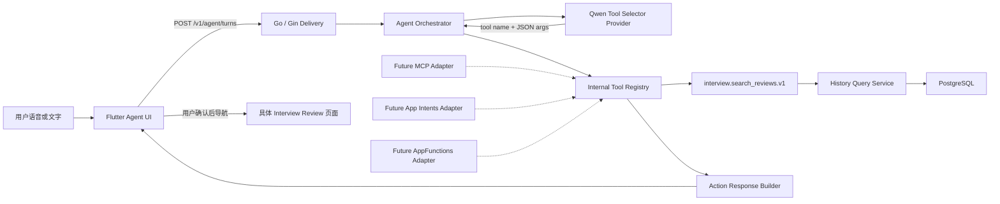
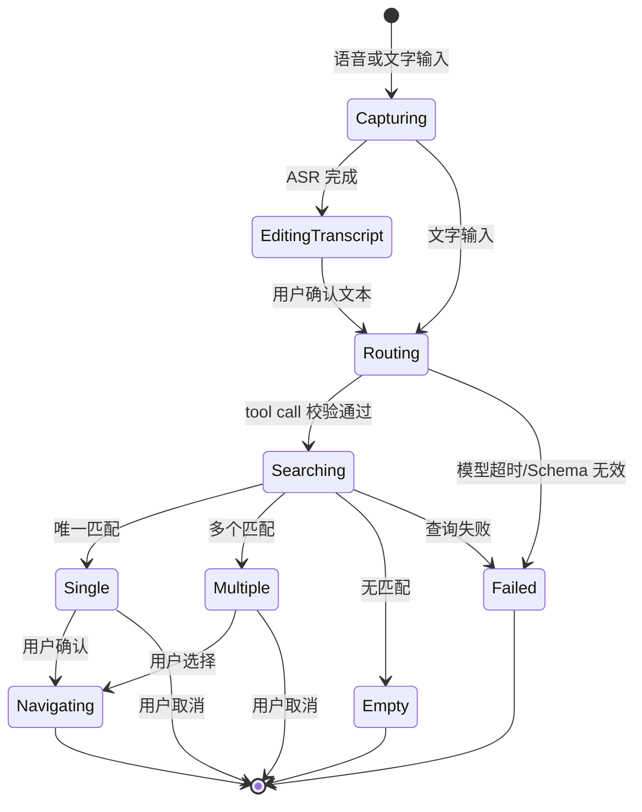

# SpeakUp 超级 Agent 技术实现方案

> 文档日期：2026-07-16<br>
> 产品：SpeakUp AI 英语面试陪练<br>
> 范围：技术选型、总体架构、接口契约、运行流程、安全可靠性与实施计划<br>
> 关联立项：[SpeakUp 超级 Agent 入口调研与立项论证](./2026-07-16-超级Agent入口调研与立项论证.md)

## 0. 技术决策摘要

| 方向 | 决策 |
|---|---|
| Agent 运行方式 | 首期采用受限的单步工具路由，不建设自主规划型 Agent |
| 模型调用 | 使用千问文本模型 Function Calling 生成工具名和结构化参数 |
| 工具执行 | Go 后端内部 Tool Registry 负责 Schema 校验、权限校验和执行分发 |
| 业务访问 | 工具只调用现有 Domain Service，不直接访问数据库 |
| MCP | 首期不接入；未来需要跨宿主或第三方开放时增加 MCP Adapter |
| 语音入口 | 短语音 ASR 转写后进入文本 Function Calling，不复用实时面试长连接 |
| 前端响应 | Go 生成确定性的 Action Bubble，Flutter 在用户确认后执行受控导航 |
| 首期工具 | 仅开放只读工具 `interview.search_reviews.v1` |
| 安全边界 | 模型输出一律视为不可信输入；用户身份只从服务端认证上下文获得 |

首期调用链：

```text
Flutter 语音/文字入口
  -> 短语音 ASR 与文本确认
  -> Go Agent Orchestrator
  -> 千问 Function Calling
  -> Internal Tool Registry
  -> History Query Service
  -> 确定性 Action Bubble
  -> 用户确认
  -> Flutter 打开具体 Review
```
## 1. 技术选型：Function Calling、Tool Registry 与 MCP

### 1.1 它们解决的是不同层次的问题

| 方案 | 解决的问题 | SpeakUp 中的位置 | 首期是否需要 |
|---|---|---|---|
| Function Calling | 让模型从给定工具中选择函数，并返回符合约定的 JSON 参数 | 千问模型与 Go Agent Orchestrator 之间 | **需要** |
| Tool Registry | 注册工具定义、执行器、权限、版本和风险等级 | Go 模块化单体内部 | **需要，且是核心** |
| MCP | 让不同 AI Host 通过统一协议发现并调用远程或本地工具 | SpeakUp 与外部 Agent/宿主之间 | **不需要** |
| Apple App Intents | 向 Siri、Spotlight、Shortcuts、Apple Intelligence 暴露 App 动作和实体 | iOS 平台适配层 | 后续 |
| Android AppFunctions | 向 Android 系统、Agent 和 AI 助手暴露 App 能力 | Android 平台适配层 | 后续，等待 API 稳定 |

千问官方的 Function Calling 流程是：应用把工具列表交给模型，模型返回函数名和 JSON 入参，应用执行函数，再把工具结果交回模型生成响应。也就是说，模型只提出调用建议，数据库查询、鉴权和业务执行仍然由 SpeakUp 控制。[阿里云百炼 Function Calling](https://help.aliyun.com/zh/model-studio/qwen-function-calling)

MCP 是基于 JSON-RPC 的 host-client-server 架构，包含连接生命周期、能力协商、工具发现、资源、提示词和授权等协议能力，适合一个工具服务要被多个不同 AI 宿主复用的场景。[MCP Architecture](https://modelcontextprotocol.io/specification/2025-11-25/architecture)

### 1.2 选型评分

| 维度 | 内部 Function Calling | 首期直接上 MCP |
|---|---:|---:|
| 首期链路复杂度 | 低 | 中高 |
| 与现有 Go 模块化单体匹配度 | 高 | 中 |
| 认证与用户数据隔离 | 复用现有登录态 | 需新增 MCP 授权边界 |
| Flutter 接入成本 | 只调用 REST | 需引入或自建 MCP Client |
| 多宿主互操作 | 低 | 高 |
| 当前产品价值增量 | 高 | 低 |
| 未来可演进性 | 高，前提是工具层独立 | 高 |

**正式决策：** 首期不用 MCP；但内部工具的 `name`、`description`、`inputSchema`、`outputSchema`、版本和错误码采用协议无关定义，避免以后为了接 MCP 重写业务逻辑。

### 1.3 首期 Agent 运行模式

首期只支持“查找某场历史面试并进入 Review”，不应让模型自由循环调用多个工具。更合适的实现是受限的单步工具路由：

1. 语音先转为可编辑文本；
2. Go 只向模型暴露 `interview.search_reviews.v1` 一个只读工具；
3. 使用 `tool_choice` 强制该工具，模型只负责抽取时间、岗位和“最近一次”等语义参数；
4. Go 校验参数并查询当前用户的数据；
5. Go 根据 0、1、多个结果生成确定性的 Action Bubble；
6. 用户点击后由 Flutter 导航，不让模型执行跳转。

受限单步路由可以降低测试复杂度，并避免模型错误选择工具或进入无限循环。阿里云百炼官方支持通过 `tool_choice` 强制指定函数，适合首期只有单一意图的场景。[阿里云百炼 Function Calling：强制工具调用](https://help.aliyun.com/zh/model-studio/qwen-function-calling)

## 2. 总体架构

该方案遵循已确定的 Flutter + Go/Gin 模块化单体 + PostgreSQL 架构，Agent 不直接访问数据库，也不绕过 History 模块的数据隔离规则。



### 2.1 模块职责

| 模块 | 职责 | 禁止事项 |
|---|---|---|
| Agent Delivery | 认证、限流、请求校验、SSE/JSON 响应 | 不写 SQL，不解析厂商 tool call |
| Agent Orchestrator | 维护一次 turn、调用模型、校验 tool call、设置超时 | 不持有业务数据访问权限 |
| Tool Selector Provider | 隔离千问请求与返回格式 | 不执行业务工具 |
| Tool Registry | 工具注册、Schema、版本、权限、风险等级、执行分发 | 不依赖 Flutter 或具体模型 |
| History Query Service | 按当前用户、时间与岗位查询面试 | 不信任模型传入的 `user_id` |
| Action Response Builder | 将查询结果转换为稳定 UI 数据 | 不让模型生成 deep link |
| Agent Audit | 记录模型、工具、耗时、结果数量和错误码 | 不记录原始音频和不必要的简历正文 |

### 2.2 与实时面试语音链路的关系

超级入口不是实时模拟面试会话，不应复用 `qwen3.5-omni-plus-realtime` 的长连接作为首期主链路。推荐：

```text
按住说话/点击录音
  -> 短语音 ASR
  -> 用户可修改转写文本
  -> 文本 Function Calling
  -> Action Bubble
```

原因是该入口需要的是可靠参数抽取、可编辑转写和低成本短请求，而不是低延迟双向语音对话。可复用现有 `TranscriptionProvider` 抽象，但应新增“短指令转写”用例，不能把 Agent UI 绑死在千问实时 Omni 的厂商事件上。

## 3. 首期工具契约

### 3.1 工具定义

工具名建议使用带领域和版本的稳定命名：`interview.search_reviews.v1`。它只负责检索，不负责打开页面。

```json
{
  "name": "interview.search_reviews.v1",
  "description": "Search the authenticated user's completed interview sessions that have review data.",
  "inputSchema": {
    "type": "object",
    "additionalProperties": false,
    "properties": {
      "time_range": {
        "type": "object",
        "additionalProperties": false,
        "properties": {
          "start": { "type": ["string", "null"], "format": "date-time" },
          "end": { "type": ["string", "null"], "format": "date-time" }
        },
        "required": ["start", "end"]
      },
      "role_keyword": { "type": ["string", "null"], "maxLength": 80 },
      "selection": {
        "type": "string",
        "enum": ["latest", "within_range"]
      },
      "limit": { "type": "integer", "minimum": 1, "maximum": 5 }
    },
    "required": ["time_range", "role_keyword", "selection", "limit"]
  }
}
```

关键约束：

- `user_id` 不出现在 Schema 中，必须从服务端认证上下文获得；
- “上周”“昨天”等相对时间由模型结合服务器提供的当前日期和 `Asia/Shanghai` 时区归一化，Go 再验证；
- 查询仅返回已完成且存在可查看 Review 的会话；
- 默认最多返回 5 条，防止把用户全部历史数据送入模型；
- 模型不能生成 SQL、资源 ID 或客户端路由。

### 3.2 工具输出

```json
{
  "status": "multiple_matches",
  "matches": [
    {
      "interview_session_id": "is_01J...",
      "interviewed_at": "2026-07-10T19:30:00+08:00",
      "role_name": "Java 后端工程师",
      "duration_seconds": 1680,
      "review_status": "ready"
    }
  ],
  "applied_filters": {
    "start": "2026-07-06T00:00:00+08:00",
    "end": "2026-07-13T00:00:00+08:00",
    "role_keyword": "Java 后端"
  }
}
```

`status` 固定为：`single_match`、`multiple_matches`、`no_match`、`needs_clarification`。前端基于枚举渲染 UI，不解析模型自由文本。

## 4. App API 与交互状态机

### 4.1 REST API

首期建议单一同步接口，超时目标控制在 8 秒以内：

```http
POST /v1/agent/turns
Authorization: Bearer <app-session-token>
Content-Type: application/json

{
  "input": {
    "type": "text",
    "text": "帮我复盘上周的 Java 后端面试"
  },
  "client_timezone": "Asia/Shanghai",
  "conversation_id": null
}
```

```json
{
  "turn_id": "at_01J...",
  "type": "action_candidates",
  "message": "找到 2 场可能的面试，请选择一场。",
  "actions": [
    {
      "action_id": "aa_01J...",
      "kind": "open_interview_review",
      "title": "7 月 10 日 · Java 后端工程师",
      "subtitle": "28 分钟 · Review 已生成",
      "resource": {
        "type": "interview_session",
        "id": "is_01J..."
      },
      "requires_confirmation": true
    }
  ]
}
```

客户端根据 `kind + resource.id` 使用本地受控路由表导航，例如 `open_interview_review -> /interviews/:id/review`。服务端不返回任意 URL，避免模型或工具结果注入恶意 deep link。

语音上传建议独立为 `POST /v1/agent/transcriptions`，返回转写文本供用户编辑；确认文本后再调用 `/v1/agent/turns`。这样语音失败不会污染 Agent turn，也便于分别统计 ASR 与意图识别质量。

### 4.2 状态机



首期最多允许一次模型调用和一次工具调用。只有 `needs_clarification` 才创建下一轮，最多追问一次；仍不明确时回退到传统历史筛选页。

## 5. 安全与可靠性

### 5.1 把模型视为不可信的路由建议者

- 所有 tool arguments 必须做 JSON Schema 和业务二次校验；
- 工具白名单由服务端决定，客户端与用户文本不能注册工具；
- 工具执行器必须从认证上下文注入当前用户，不接受模型提供的身份；
- 所有查询继续走 History Query Service 的数据隔离规则；
- Action Bubble 中展示日期、岗位和对象，用户确认后才导航；
- 未来新增修改、删除、发送类工具时，必须单独确认并使用幂等键；
- Prompt 中的“忽略规则、查询别人的数据”等内容只能当普通用户文本处理。

MCP 官方工具规范同样建议始终保留 human-in-the-loop、清晰展示被调用工具并为操作提供确认；这支持当前“结果气泡后再进入”的产品决策。[MCP Tools](https://modelcontextprotocol.io/specification/2025-11-25/server/tools)

### 5.2 超时、降级与重试

| 故障 | 用户体验 | 后端策略 |
|---|---|---|
| ASR 失败 | 保留文字输入入口，允许重录 | 不创建 Agent turn |
| 模型超时 | 提示“暂时无法理解”，提供历史入口 | 只重试一次，设置总 deadline |
| tool call Schema 无效 | 不执行查询 | 记录 `invalid_tool_arguments` |
| History 查询超时 | 提示稍后重试 | 不重复调用模型 |
| 无匹配 | 展示已理解的筛选条件 | 提供“修改条件”“查看全部历史” |
| 多匹配 | 展示最多 5 个候选 | 不让模型静默选中 |
| Review 已删除或未就绪 | 禁止导航 | 返回资源状态并刷新候选 |

模型不可用时可增加一个有限规则降级：只支持“最近一次面试”，直接调用 History Query Service；不要用复杂正则复制完整 NLU，否则会形成两套不可维护的意图系统。

### 5.3 可观测性与隐私

每个请求使用 `request_id -> agent_turn_id -> provider_call_id -> tool_call_id` 串联日志，至少记录：

- 输入方式、语言、模型版本、Prompt 版本；
- 首 Token/完整响应/工具执行/总耗时；
- 工具名、参数校验结果、候选数量、最终 action 类型；
- 用户是否确认、取消、改选或回退传统导航；
- 错误码与重试次数。

默认不在普通日志记录原始音频、完整转写、简历正文或面试回答。若为质量评估采样原始文本，需要单独告知、脱敏、限期保存并允许退出。
