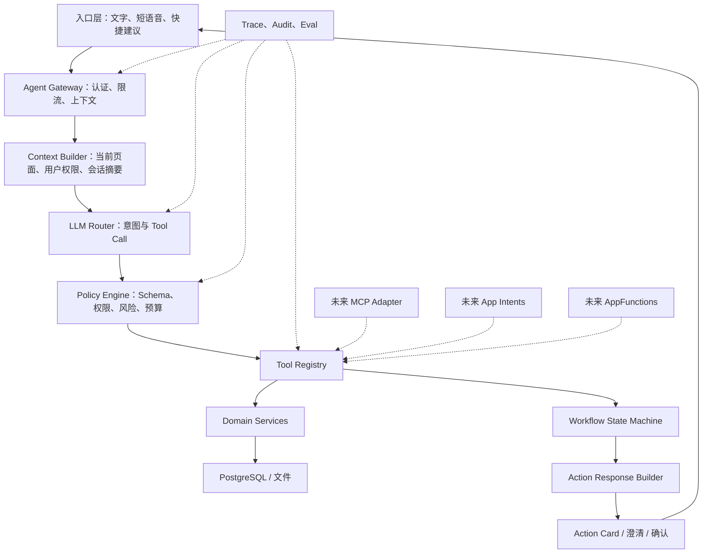
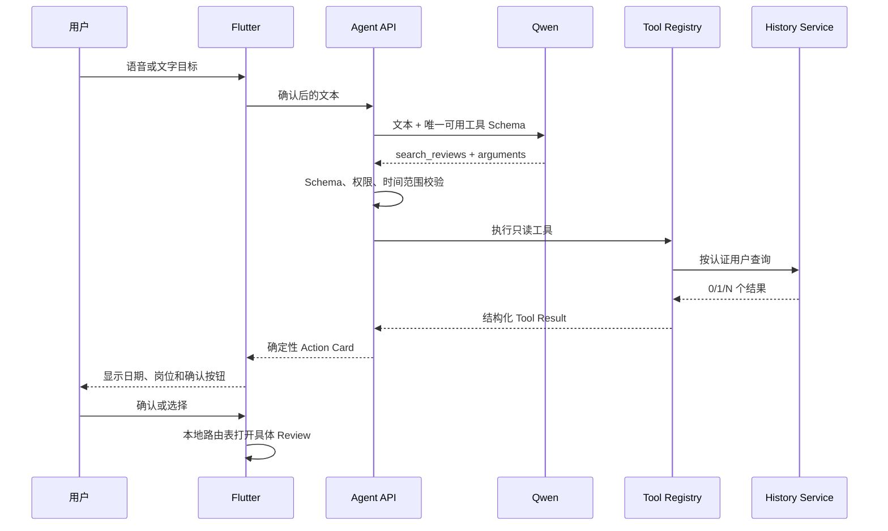

# SpeakUp 超级 Agent 入口主流技术实现调研

> 调研日期：2026-07-17  
> 产品：SpeakUp AI 英语面试陪练  
> 关联立项：[超级 Agent 入口调研与立项论证](./2026-07-16-超级Agent入口调研与立项论证.md)  
> 关联方案：[超级 Agent 技术实现方案：Function Calling 与 MCP](./2026-07-16-超级Agent技术实现方案-Function-Calling与MCP.md)  
> 调研范围：App 内自然语言入口、模型工具调用、Agent 编排、语音、记忆、系统级入口、安全与可观测性

## 0. 结论先行

目前主流的“超级 Agent 入口”并不是让模型直接操作 App UI，而是采用以下五层结构：

```text
语音/文字入口
  -> 模型理解目标并产生结构化 Tool Call
  -> 应用自己的 Tool Registry 校验并执行
  -> 确定性工作流控制步骤、状态和权限
  -> Action Card / Confirmation UI 向用户展示结果和后续动作
```

不同厂商的 Function Calling、OpenAI Agents SDK、Google ADK、LangGraph、MCP、Apple App Intents 和 Android AppFunctions，分别解决其中不同层的问题，不能互相替代。

对 SpeakUp 的直接建议是：

1. **首期采用 Function Calling + Go 内部 Tool Registry + 确定性状态机**，不引入自由规划型 Agent。
2. **模型只做语义理解和参数抽取，不直接访问数据库、不生成路由、不替用户确认。**
3. **语音先走短指令 ASR，再进入文本 Agent 链路**；暂不使用实时端到端语音作为超级入口主链路。
4. **Tool Registry 是长期核心资产**。内部先采用协议无关工具定义，未来再增加 MCP、App Intents、AppFunctions 适配器。
5. **工作流逐步从单步路由升级为显式图/状态机**；只有出现长任务、暂停恢复、并行工具和多 Agent 协作后，才考虑 LangGraph、ADK 或 Agents SDK 类运行时。

这与现有《Function Calling 与 MCP》方案的方向一致。本次调研进一步确认：首期不需要 MCP，也不需要通用 Agent 框架，但需要从第一天把工具契约、权限、确认、审计和评测做成独立能力。

## 1. 需要区分的六类技术

| 技术 | 解决的问题 | 典型实现 | 是否替代业务后端 |
|---|---|---|---|
| 自然语言入口 | 用户如何表达目标 | Chat 输入框、语音按钮、浮层、系统助手 | 否 |
| Function Calling | 模型如何选择能力并生成结构化参数 | Qwen、OpenAI、Claude、Gemini Tool Use | 否 |
| Tool Registry | 应用如何注册、校验、授权和执行能力 | 内部 Registry、工具网关 | 否，是业务后端的一部分 |
| Agent Runtime | 如何循环调用工具、保存状态、暂停恢复 | Agents SDK、LangGraph、Google ADK | 否 |
| 工具互操作协议 | 工具如何被不同 AI Host 发现和调用 | MCP | 否 |
| OS 能力暴露 | App 能力如何进入系统助手 | Apple App Intents、Android AppFunctions | 否 |

最容易出现的选型误区，是把 MCP 当成 Agent 编排器，或把 Function Calling 当成完整 Agent。MCP 主要解决工具互操作；Function Calling 只产生结构化调用建议；真正的鉴权、业务执行、事务、状态、重试和用户确认仍属于应用。

## 2. 主流实现路线

### 2.1 路线 A：LLM Function Calling + 应用自建执行层

这是嵌入现有 App 的最常见、最轻量方案。

典型流程：

```text
App 输入
  -> 后端按用户、页面和权限选择可用工具
  -> 模型返回 tool_name + JSON arguments
  -> 后端校验 Schema 与业务规则
  -> 执行业务 Service
  -> 返回结构化结果或再次交给模型总结
```

OpenAI、Claude、Gemini 和千问的官方工具调用流程本质一致：应用声明工具及 JSON Schema，模型决定函数和参数，应用执行函数，再把结果返回给模型或 UI。OpenAI 还提供严格 Schema 模式、`tool_choice` 和关闭并行调用等控制；千问支持 `auto`、`required` 和强制指定某一工具。[OpenAI Function Calling](https://developers.openai.com/api/docs/guides/function-calling)；[Claude Tool Use](https://docs.anthropic.com/en/docs/build-with-claude/tool-use/overview)；[Gemini Function Calling](https://ai.google.dev/gemini-api/docs/function-calling)；[千问 Function Calling](https://help.aliyun.com/zh/model-studio/qwen-function-calling)

适合：

- 工具数量较少；
- 任务通常一步或两步完成；
- 产品已有稳定业务 Service；
- 要求低延迟、低成本、强可控。

不足：

- 循环、恢复、长任务、并发和人工审批要自己实现；
- 工具增多后，需要动态工具选择、工具分组和评测体系。

**对 SpeakUp：首期首选。** 当前只有一个只读 Review 检索工具，使用 Go 自建薄编排层比引入通用运行时更简单。

### 2.2 路线 B：Agent SDK / Agent Runtime 管理工具循环

当任务需要“模型选择工具—执行—观察结果—继续选择工具”多次循环时，主流做法是引入 Agent Runtime。

| 方案 | 核心特点 | 更适合的场景 | 与 SpeakUp Go 栈的关系 |
|---|---|---|---|
| OpenAI Agents SDK | 内置 Agent loop、工具、handoff、guardrail、session、HITL、tracing | OpenAI 技术栈、多轮和多 Agent | Python/TS 为主，当前无必要引入 |
| Google ADK | Agent、Workflow Agent、工具、Session/Memory、部署抽象 | Gemini/Google Cloud、多 Agent | 已有 Go 实现，第二阶段可 PoC |
| LangGraph | 显式图、持久化 checkpoint、暂停恢复、HITL、长任务 | 复杂、长时、可恢复工作流 | Python/JS 为主，可借鉴状态图思想 |
| CloudWeGo Eino | Go 语言的模型、工具、Graph/Workflow 等组件化能力 | Go 团队希望采用现成 Agent 组件 | 工具达到一定规模后可 PoC |

OpenAI 官方明确区分：短生命周期、希望自己掌握循环和状态时直接用 Responses API；需要运行时管理工具、guardrail、handoff 和 session 时再用 Agents SDK。[OpenAI Agents SDK](https://openai.github.io/openai-agents-python/)

LangGraph 的主要价值是 durable execution、checkpoint、human-in-the-loop 和故障恢复，而不是提高一次简单意图识别的准确率。[LangGraph Overview](https://docs.langchain.com/oss/python/langgraph/overview)；[LangGraph Persistence](https://docs.langchain.com/oss/python/langgraph/persistence)

对于 Go 技术栈，目前已有 [Google ADK Go](https://github.com/google/adk-go) 和 [CloudWeGo Eino](https://github.com/cloudwego/eino)。Eino 提供 Tool、Graph/Workflow、ReAct、HITL 和流式编排；ADK Go 提供 Agent、Runner、Session、Memory、Tool 与 Telemetry 等包。因此后续确有运行时需求时，可以保持 Go 栈做 PoC，不必先引入 Python 服务。

**对 SpeakUp：第二阶段再评估。** 当出现“检索三场面试—读取 Review—归纳弱项—生成练习—等待用户确认—创建训练”这类跨步骤任务时，先在 Go 内部实现显式状态机；只有状态机复用、暂停恢复和并行执行成本明显上升，才引入框架。

### 2.3 路线 C：MCP 作为标准工具接口

MCP 采用 Host—Client—Server 架构和 JSON-RPC 数据层，支持工具、资源、提示词、能力协商和通知；远程传输通常使用 Streamable HTTP，并建议使用 OAuth。[MCP Architecture](https://modelcontextprotocol.io/docs/learn/architecture)

它的价值是：

- 同一套工具被 ChatGPT、Claude、IDE Agent 或企业 Agent 等多个宿主调用；
- 接入第三方工具生态；
- 工具发现和 Schema 获取标准化；
- 远程授权和跨团队边界更清晰。

它不负责：

- 决定 Agent 的业务工作流；
- 替代 Domain Service；
- 自动保证数据隔离；
- 自动解决 Prompt Injection 和高风险操作确认。

OpenAI 和 Anthropic 都已经支持从模型 API 直接连接远程 MCP Server，并提供工具 allowlist/denylist 或 approval 控制，说明 MCP 已成为跨宿主工具接入的主流方向。[OpenAI MCP and Connectors](https://developers.openai.com/api/docs/guides/tools-connectors-mcp)；[Anthropic MCP Connector](https://docs.anthropic.com/en/docs/agents-and-tools/mcp-connector)

**对 SpeakUp：内部暂不部署 MCP Server。** 先让 Tool Registry 的工具定义保持协议无关；未来出现以下任一条件再增加 MCP Adapter：

- SpeakUp 能力要开放给外部 AI 助手；
- 多个独立 Agent 服务要共享工具；
- 需要接入大量现成第三方 MCP 工具；
- 工具边界跨团队、跨进程或跨组织。

### 2.4 路线 D：Apple App Intents 与 Android AppFunctions

这是把 App 能力开放给操作系统和系统助手的入口层，不是 App 内 Agent 的替代品。

Apple App Intents 使用 `AppIntent`、参数和 `AppEntity` 描述动作与业务对象，使能力可被 Siri、Apple Intelligence、Spotlight 和 Shortcuts 发现。Interactive Snippet 可以展示结果、确认和后续按钮，与 SpeakUp 的 Action Bubble 思路接近。[Apple AppIntent](https://developer.apple.com/documentation/appintents/appintent)；[Apple Interactive Snippets](https://developer.apple.com/documentation/appintents/displaying-static-and-interactive-snippets)

Android AppFunctions 允许 App 把 Kotlin 函数注册为设备上的可发现工具，由获得权限的 Agent/助手调用。官方将其定位为移动端 MCP 工具的对应机制，但截至 2026 年 7 月仍是实验预览，Gemini 端到端集成仍处于受限测试阶段。[Android AppFunctions](https://developer.android.com/ai/appfunctions)

**对 SpeakUp：作为后续分发入口。** 先把业务动作沉淀为稳定 Tool Contract，再分别编写 iOS/Android Adapter。不要在 Flutter 页面或平台 Intent 中重复业务逻辑。

### 2.5 路线 E：Computer Use / UI 自动化

这类方案让模型通过截图、鼠标、键盘操作现有 UI，主要用于无法提供 API 的第三方系统或旧系统。

对自有 App 不推荐作为主路径：

- 延迟高，步骤多；
- UI 改版容易破坏任务；
- 难以做对象级权限和幂等；
- 容易受到页面内容 Prompt Injection；
- 很难稳定达到产品级 SLA。

SpeakUp 能直接调用自己的 Domain Service，因此没有必要让 Agent 模拟点击自己的页面。

## 3. 主流产品级分层架构



### 3.1 入口与上下文

主流入口通常采用“对话输入 + 建议动作 + 结构化结果卡片”，而不是只有空白 Chat 页面。

SpeakUp 可向模型提供：

- 当前时间和时区；
- 当前页面与当前对象 ID；
- 当前用户可用能力；
- 最近一次 Agent turn 的结构化摘要；
- 不包含敏感正文的用户学习状态摘要。

不要默认把全部面试历史、完整简历和所有 Review 放入 Prompt。事务性对象应按工具查询，既降低 Token，也减少越权和陈旧数据。

### 3.2 动态工具暴露

不是每轮都把所有工具交给模型。推荐按以下条件生成工具白名单：

```text
用户权限 × 当前页面 × 产品阶段 × 风险等级 × 实验分组
```

例如，首期首页 Agent 只暴露 `interview.search_reviews.v1`；Review 页面可额外暴露 `practice.retry_question.v1`；未完成面试的用户不暴露 Review 工具。

动态工具暴露比在 Prompt 中写“不要调用某工具”可靠，也能减少模型选错工具和工具 Schema 占用的上下文。

### 3.3 确定性工作流包围非确定性模型

推荐模式：

```text
确定性状态机
  -> 在需要理解自然语言的节点调用模型
  -> 在需要业务数据的节点调用工具
  -> 在高风险或多候选节点暂停并请求用户确认
  -> 根据枚举结果确定下一状态
```

不推荐让模型自己无限循环直到“认为任务完成”。每个工作流应设置：

- 最大模型调用次数；
- 最大工具调用次数；
- 总超时和单步超时；
- 允许调用的工具集合；
- 可恢复和不可恢复错误；
- 用户确认点；
- 最终降级路径。

### 3.4 三类记忆必须分开

| 记忆类型 | 示例 | 存储方式 | 是否直接进入 Prompt |
|---|---|---|---|
| 会话工作记忆 | “上周那场”承接上一轮 | Agent Turn / Conversation State | 摘要后进入 |
| 领域事实 | 面试、Review、题目、练习记录 | PostgreSQL 业务表 | 通过工具按需读取 |
| 长期偏好 | 目标岗位、偏好难度、学习时间 | 明确字段和用户可编辑设置 | 必要时进入 |

向量数据库适合语义检索非结构化内容，不应替代 PostgreSQL 中的用户、面试、Review 和权限关系。首期 Review 检索不需要 RAG。

### 3.5 Server-driven Action UI

模型不应直接返回任意 Deep Link 或 Flutter 路由。后端返回稳定的 Action Contract：

```json
{
  "type": "action_candidates",
  "message": "找到 2 场可能的面试，请选择一场。",
  "actions": [
    {
      "kind": "open_interview_review",
      "resource_type": "interview_session",
      "resource_id": "is_01J...",
      "title": "7 月 10 日 · Java 后端工程师",
      "requires_confirmation": true
    }
  ]
}
```

Flutter 只用 `kind + resource_type + resource_id` 查询本地路由表。这样模型、MCP 工具或外部数据都无法注入任意 URL。

## 4. 语音入口的两种实现

### 4.1 级联式：ASR → 文本 Agent → 可选 TTS

优点：

- 转写可见、可编辑；
- Function Calling 和文本评测更稳定；
- ASR、模型、业务工具可分别观测和降级；
- 适合“打开、查找、继续、复盘”短指令。

缺点是多一次转写等待，连续对话的自然度低于实时语音。

### 4.2 实时式：Speech-to-Speech Realtime Agent

优点是延迟低、可打断、连续对话自然，适合陪练和面试会话。主流实时 Agent 也可以在语音会话中调用工具。

缺点是会话、打断、音频播放、工具等待和错误恢复更复杂；用户也更难检查模型是否正确理解了日期、岗位等关键参数。

**SpeakUp 的边界应保持清晰：** 模拟面试继续使用实时语音；超级入口首期使用短语音 ASR + 文本确认。未来如果入口变为持续陪伴式教练，再把两条链路在 Agent Gateway 层统一，而不是现在复用实时面试 WebSocket。

## 5. 安全与可靠性已经成为主流实现的必要组成

### 5.1 模型输出始终是不可信输入

- 对参数做 JSON Schema 校验和业务二次校验；
- `user_id`、租户、角色和权限从服务端认证上下文注入；
- 工具只能调用 Domain Service，禁止生成 SQL；
- 查询类工具限制条数和字段；
- 工具结果中的文本也可能包含 Prompt Injection，不自动当作指令；
- 每轮只开放最小工具集合。

### 5.2 按风险等级确认

| 风险等级 | 示例 | 默认策略 |
|---|---|---|
| R0 纯读取 | 查找 Review、查看进步 | 可自动执行，结果可见 |
| R1 导航/开始会话 | 打开 Review、开始练习 | Action Card 确认 |
| R2 可逆写入 | 创建学习计划、修改偏好 | 展示参数并确认，使用幂等键 |
| R3 高影响/不可逆 | 删除数据、公开分享、付费 | 强确认、重新鉴权或不开放 |

MCP 官方工具规范建议保留 human-in-the-loop、显示工具调用并提供确认；Android 也要求破坏性操作具有明确确认。[MCP Tools](https://modelcontextprotocol.io/specification/draft/server/tools)；[Android AppFunctions 安全建议](https://developer.android.com/ai/appfunctions/add-appfunctions)

### 5.3 幂等、预算和熔断

所有写工具应有 `idempotency_key`。Agent Orchestrator 还应限制单轮 Token、模型调用次数、工具次数和总时长，防止模型循环、重复写入和成本失控。

## 6. 可观测性与评测

上线 Agent 不能只看“模型回复是否自然”，应分别测量理解、执行和产品结果。

### 6.1 运行链路

```text
request_id
  -> conversation_id
  -> turn_id
  -> model_call_id
  -> tool_call_id
  -> action_id
  -> final_user_event
```

### 6.2 核心指标

| 层次 | 指标 |
|---|---|
| ASR | 转写修改率、空结果率、耗时 |
| 意图 | Tool 选择准确率、参数完全正确率、澄清率 |
| 工具 | Schema 失败率、权限拒绝率、执行成功率、P95 延迟 |
| 交互 | 候选改选率、确认率、取消率、传统入口回退率 |
| 产品 | 到达 Review 的步骤/耗时、Review 使用率、复练转化率 |
| 安全 | 越权测试通过率、重复写入率、高风险未确认执行数 |

### 6.3 首期评测集

建议在开发前固定 150～300 条中文口语化指令，覆盖：

- 昨天、上周、最近一次、具体日期、跨月；
- Java 后端、后端、产品经理等岗位别名；
- 唯一结果、多结果、无结果；
- 缺少时间或岗位；
- 中英混输、ASR 常见错字；
- 超出范围请求；
- 越权和 Prompt Injection；
- 同义表达和省略表达。

模型或 Prompt 版本升级必须回放该数据集。首期最重要的指标不是自由对话满意度，而是“目标 Review 是否正确命中”。

## 7. SpeakUp 推荐落地架构

### 7.1 首期组件

| 组件 | 实现建议 |
|---|---|
| Flutter Agent UI | 文字/按住说话、转写编辑、候选卡片、一次澄清、受控导航 |
| 短指令 ASR | 复用 `TranscriptionProvider` 抽象，独立于实时面试连接 |
| Agent Delivery | `POST /v1/agent/transcriptions` 与 `POST /v1/agent/turns` |
| Context Builder | 注入服务端时间、时区、已认证用户和可用工具 |
| Qwen Router | 非思考模式、强制工具、禁止并行调用、短超时 |
| Tool Registry | Schema、版本、权限、风险、超时和 executor |
| Search Review Tool | 只调用 History Query Service，最多 5 条 |
| Workflow | Go 显式状态机，最多一次模型调用、一次工具调用、一次澄清 |
| Action Builder | 代码生成消息和卡片，模型不生成路由 |
| Audit/Eval | 结构化 trace、错误码、确认/改选/回退事件 |

### 7.2 首期调用链



### 7.3 为什么当前不选通用框架

首期只有一个工具和一个短工作流。引入完整框架不会提升核心意图准确率，却会增加：

- 新运行时和语言栈；
- 状态存储与现有 PostgreSQL 的重复抽象；
- 框架事件到 Go/Flutter 契约的转换；
- 调试、部署和供应商锁定成本。

建议先定义一个很薄的 Go 接口：

```go
type ToolDefinition struct {
    Name         string
    Version      string
    Description  string
    InputSchema  json.RawMessage
    RiskLevel    string
    RequiredScope string
}

type ToolExecutor interface {
    Execute(ctx context.Context, auth AuthContext, args json.RawMessage) (ToolResult, error)
}
```

当工具超过约 8～12 个、出现 3 步以上工作流、需要暂停恢复或多个专业 Agent 时，再用真实复杂度验证 Eino、LangGraph、ADK 或 Agents SDK，而不是现在预先引入。

## 8. 分期路线

### Phase 1：可靠入口

- 一个只读工具：查找历史 Review；
- 短语音 ASR + 文字；
- 0/1/N 结果卡片；
- 一次澄清；
- 全链路 trace 和离线评测。

验收重点：正确命中率、任务完成时间、Review 到达率。

### Phase 2：多能力单 Agent

- 继续上次练习；
- 同题复练；
- 查看近期进步；
- 动态工具暴露；
- R0/R1/R2 风险策略；
- 多步骤显式工作流与 checkpoint。

验收重点：跨模块完成率、错误恢复率、重复执行率。

### Phase 3：平台化

- 内部工具目录与版本治理；
- MCP Adapter；
- iOS App Intents；
- Android AppFunctions（待稳定）；
- 长任务与异步通知；
- 必要时引入专业 Agent 或 Agent Runtime。

验收重点：多入口复用率、工具兼容性、权限一致性。

## 9. 最终选型表

| 决策项 | 首期选择 | 暂不选择 | 触发升级条件 |
|---|---|---|---|
| 模型交互 | Qwen Function Calling | 自由 ReAct 循环 | 出现多工具连续规划 |
| 编排 | Go 确定性状态机 | LangGraph/ADK/Agents SDK | 长任务、暂停恢复、并行明显增加 |
| 工具层 | 内部 Tool Registry | 直接在 Prompt 写 API | 从第一期即建立 |
| 协议 | 内部 JSON Schema | MCP Server | 跨宿主或第三方开放 |
| 语音 | 短语音 ASR → 文本 | 实时 S2S 入口 | 持续陪伴式语音 Agent |
| 记忆 | PostgreSQL 领域数据 + Turn 摘要 | 全量聊天记录/RAG 代替业务库 | 非结构化语义检索成为明确需求 |
| UI | Action Card + 用户确认 | 模型生成 Deep Link | 不升级，长期保持受控 |
| 系统入口 | App 内入口 | App Intents/AppFunctions | App 内闭环验证成功后 |

## 10. 一句话判断

SpeakUp 现在应该建设的不是“一个能自由操作所有东西的万能 Agent”，而是“一个以自然语言为入口、以 Tool Registry 为能力底座、以确定性工作流和用户确认为安全边界的 App 操作层”。

Function Calling 是首期入口，Tool Registry 是长期资产，工作流运行时是复杂度上升后的选择，MCP 和系统级 Intent 是能力对外分发的后续适配层。
