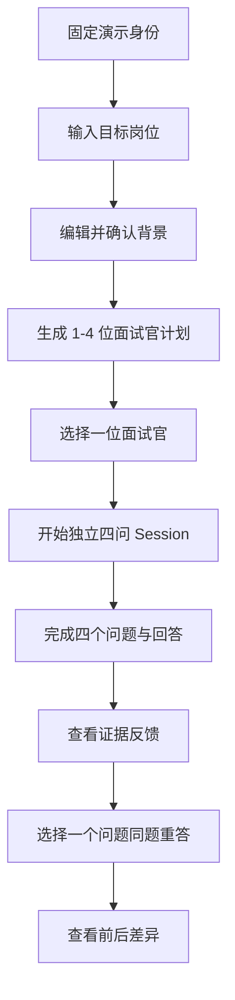
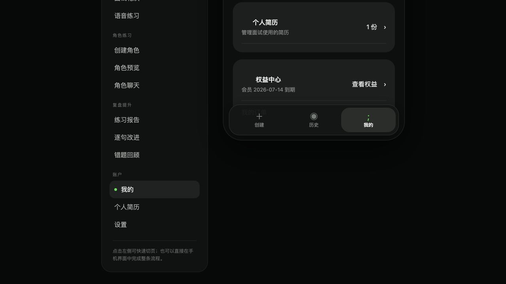
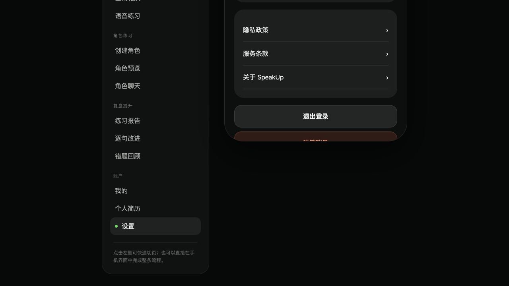
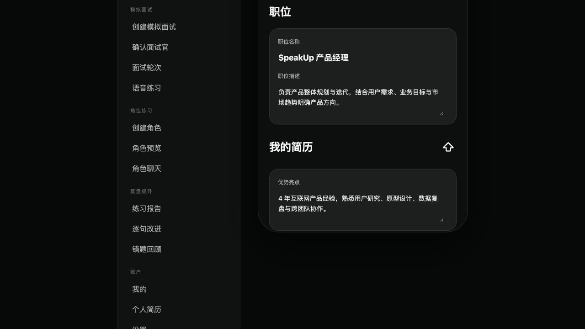
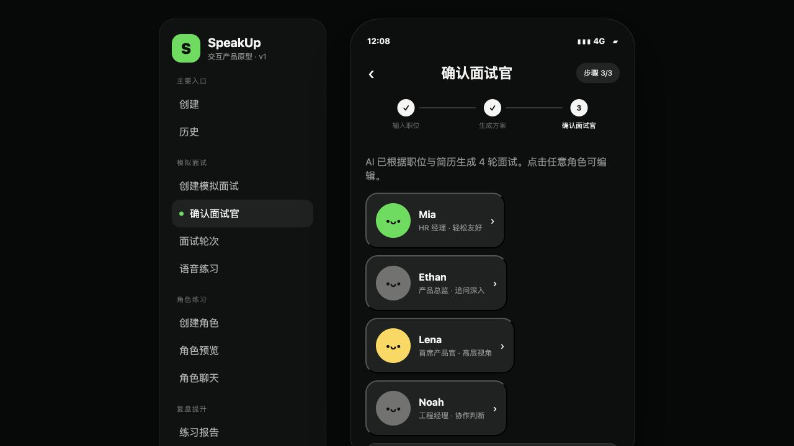
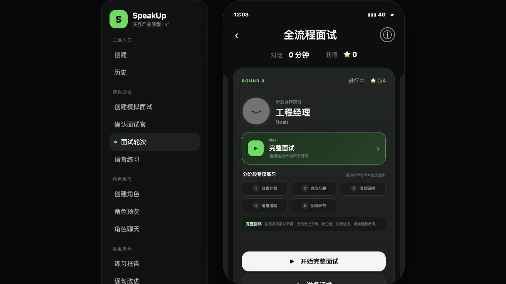
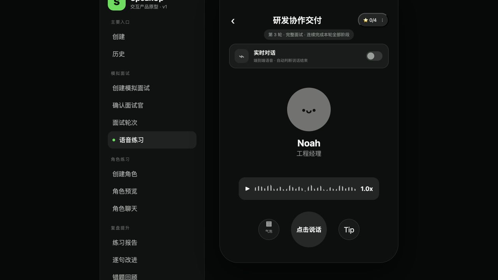
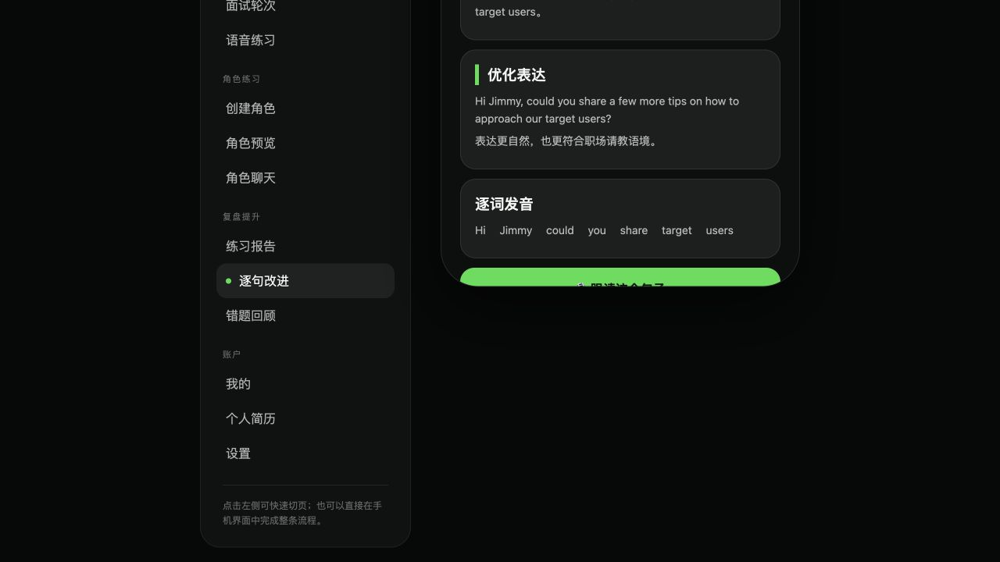
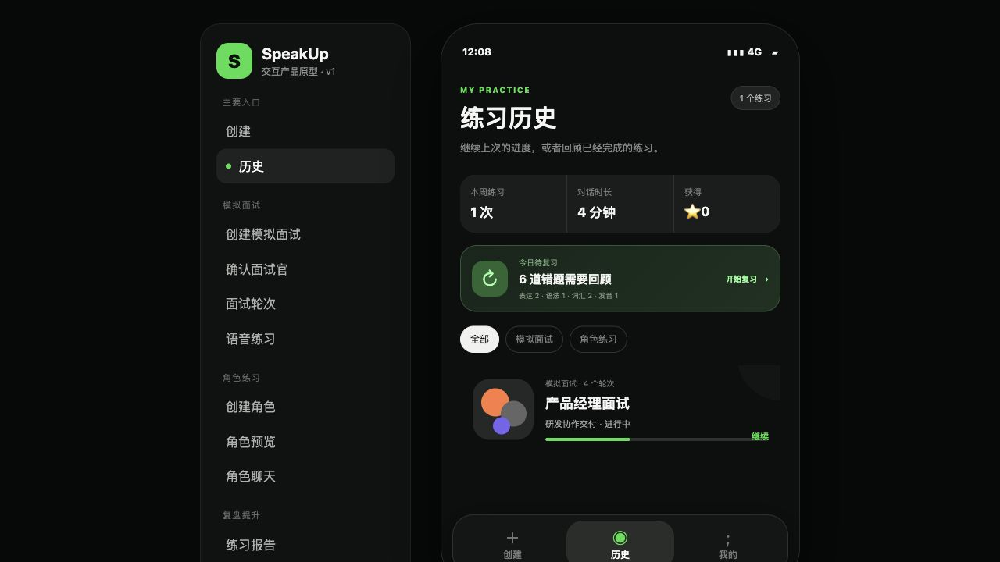

# SpeakUp MS1 面试主链路图文 PRD

> 状态：已按主仓已接受 Proposal 收敛，待团队终审<br>
> 更新日期：2026-07-20<br>
> 当前可交互原型：[SpeakUp 线上原型](https://speakup-preview.oopwqsnyzxm.chatgpt.site/)<br>
> 产品总入口：[1024XEngineer/XE3-ESL#9](https://github.com/1024XEngineer/XE3-ESL/issues/9)<br>
> 本次收口任务：[1024XEngineer/XE3-ESL#16](https://github.com/1024XEngineer/XE3-ESL/issues/16)

## 1. 文档目的与权威输入

本文把已接受的产品 Proposal 同步为 MS1 唯一图文 PRD，负责说明跨页面流程、截图映射、Mock 边界和端到端验收，不新增产品范围。

本次修订以以下主仓结论为准：

- [#10 反馈与复练](https://github.com/1024XEngineer/XE3-ESL/issues/10)：MS1 用 Mock 串联证据反馈与同题重答；独立复练清单放到 MS3。
- [#11 简历与背景](https://github.com/1024XEngineer/XE3-ESL/issues/11)：MS1 使用预置简历或手动背景；真实一份 PDF 上传解析放到 MS2。
- [#12 面试与语音](https://github.com/1024XEngineer/XE3-ESL/issues/12)：一个计划包含 1–4 位面试官；每次选择一位面试官开始独立四问 Session。
- [#14 账户与个人中心](https://github.com/1024XEngineer/XE3-ESL/issues/14)：MS1 使用固定演示身份；MS2 再实现一种真实认证方式。

若本文与上述已接受 Proposal 冲突，以已接受 Proposal 为准，并通过新的 Issue/PR 修订本文。

## 2. MS1 交付边界

### 2.1 MS1 要证明什么

MS1 只证明方向、信息结构和最小主链路可以串联：

```text
固定演示身份
  -> 输入并确认目标岗位与背景
  -> 查看包含 1–4 位面试官的计划
  -> 选择一位面试官
  -> 完成独立四问 Session
  -> 查看证据反馈
  -> 至少完成一次同题重答
```

允许岗位、背景、问题、语音、转录、分析、反馈和重答结果使用确定性演示数据，但页面和演示说明必须明确标注 Mock，不能把“可点击”描述为真实供应商或后端能力。

### 2.2 MS1 不交付

- 不实现真实注册、登录、退出、找回密码或账户注销。
- 不实现真实简历上传、PDF/DOC/DOCX 解析或多简历管理。
- 不接入真实 ASR、TTS、LLM、对象存储或 RAG。
- 不实现连续实时语音、自然打断、弱网恢复或多面试官同时在线。
- 不实现完整历史、跨会话保存、独立错题/复练清单或成长统计。
- 不实现自定义角色、角色市场、会员、订单、支付、排行榜或社交功能。

### 2.3 后续 Milestone

| 能力 | MS2 | MS3 及以后 |
|---|---|---|
| 身份 | 一种真实认证方式 | 注销、完整删除与异常验证 |
| 简历 | 1 份文本型 PDF 上传、解析、选择和删除 | 最多 3 份，补 DOC/DOCX 与切换 |
| 语音与追问 | 真实语音/转录、受控追问和基础报告保存 | 四轮/专项、完整异常恢复 |
| 反馈与复练 | 真实转录生成基础报告 | 四类错题、独立复练清单和历史 |
| 自定义角色 | 不作为阻塞项 | 重新评审后决定最小实现 |

## 3. 原型截图使用规则

本文截图是 2026-07-14 产品评审时使用的历史快照，用于追溯当时的信息结构和范围映射，不要求与后续原型逐像素一致，也不等于对应功能已在 MS1 实现。后续原型的视觉、文案或非 MS1 页面变化无需回写本文；只有主链路或 Milestone 边界发生新的正式决策时，才通过独立 Issue/PR 修订。

每张截图必须使用以下状态之一：

| 标记 | 含义 |
|---|---|
| `保持` | MS1 原型沿用页面结构 |
| `修改` | 保留页面，但按已接受 Proposal 收缩行为 |
| `后续实现` | 两个月范围内可能实现，但不属于 MS1 |
| `不实现` | 当前两个月研发范围明确排除 |

## 4. 核心演示对象

| 概念 | MS1 定义 |
|---|---|
| `DemoUser` | 固定演示身份，不包含真实凭证和认证流程 |
| `InterviewContext` | 本次确认的岗位名称、岗位描述、简历亮点、考察范围和补充要求 |
| `InterviewPlan` | 基于已确认背景生成的演示计划，包含 1–4 位面试官 |
| `Interviewer` | 一位独立面试官的职责、关注点和对话风格 |
| `PracticeSession` | 用户与一位面试官完成的独立四问演示场次 |
| `Turn` | 一个问题、一个演示回答及对应 Mock 转录 |
| `FeedbackItem` | 引用回答原句的演示诊断与改进目标 |
| `RetryRequest` | 针对一个原问题提交的同题重答 |

MS1 中固定四问只属于当前程序员英文面试演示场景，不是平台级永久规则。

## 5. 端到端演示流程



演示必须满足：

1. 岗位可以自由输入，当前产品经理或程序员岗位只是可替换样例。
2. 计划可展示 1–4 位职责不同的面试官，但每场 Session 只选择一位。
3. 四问中至少一次追问明确引用上一轮回答中的信息。
4. 报告至少展示一条引用用户原句的反馈。
5. 用户可从报告进入一次同题重答，并看到“已补充 / 仍缺少”的演示结果。
6. 演示人员能逐项说明哪些是页面逻辑、固定演示数据、Mock 或尚未实现。

## 6. 页面一：固定演示身份与“我的”





**原型映射：`修改`。**

### MS1 行为

- 应用直接使用一个明确标注的固定演示用户进入主链路。
- “我的”页可展示演示昵称、头像和静态统计，但不得声称数据来自真实跨会话记录。
- 设置页不提供可用的注册、登录、退出或注销流程。
- 会员、权益中心、订单和支付入口隐藏；不得以“规划中”入口制造本周期交付预期。

### 后续实现

- MS2 实现一种真实认证方式，并让核心数据具有真实用户归属。
- 注销和完整数据删除在真实账户启用后按后续 Milestone 验收。

## 7. 页面二：背景与简历


**原型映射：`后续实现`。**

### MS1 行为

- 主链路使用一份明确标注的预置简历，或让用户手动填写岗位背景。
- 用户可以编辑并确认：岗位名称、岗位描述、简历亮点、考察范围和补充要求。
- 预置简历和背景可以是演示数据，但不得伪装成已上传、已解析的真实文件。
- 没有简历时仍能用目标岗位和手动背景继续创建计划。

### 不属于 MS1

- 上传、解析、删除真实 PDF。
- DOC/DOCX、最多 3 份简历、默认简历或切换。
- 解析状态、OCR、对象存储和跨会话历史快照。

## 8. 页面三：创建并确认面试计划




**原型映射：`保持` 信息结构，`修改` 数据真实性。**

### MS1 行为

- 用户输入任意技术相关岗位，不能把演示岗位写死为唯一支持对象。
- 系统展示可编辑的岗位描述、简历亮点、考察范围和补充要求。
- 用户确认后进入面试计划；生成内容允许来自确定性 Mock。
- 使用 Mock 时需在演示说明或页面状态中明确，不声称来自真实模型。

### 验收

- 更换岗位后，计划标题、背景摘要和面试官职责不残留上一演示岗位内容。
- 用户能够修正生成结果后再继续。

## 9. 页面四：面试官与独立场次





**原型映射：`修改`。**

### MS1 行为

- 一个计划包含 1–4 位面试官；具体姓名、头像和职位是可替换演示配置。
- 面试官分别代表不同职责视角，按独立场次出现，不做多人实时面试。
- 用户每次选择一位面试官开始独立四问 Session。
- 每位面试官的场次状态相互独立，不共享进行中的问题或回答。

### 不属于 MS1

- 面试官编辑、添加、删除和排序的真实持久化。
- 五类专项练习的完整实现。
- 多面试官同时提问、协作评价或视频会议。

## 10. 页面五：四问语音练习



**原型映射：`修改` 为确定性 Mock 四问演示。**

### MS1 行为

- 每场 Session 固定包含四个有效 Turn。
- 问题、演示回答、转录和播放可以使用固定数据或 Mock。
- 至少一次后续问题必须显式引用上一轮回答中的项目、方案、取舍或结果。
- 页面应能区分提问、回答、处理中、完成和失败等状态，即使底层实现为 Mock。
- 允许重新开始演示场次；不要求真实弱网恢复或跨设备恢复。

### 不属于 MS1

- 真实录音上传、ASR、TTS、LLM 或连续实时通话。
- 自然打断、说话权切换、取消、重连、音频格式与性能验收。
- 动态问题数量、最多六问或无限追问。

## 11. 页面六：报告、逐句改进与同题重答


**报告原型映射：`保持` 结构，`修改` 为 Mock 数据。**

### MS1 报告

- 展示本场四问的完成状态和简短总结。
- 至少一条反馈引用演示回答原句，并说明有效证据或缺口。
- 反馈不能虚构用户未提供的项目、职责、数据或结果。
- 页面明确报告为演示数据或 Mock，不宣称已完成真实分析。



**逐句改进映射：`保持` 一条演示路径。**

- MS1 至少展示一条原句、问题原因、优化表达和修改说明。
- 允许从报告进入同题重答，不要求真实跟读或音素评分。


**独立错题回顾映射：`后续实现`。**

- MS1 不实现独立错题/复练清单、四类错题、掌握状态或跨会话统计。
- MS1 只需从本场报告进入一次同题重答，并展示前后差异。
- 独立复练清单和完整历史放到 MS3。

## 12. 页面七：历史



**原型映射：`修改` 为演示记录。**

### MS1 行为

- 可以展示本次演示产生的一条计划、场次和报告记录。
- 页面必须说明记录是否只存在于当前演示或浏览器本地状态。
- 不将静态卡片或浏览器本地数据描述为真实用户跨会话历史。

### 后续实现

- MS2 保存基础报告并支持真实身份下再次访问。
- MS3 补齐完整历史、错题来源、复练版本和成长统计。

## 13. Mock 与真实能力说明

演示前应使用下表逐项说明：

| 环节 | MS1 可接受实现 | 演示时必须说明 |
|---|---|---|
| 身份 | 固定演示用户 | 无真实认证 |
| 岗位与背景 | 用户输入 + 预置/手动背景 | 预置内容来源 |
| 计划与面试官 | 固定规则或 Mock 生成 | 非真实模型生成时明确标注 |
| 四问 Session | 确定性脚本或 Mock Provider | 追问依赖关系如何演示 |
| 语音与转录 | 固定音频、文字或模拟状态 | 无真实 ASR/TTS 时明确标注 |
| 报告 | 基于演示回答的固定反馈 | 无真实分析时明确标注 |
| 同题重答 | 固定前后对比 | 不等于独立复练系统 |
| 历史 | 当前演示记录或本地状态 | 无真实跨会话保存时明确标注 |

## 14. MS1 端到端验收

### 场景 A：岗位与背景

1. 固定演示用户进入创建流程。
2. 输入一个非默认技术岗位。
3. 编辑并确认岗位描述、背景亮点和考察范围。
4. 未上传真实简历也能继续。

### 场景 B：面试官与四问 Session

1. 计划展示 1–4 位与岗位相符的面试官。
2. 选择其中一位开始独立 Session。
3. 完成四个有效 Turn。
4. 至少一个问题明确依赖上一轮回答。

### 场景 C：反馈与同题重答

1. 报告展示四问完成情况。
2. 至少一条反馈引用回答原句。
3. 从报告进入一次同题重答。
4. 查看“已补充 / 仍缺少”的前后差异。

### 场景 D：范围诚实性

1. 演示人员能区分真实页面逻辑、固定演示数据、Mock 和尚未实现。
2. 页面和讲解不把真实注册、文件解析、外部 AI、跨会话历史或独立错题清单说成 MS1 已交付。
3. 会员、订单、自定义角色和其他非本期能力不阻塞主链路，也不进入验收。

## 15. #16 完成核对

- [x] 一个计划包含 1–4 位面试官，每次选择一位开始独立四问 Session。
- [x] MS1 使用固定演示身份，真实认证放 MS2。
- [x] MS1 使用预置简历或手动背景，真实一份 PDF 上传解析放 MS2。
- [x] MS1 面试、证据反馈和同题重答允许使用明确标注的 Mock。
- [x] 独立复练清单放 MS3，自定义角色不进入 MS1/MS2 阻塞范围。
- [x] 每张截图均标明保持、修改、后续实现或不实现。
- [x] 本文只同步产品范围，不修改架构、数据库或代码实现。

团队终审通过后，将本文状态更新为“已接受并冻结”，并在主仓 #16 回填评审结论与本次 PR 链接。
