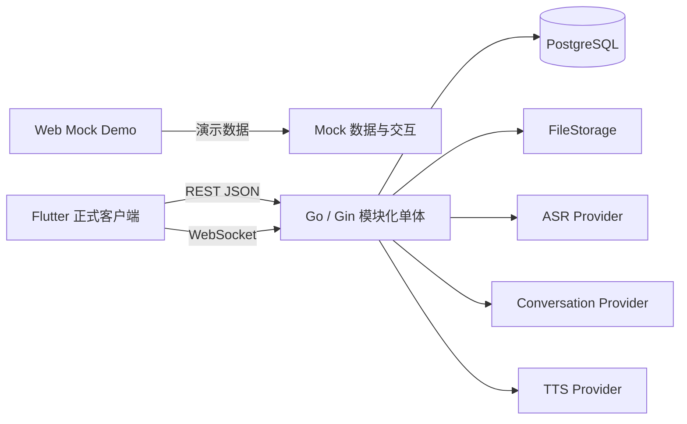
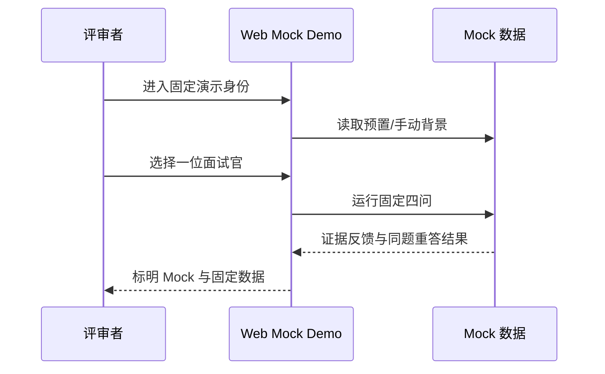
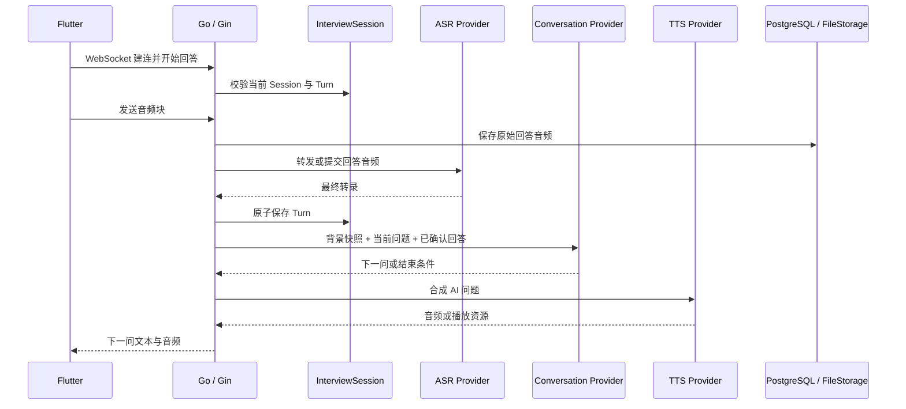
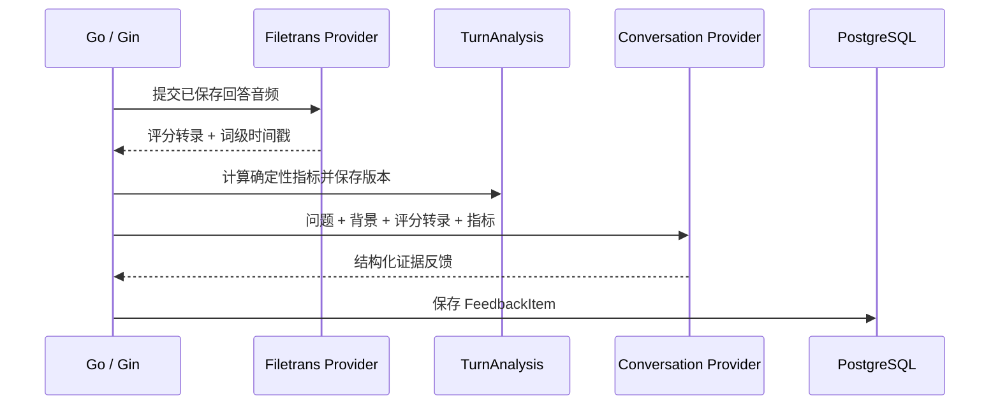

# [提案] SpeakUp MS1 系统架构与技术选型

> 状态：评审草案，跟踪 Issue [#15](https://github.com/1024XEngineer/XE3-ESL/issues/15)<br>
> 日期：2026-07-14<br>
> 技术裁定：[#3](https://github.com/1024XEngineer/XE3-ESL/issues/3#issuecomment-4967887496)<br>
> 产品输入：[#10](https://github.com/1024XEngineer/XE3-ESL/issues/10)、[#11](https://github.com/1024XEngineer/XE3-ESL/issues/11)、[#12](https://github.com/1024XEngineer/XE3-ESL/issues/12)、[#14](https://github.com/1024XEngineer/XE3-ESL/issues/14)

## 1. 文档职责

本文决定 MS1 的系统边界、模块职责、依赖方向、关键不变量、通信分工和 Mock/真实实现关系。

本文不定义完整数据库字段、OpenAPI 字段、WebSocket 消息字段、Prompt、评分算法或代码目录。它们必须在 #15 通过后拆成单一可验收 Issue；PostgreSQL 物理设计由 #17 负责。

### 1.1 权威关系

- #15 评审通过并合入后，本文是系统设计、任务拆分和 Review 的主架构基线。
- #3 保存技术调研与裁定依据，#15 保存架构评审状态和变更记录，不复制本文全部内容。
- 本文处于草案阶段时，以已确认产品 Proposal 和 #3 最终裁定为输入；本文正式合入后，团队日常实现优先查本文。
- 后续架构变化必须先通过 #15 或新的架构 Proposal 形成结论，再同步本文和受影响的专项文档。

## 2. 决策摘要

| 方向 | 决策 | 当前边界 |
|---|---|---|
| 正式客户端 | Flutter | 唯一正式客户端；React + Vite + Tailwind 只保留为 Web Mock Demo |
| 后端 | Go + Gin 模块化单体 | 基于 `net/http`；不拆微服务，不预设 Python sidecar |
| 数据库 | PostgreSQL | 保存业务对象、状态、版本和文件元数据 |
| 文件 | `FileStorage` 抽象 | MS1 可用本地文件，数据库只保存稳定 `storage_key` |
| 普通通信 | REST JSON | 非实时资源操作 |
| 实时通信 | WebSocket | MS1 可 Mock；MS2 先实现点击说话链路 |
| 实时 ASR | `qwen3-asr-flash-realtime`（北京） | Fun-ASR-Realtime 为技术词、热词或实时词级时间戳备选 |
| 回答后转录 | `qwen3-asr-flash-filetrans`（北京） | 为 `TurnAnalysis` 提供评分转录和词级时间戳 |
| 对话模型 | `qwen3.6-flash-2026-04-16`（北京、非思考） | 质量不足时切换 `qwen3.7-plus` |
| TTS | MiMo TTS 当前默认 | MiniMax / CosyVoice 为国内备选，Azure 为国际备用 |
| RAG | MS1 不采用 | 使用确认背景快照和当前 Session 必要上下文 |
| 供应商隔离 | 窄能力 Provider | 业务模块不得依赖厂商 SDK、事件名或返回对象 |

## 3. 架构目标

1. MS1 在外部 AI 服务关闭时仍能稳定演示主链路。
2. 产品概念只有一套，Mock 与真实实现共享相同业务对象和状态语义。
3. 一个成员能够在模块边界内独立开发，不需要理解整个系统。
4. 已完成 Turn、原回答、反馈和复练版本不会因当前请求失败而丢失。
5. 用户私有数据具有一致归属，不能通过子资源引用跨用户数据。
6. 供应商可以替换，但不为尚未发生的切换建设双活或复杂路由。

## 4. 系统上下文



边界解释：

- Web Demo 不承担 Flutter、真实录音或生产部署的架构验收。
- Go 后端拥有业务状态，外部供应商只提供识别、生成或合成能力。
- PostgreSQL 不保存 PDF 或音频二进制，只保存文件键、元数据和业务关系。
- MS1 不接入 RAG、向量数据库、支付、会员、角色市场或复杂任务队列。

## 5. 构建块与职责

```text
Delivery
  -> Identity
  -> Resume
  -> InterviewPlan
  -> InterviewSession
  -> TurnAnalysis
  -> Feedback
  -> History

Infrastructure
  -> PostgreSQL Repository
  -> FileStorage
  -> Mock / ASR / Conversation / TTS Providers
```

| 模块 | 职责 | 不负责 |
|---|---|---|
| Delivery | REST/WS 入口、认证上下文、输入校验、错误映射 | 业务规则、厂商事件透传 |
| Identity | 固定演示身份；后续真实认证和数据归属 | 会员、订单、社交关系 |
| Resume | 文件元数据、解析状态、确认背景快照 | ATS 评分、简历编辑 |
| InterviewPlan | 岗位背景、1–4 位面试官、确认快照 | 进行中的会话状态 |
| InterviewSession | 一位面试官的一场四问、Turn 状态和恢复 | 跨 Session 的成长统计 |
| TurnAnalysis | 评分转录、词级时间戳、确定性指标、状态和版本 | 修改原 Turn、无证据总分 |
| Feedback | 引用原回答的诊断、改进目标和复练对比 | 虚构经历、覆盖历史版本 |
| History | 计划、面试官、Session、反馈和复练的查询聚合 | 重新解释历史数据 |

## 6. 架构不变量

1. 一个 `InterviewPlan` 包含 1–4 位 `Interviewer`。
2. 一个 `InterviewSession` 只属于一位 `Interviewer`。
3. 一场完整 Session 固定四个有效 `Turn`，同一序号不可重复。
4. 目标岗位和背景在创建计划时形成快照；当前简历变化不修改历史计划。
5. 原回答、反馈和每次 `RetryAttempt` 只追加，不覆盖已有版本。
6. `TurnAnalysis` 可以失败和重试，但不能改变已完成 Turn。
7. 所有用户私有资源必须有一致归属，子资源不能跨用户引用父资源。
8. Mock 与真实 Provider 返回相同的业务语义和错误分类。
9. Flutter 不接收厂商 API Key，也不直接依赖厂商事件结构。
10. 未实测的准确率、TTFT、质量和成本不得保存或展示为已验证事实。

## 7. 核心领域关系

```mermaid
erDiagram
  User ||--o{ Resume : owns
  User ||--o{ InterviewPlan : creates
  InterviewPlan ||--|{ Interviewer : contains
  Interviewer ||--o{ InterviewSession : starts
  InterviewSession ||--|{ Turn : contains
  Turn ||--o| TurnAnalysis : analyzed_by
  Turn ||--o| FeedbackItem : produces
  Turn ||--o{ RetryAttempt : retries
  Turn ||--o{ AudioAsset : records
  RetryAttempt ||--o{ AudioAsset : records
```



物理表、外键、复合约束、删除语义和可执行 SQL 不在本文重复，统一由 #17 收口。

## 8. 运行时视图

### 8.1 MS1 Mock 演示



MS1 Demo 不依赖真实 Go、PostgreSQL、ASR、LLM 或 TTS。接口主干可以存在，但外部服务不构成演示阻塞条件。

### 8.2 MS2 点击说话四问



点击说话链路中，客户端明确开始和结束回答；不在 MS2 首次实现中承诺连续全双工、自动打断或多人同场。

### 8.3 回答后分析与反馈



- Qwen Realtime 当前不提供词级时间戳，不能单独承担 `TurnAnalysis`。
- 普通 ASR 只回答“说了什么”，不等于发音评测。
- 反馈引用必须能定位到保存的转录；定位失败时不得保存为确定证据。

### 8.4 同题重答

```text
FeedbackItem
  -> 创建 RetryAttempt
  -> 保存新音频和转录
  -> 只检查原改进目标
  -> 保存“已补充 / 仍缺少”
```

复练不能覆盖原 Turn，也不能重新生成一套与原缺口无关的总评分。

## 9. 接口边界

### 9.1 REST

REST 负责：

- 身份和会话外资源；
- 背景、计划和面试官；
- 历史、报告和反馈查询；
- 文件元数据和受保护访问；
- 后续真实账户的数据删除请求。

### 9.2 WebSocket

WebSocket 只负责：

- Session 建连和恢复；
- 回答音频块和控制事件；
- 转录、处理状态、下一问和错误事件；
- 心跳、断线和当前题重试语义。

不得把普通 CRUD 全部迁入 WebSocket，也不得把厂商原始事件直接转发给 Flutter。

### 9.3 Provider

| Provider | 最小职责 | 首选与备选 |
|---|---|---|
| `ASRProvider` | 实时识别、最终转录、错误归一化 | Qwen Realtime；Fun-ASR 备选 |
| `FileTranscriptionProvider` | 回答后评分转录和词级时间戳 | Qwen Filetrans |
| `ConversationProvider` | 四问、受控追问、结构化反馈 | Qwen3.6 Flash；Qwen3.7 Plus 备选 |
| `TTSProvider` | 文本转语音和播放资源 | MiMo；MiniMax / CosyVoice / Azure 备选 |
| `ResumeParserProvider` | PDF 文本转背景候选 | MS1 Mock；MS2 再决定实现 |

Provider 只隔离必要能力，不建设双厂商同时在线、自动故障转移或通用 Agent 框架。

## 10. 数据与文件一致性

- PostgreSQL 保存业务对象、状态、版本、归属关系和 `storage_key`。
- `FileStorage` 保存 PDF、回答音频和复练音频；文件键不能包含本地绝对路径。
- 数据库提交与文件写入无法共享事务，必须支持补偿清理和幂等重试。
- 删除简历不删除历史计划的背景快照。
- 真实注销启用后，删除范围必须覆盖数据库记录与受保护文件。
- 账户、计划、Session、Turn、反馈和文件的用户归属必须一致。

## 11. 错误与恢复

| 场景 | 状态处理 | 用户动作 |
|---|---|---|
| 当前回答上传失败 | 不创建有效 Turn | 重答当前题 |
| ASR 失败 | 保留音频和当前题 | 重试识别或重答 |
| 下一问生成失败 | 已完成 Turn 不回滚 | 重试生成 |
| TTS 失败 | 保留下一问文本 | 重试播放或降级文本 |
| TurnAnalysis 失败 | Turn 保持完成 | 单独重试分析 |
| Feedback 失败 | Analysis 保持完成 | 单独重试反馈 |
| WebSocket 断线 | 按服务端状态恢复 | 不重复已完成 Turn |

所有重试必须使用业务幂等键，不能依赖厂商请求 ID 作为唯一业务状态。

## 12. 安全与隐私

- API Key 只保存在后端配置，不进入客户端、日志或仓库。
- 所有私有资源查询必须带认证后的用户上下文；MS1 固定身份也保留归属字段。
- 文件通过受保护接口或短时签名地址访问，不暴露永久公共 URL。
- 日志不记录密码、完整简历、完整音频、完整 Prompt 或供应商密钥。
- 北京地域用于中国内地存储和推理，但不能替代应用自身的隐私、内容安全或备案判断。

## 13. Mock 与真实实现映射

| 能力 | MS1 | MS2 起 |
|---|---|---|
| 身份 | 固定演示用户 | 一种真实认证方式 |
| 简历背景 | 预置或手动 | 一份文本型 PDF 上传与确认 |
| 面试官 | 固定/可编辑演示数据 | 根据确认背景生成并保存 |
| 四问 | 固定脚本，至少一次上下文追问 | 一个面试官的真实点击说话四问 |
| 语音 | 预置音频或本地模拟 | Flutter + Go WebSocket + ASR/TTS |
| 反馈 | 固定结构化证据反馈 | 基于真实转录生成并保存 |
| 同题重答 | 一次 Mock 版本对比 | 保存真实 RetryAttempt |
| 历史 | 固定演示记录 | 跨会话访问核心数据 |

## 14. 关键决策记录

### 14.1 模块化单体

- 选择：Go + Gin 模块化单体。
- 原因：两个月周期、团队规模和当前并发不需要微服务。
- 代价：部署仍是整体发布；模块边界必须靠代码结构和依赖规则维持。

### 14.2 Flutter 与 Web 分工

- 选择：Flutter 是正式客户端，Web 只负责当前 Mock Demo。
- 原因：避免同时维护两套正式 UI，并让移动端语音体验成为最终交付基线。
- 代价：Web Demo 代码不直接沉淀为正式客户端。

### 14.3 REST 与 WebSocket 分工

- 选择：资源管理使用 REST，实时会话使用 WebSocket。
- 原因：保持接口可调试性，同时满足音频流和服务端事件推送。
- 代价：团队需要维护两类接口契约。

### 14.4 ASR + LLM + TTS Provider，不采用单一 S2S 绑定

- 选择：业务通过独立 Provider 组合识别、生成和合成。
- 原因：与 #3 最终裁定一致，便于单独处理回答后时间戳、证据反馈和供应商替换。
- 代价：端到端延迟需要在 MS2 集成时控制；不宣称尚未实测的性能。

### 14.5 PostgreSQL 与 FileStorage

- 选择：关系数据进入 PostgreSQL，文件进入 `FileStorage`。
- 原因：关系约束、版本和用户归属适合 PostgreSQL；文件不应作为数据库大对象处理。
- 代价：必须补偿数据库与文件之间的不一致。

### 14.6 MS1 不采用 RAG

- 选择：直接使用用户确认背景快照和当前 Session 上下文。
- 原因：当前数据规模小且来源单一，RAG 会增加索引、权限、版本和召回复杂度。
- 触发条件：出现多资料、长期历史或岗位知识库的可解释检索需求时另开 Proposal。

## 15. 风险与后续验证

| 优先级 | 风险 | 处理 |
|---|---|---|
| P0 | Web Demo 被误当成正式客户端 | 在文档、Issue、汇报和验收中持续标明 Mock |
| P0 | 产品文档仍残留旧 MS1 范围 | 由 #16 修订并评审图文 PRD |
| P0 | 数据模型无法表达 TurnAnalysis 和归属约束 | 由 #17 完成 Schema 与验证示例 |
| P1 | Flutter 音频格式、重连或播放不兼容 | MS2 接入验收记录真实设备和限制 |
| P1 | ASR 技术词、时间戳或费用不满足 | 切换 Fun-ASR 或调整回答后转录方案 |
| P1 | Qwen3.6 Flash 追问质量不足 | 使用相同输入切换 Qwen3.7 Plus |
| P1 | TTS 默认供应商价格或稳定性变化 | 通过 `TTSProvider` 切换 MiniMax / CosyVoice / Azure |
| P1 | 模型反馈引用不存在的证据 | 服务端校验引用，失败时不保存确定结论 |

MS1 不单独执行 ASR/LLM PoC。真实准确率、TTFT、质量和账单随 MS2 接入验收记录；未验证数据不得写成官方承诺或产品事实。

## 16. MS1 架构验收

- [ ] 模块职责、依赖方向和十条架构不变量经团队确认。
- [ ] #10、#11、#12、#14 均能映射到明确模块和 Mock/真实边界。
- [ ] Flutter 正式客户端与 Web Mock Demo 边界明确。
- [ ] REST、WebSocket 和 Provider 的职责不重叠。
- [ ] PostgreSQL 与 FileStorage 的分工及补偿风险明确。
- [ ] `TurnAnalysis` 独立于原 Turn，支持失败和重试。
- [ ] ASR、回答后转录、对话模型和 TTS 与 #3 最终裁定一致。
- [ ] MS1 关闭外部供应商时仍可完成 Demo。
- [ ] 未把真实注册、PDF 解析、连续语音、自定义角色或 RAG 写入 MS1 真实交付。
- [ ] 后续实现能从本文拆出，不需要重新讨论产品含义。

## 17. 后续 Issue

- 产品与截图同步：[#16](https://github.com/1024XEngineer/XE3-ESL/issues/16)
- PostgreSQL 与 `TurnAnalysis`：[#17](https://github.com/1024XEngineer/XE3-ESL/issues/17)
- 代码空骨架、REST 契约、WebSocket 协议、Flutter 音频和供应商接入：在 #15 接受后分别创建单一可验收子 Issue。

本文通过 #15 评审后冻结；供应商版本或价格变化只更新对应实现 Issue，除非变化会改变模块边界、数据语义或 MS1 范围。
