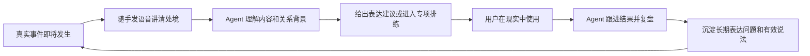
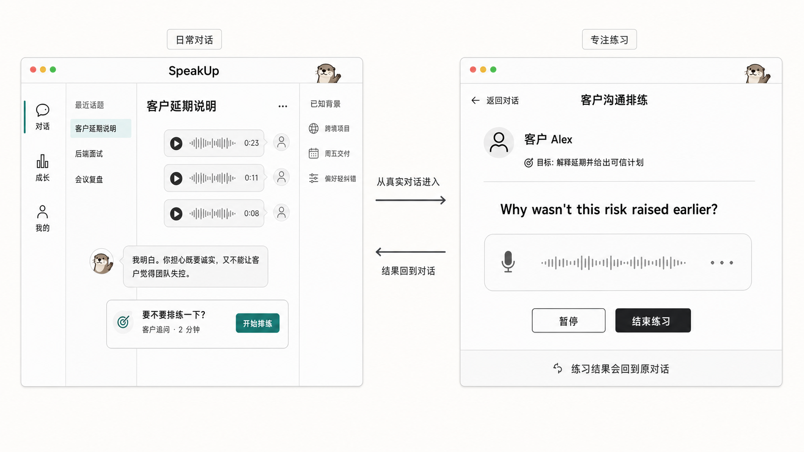

# SpeakUp 产品方向重新评估

> 日期：2026-07-19
> 决策问题：继续做“英文面试练习产品”，还是转向“异步语音长期 Agent”？
> 评估依据：当前可交互原型、项目内部调研、一次新增用户访谈、竞品官方数据与相关研究
> 当前结论：**批准验证新方向，不批准直接全面 Pivot。**

## 一页结论

### 1. 师兄的需求成立到什么程度

| 判断层级 | 当前证据 | 结论 |
|---|---|---|
| 用户没有整块学习时间，不愿每次“开始一节练习” | 内部调研、师兄访谈、微信语音学习研究均有相邻证据 | **高度可信** |
| 用户希望低压力地连续表达，不被 AI 机械打断 | 师兄直接反馈；内部低评分评论中“AI 对话机械不灵活”出现 102 次 | **高度可信** |
| 异步语音是自然交互 | 微信/WhatsApp 已完成用户教育；中国成人英语学习研究也出现正向结果 | **成立** |
| 长期记忆会提高跨天复访 | 竞品正在投入，用户有需求信号 | **合理但未验证** |
| 用户会长期用 SpeakUp，而不是 ChatGPT、Speak 或 Praktika | 没有行为或付费证据 | **尚未成立** |
| 应该马上做角色广场或泛 AI 陪伴 | 没有证据，且竞争与运营成本很高 | **不成立** |

因此，最准确的判断不是“这个需求成立/不成立”二选一，而是：

> **问题层已经足够可信，值得立即做产品实验；解决方案层和商业层仍需验证。**

### 2. 当前英文面试方向是否做错了

没有做错，但把一个好的切口误当成了最终产品。

英文面试的优点是：目标明确、失败代价高、容易解释价值、容易形成结构化反馈。它非常适合作为早期获客入口和高价值专项。

它的结构性缺点是：低频、阶段性强。用户面试前密集使用，面试结束后自然失去回来理由。因此：

> **面试应该从“整个产品”降为 SpeakUp Agent 的一项专注能力。**

### 3. 当前原型能否作为最终形态

不能。

当前原型可以继续作为“正式训练模式”的基础，但不能作为整个产品的最终主形态。它体现的是：

```text
选择功能 → 配置训练 → 进入固定回合 → 结束 → 查看报告
```

师兄描述的使用模型是：

```text
现实中发生一件事 → 随手发几段语音 → Agent 理解并承接
→ 必要时练一下 → 回到现实 → 第二天继续
```

两者不是多一个语音按钮的差别，而是产品入口、节奏和留存机制都不同。

### 4. 推荐的新产品命题

不要定义成“英语聊天 Agent”或“AI 朋友”，那会直接落入通用 AI 和成熟口语产品的竞争。

更窄、更可信的命题是：

> **面向没有固定学习时间、但每周都会遇到真实英语沟通的中国职场人，SpeakUp 是一个可以随时发语音的职业英语联系人。它记得用户的工作背景，在真实事件前帮助准备和排练，事件后帮助复盘，并持续把现实沟通变成可见的英语成长。**

### 5. 现在应该做什么

不是马上重写后端，而是先用 14 天验证三个行为：

1. 用户会不会在没有“开始练习”提示时主动发语音；
2. 用户会不会在不同日期回来继续真实事件；
3. 用户是否真的把建议用于面试、会议、客户或同事沟通。

只有这些行为成立，长期 Agent 才有资格成为最终主界面。

---

## Product Snapshot：当前产品到底是什么

### 当前定位

现有 Proposal 对 SpeakUp 的定义是：

> 以英文技术相关岗位模拟面试为核心、以可配置角色对话为扩展的 AI 语音练习教练。

当前主链路完整而清楚：岗位/JD/简历 → 面试方案 → 多轮问答 → 报告 → 错题复练。这套设计对“下周有一场重要英文面试”的用户是合理的。

### 实际走查当前原型后的判断

本次重新走查了以下路径：

1. Agent 首页“今天想练什么？”；
2. 创建模拟面试的 1/4 配置流程；
3. 一句话生成“英文餐厅点餐”；
4. 场景确认；
5. Bob 的第 1/4 轮语音练习。

原型暴露的不是单纯视觉问题，而是五个产品假设：

| 当前原型的默认假设 | 新访谈暴露的问题 |
|---|---|
| 用户打开 App 时已经知道今天要练什么 | 用户往往只有一件刚发生、说不清楚的现实问题 |
| 用户愿意先配置，再开始练习 | 忙碌用户不愿承担启动仪式 |
| 每次使用是一段完整 Session | 用户可能分几分钟、几小时甚至跨天交流 |
| AI 提问，用户逐轮回答 | 用户想先连续讲完整，再决定是否练习 |
| 报告在 Session 结束后产生价值 | 用户更关心下一次现实沟通是否说得更好 |

### 为什么它显得“传统”

传统感不是来自黑白配色或卡片，而是来自学习范式：

- 首页要求用户先选择训练任务；
- 面试显示“1/4”，场景练习显示“第 1/4 轮”；
- 用户需要经过场景生成、场景确认、开始练习；
- AI 的主要职责是提问、推进和结束回合；
- 学习价值集中在结束后的报告。

即使把“面试”换成“餐厅点餐”，底层仍然是一次四轮课程。它拓宽了内容，没有改变使用方式。

对应实现：

- Agent 首页和入口：[panel-extension.js](../../../../prototype/speakup-premium/assets/panel-extension.js#L442)
- 静态最近对话：[panel-extension.js](../../../../prototype/speakup-premium/assets/panel-extension.js#L225)
- 固定场景角色和回合：[panel-extension.js](../../../../prototype/speakup-premium/assets/panel-extension.js#L305)
- 一问一答语音 Mock：[panel-extension.js](../../../../prototype/speakup-premium/assets/panel-extension.js#L484)
- 浏览器本地持久化：[interview-alignment.js](../../../../prototype/speakup-premium/assets/interview-alignment.js#L27)
- 数据库能力：当前精简后的产品原型未接入数据库，仅保留浏览器本地状态
- 430px 手机画布限制：[prototype.html](../../../../prototype/speakup-premium/pages/prototype.html#L1851)

### 哪些资产值得保留

现有成果并没有白做。真正有价值的是学习能力，而不是页面层级：

1. JD、简历、岗位和真实经历上下文；
2. 基于上一轮回答的追问；
3. 原音、转写、证据诊断和优化表达；
4. 错题收藏、同题复练和多版本对比；
5. 面试与场景角色扮演；
6. 正式训练结束后的结构化报告。

这些能力可以成为长期 Agent 背后的工具。预计可以延用约 30%–40% 的页面和学习资产，但最终主路径需要重新设计。

---

## Evidence：为什么值得验证，又为什么还不能下结论

### 项目内部证据

项目现有需求研究覆盖了 80 条公开社媒内容：日常与自由表达 30 条，职场、面试与客户沟通 22 条；“稳定、可持续的口语练习机会”和“可信、可解释的反馈”各出现 8 条。但报告也明确注明：**用户访谈未执行**。[用户需求调研综合报告](../../week1/覃迦迎/2026-07-08-用户需求调研综合报告.md)

另一份报告对 2,061 条低评分评论做标签分析，“AI 对话内容机械不灵活”出现 102 次，覆盖 9 个产品。[未满足需求 Top10](../../week1/黄天宇/2026-07-08-未满足需求Top10.md)

这些资料能证明相邻问题存在，却不能证明异步长期 Agent 会留存。师兄是项目目前第一个高质量直接访谈信号，但仍然只是 `n=1`。

### 外部证据

| 证据 | 它能证明什么 | 它不能证明什么 |
|---|---|---|
| WhatsApp 曾披露日均约 70 亿条语音消息。[官方资料](https://about.fb.com/news/2022/03/new-voice-message-features-on-whatsapp/) | 异步语音是成熟沟通习惯 | 用户会用它学习英语 |
| 一项面向中国成人英语学习者的微信语音研究使用问卷 `n=50`、访谈 `n=5`，参与者认可其打破时间和地域限制的价值。[CALL-EJ](https://callej.org/index.php/journal/article/view/329) | 微信语音式学习确有可用性信号 | AI 长期 Agent 会留存或付费 |
| 2025 年一项 `n=120` 的研究中，持续使用 AI chatbot 的实验组在口语相关指标上优于对照组。[ScienceDirect](https://www.sciencedirect.com/science/article/pii/S2590291125006618) | AI 对话可以成为有效练习手段 | 异步比实时更好 |
| Speak 官方披露 2025 年用户说了 37.4 亿句、练习 1,960 万小时，并创建 8,030 万个个性化课程。[Speak Wrapped 2025](https://www.speak.com/blog/speak-wrapped-2025) | AI 口语练习存在大规模真实使用 | SpeakUp 的具体方向成立 |
| Speak 在 2024 年完成 7,800 万美元 Series C、估值 10 亿美元；此前自报 1,000 万学习者。[Series C](https://www.speak.com/blog/series-c)、[Series B-3](https://www.speak.com/blog/series-b-3) | 市场和资本认可 AI 口语赛道 | 小团队复制 Tutor 就能成功 |
| Praktika 当前自报 3,000 万学习者、120 万+评分，并已提供自由话题、温和纠错和“记住上下文”的 AI tutor。[Praktika](https://praktika.ai/) | “角色 + 记忆 + 自由聊天”已是现有竞争 | SpeakUp 只靠这些就有差异 |
| RevenueCat 2026 基于 11.5 万+订阅应用的数据称，AI 应用每用户收入高 41%，但 12 个月留存差 36%。[RevenueCat](https://www.revenuecat.com/blog/growth/subscription-app-trends-benchmarks-2026/) | AI 新鲜感能转化，但长期留存风险很高 | SpeakUp 必然有同样表现 |

### 证据汇总

可以确认：

- 用户愿意使用语音沟通；
- 用户愿意使用 AI 练口语；
- 碎片时间、低压力表达和对话机械是真问题；
- 个性化、自由对话和上下文记忆正在成为竞品标准。

不能确认：

- 多段异步语音是不是目标人群的高频偏好；
- 用户是否会在没有迫切任务时主动回来；
- 长期记忆是否真的提升价值，而不是引发被监视感；
- 用户是否愿意为 SpeakUp 而不是通用 AI 付费。

---

## Competitive Landscape：不能做成谁的缩小版

### Speak

Speak 已经有 24/7 personal Tutor，可根据学习活动调整，并允许创建个性化口语课。[Speak Tutor](https://help.speak.com/en/articles/11396739-what-is-speak-tutor)

如果 SpeakUp 只是“可以聊天并生成练习”，会成为规模更小的 Speak。

### Praktika

Praktika 已把 tutor 人格、自由话题、上下文记忆、轻纠错和低价格组合起来。[Praktika](https://praktika.ai/)

如果 SpeakUp 只是“更像朋友的英语 Agent”，会成为规模更小的 Praktika。

### Duolingo

Duolingo 的 Video Call with Lily 已经提供可随时发起的自由实时对话，并将它放入 Max 付费层。[Duolingo Video Call](https://blog.duolingo.com/video-call/)

如果 SpeakUp 只是“能和固定角色实时语音”，没有差异。

### ChatGPT

通用 AI 已具备语音和可管理的长期记忆。[ChatGPT Memory](https://help.openai.com/en/articles/8590148-memory-in-chatgpt) 用户一定会问：为什么不直接用 ChatGPT？

SpeakUp 必须回答的不是“我也能聊天”，而是：

> **我会持续跟进用户现实中的英语结果，并把准备、使用、复盘和再次改善连成闭环。**

---

## Part I：新的产品 Thesis

### 不建议的两个极端

#### 极端 A：继续只做面试产品

优点：定位清楚、演示完整、短期付费理由强。

问题：需求随面试结束而消失，留存上限低；正式创建流程也不适合碎片使用。

#### 极端 B：直接做泛英语朋友/角色广场

优点：话题多、理论频率高、容易讲“陪伴”。

问题：需求过宽、和 ChatGPT/Praktika/Character.AI 重叠、角色供给和内容治理很重，也容易只剩新鲜感。

### 推荐方向：持续的职业英语联系人

首批用户应进一步收窄为：

> 中文母语、约 B1–B2 水平、每周至少有 1–2 次真实工作英语需求、习惯使用微信语音、又不愿预约真人老师的跨境或国际化职场人。

优先职业可以是：跨境销售、海外运营、产品经理、客户成功、创业者和需要国际协作的技术人员。

### 真正的产品闭环



这里的差异化不是某个按钮，而是：

- 通用 AI 回答当前问题；
- SpeakUp 持续对用户下一次是否说得更好负责。

### 面试应该放在哪里

```text
日常异步对话
    ↓ 发现真实表达困难
聊天内轻建议
    ↓ 用户需要集中排练
面试 / 客户 / 会议专注模式
    ↓ 完成
结果回到原对话，并更新成长记录
```

例如用户说：

> “明天我要跟美国客户解释延期，但真实原因是内部资源没有协调好。”

Agent 先理解现实处境和沟通风险，而不是立刻纠错。聊清楚后，它可以自然提出：

> “要不要我扮演客户追问你两轮？我们把这个解释练得既诚实又不显得失控。”

这时才调用现有场景或正式训练能力。

---

## Part II：当前原型如何进化



### 最终主形态的判断

> **现有原型适合作为“专注训练模式”，不适合作为“产品首页和日常关系”。**

不需要增加很多页面。顶层只保留三个用户能理解的概念：

1. 对话：最近发生的真实事情；
2. 成长：长期表达问题、已经掌握的说法和现实使用记录；
3. 我的：目标、简历、记忆、隐私和设置。

面试、场景、报告、错题都降为对话内可以调用的能力。

### 一个界面，两种状态

桌面端：

```text
┌──────────────┬──────────────────────────┬─────────────────┐
│ 对话 / 成长   │ 当前长期对话              │ 按需打开          │
│ 最近话题      │ 文字、语音、任务卡         │ 记忆 / 表达建议    │
│ 面试记录      │                          │ 简历 / 练习结果    │
└──────────────┴──────────────────────────┴─────────────────┘
```

移动端仍然是同一个主聊天，左右栏收进抽屉和底部 Sheet。桌面不再把 430px 手机画布放在中央。

### 首页应该怎么变化

当前首页：

> 今天想练什么？创建模拟面试 / 场景口语练习 / 继续上次练习

建议首页直接恢复真实对话：

> “昨天你说今天要和客户解释延期，后来沟通得怎么样？”

第一次使用时也不要先展示功能菜单，可以问：

> “最近有没有一件你想用英语说清楚、但还没想好怎么说的事？”

用户说完后，产品再决定是否调用面试、场景、报告或复练。

### 哪些页面保留、降级或重做

| 当前能力 | 决策 | 新位置 |
|---|---|---|
| Agent Composer、对话抽屉 | 保留并增强 | 主界面 |
| 正式模拟面试 | 保留 | 对话中触发的专注模式 |
| 场景角色 | 保留 | 对话中临时调用，不做广场 |
| 报告与错题 | 保留并合并 | 成长记录和聊天内摘要 |
| 简历/JD | 保留 | Agent 已知背景，不反复填写 |
| “今天想练什么”空白首页 | 重做 | 真实持续对话 |
| 场景生成 → 确认 → 开始三段式 | 大幅压缩 | 聊天内一句确认或直接开始 |
| 固定四轮普通场景 | 取消默认限制 | 自然聊天；正式模式才有轮次 |
| 静态最近对话和 localStorage | 重做 | 真实账户级线程与记忆 |

### 原型能复用多少

- 视觉语言和移动端聊天壳：可以复用；
- 正式面试、报告、错题、角色练习：作为能力继续复用；
- 首页心智、核心路径、长期数据：需要重做；
- 当前原型整体：可以作为上周阶段性成果和能力演示，不能再描述为最终产品形态。

---

## Part III：先验证，再决定是否 Pivot

### 14 天 Concierge 实验

样本：12–15 名严格筛选的目标用户，而不是普通学生或泛英语兴趣用户。

入选条件：

- 最近两周确实发生过英文面试、会议、客户、同事或跨境沟通；
- 每周预计至少有一次真实英语需求；
- 有基础表达能力，但临场组织或自然表达存在困难；
- 平时习惯发语音消息；
- 不愿固定预约真人课程。

只提供：

1. 一个稳定的 SpeakUp 联系人；
2. 文字和连续语音；
3. 自然异步回复；
4. 少量可见记忆；
5. 可调用当前面试/场景专注模式；
6. 一份极简成长记录。

不建设：角色广场、复杂课程、完整后台、向量记忆、多 Agent 和实时电话。

为了验证需求，早期可以人工整理记忆、审核回复和触发练习，不需要先把完整系统全部开发出来。

### 要验证的核心假设

| 假设 | 行为证据 | 失败后的解释 |
|---|---|---|
| 用户会在没有任务入口时主动说 | 无提醒主动发起真实语音 | 只喜欢概念，不会形成行为 |
| 异步语音真的降低启动成本 | 自然连续发多段、不同时间回来补充 | 语音只是输入功能 |
| 产品能走出面试低频 | 出现会议、客户、同事等第二类场景 | 仍然只是面试工具 |
| 关系与记忆带来复访 | 跨天续聊，用户主动引用过去内容 | 记忆不是核心价值 |
| 学习闭环没有被聊天稀释 | 用户进入练习、使用建议并反馈现实结果 | 产品退化为陪聊 |
| 有独立付费价值 | 愿意真实支付或付订金 | 免费通用 AI 已经足够 |

### 建议 Go / No-Go 门槛

这些是内部实验目标，不是行业基准：

- 70% 以上完成第一次真实语音交流；
- 40% 以上在 14 天内至少使用 3 个不同日期；
- 50% 以上的使用是用户主动发起，而不是运营提醒；
- 50% 以上出现面试之外的第二类真实场景；
- 50% 以上报告把某条建议用于现实沟通；
- 20% 以上愿意真实支付或支付订金继续一个月；
- 多数复访用户能说清 SpeakUp 相比 ChatGPT 多提供了什么。

决策规则：

- 大部分指标通过：长期 Agent 升级为最终主界面，面试降为专注模式；
- 只有连续语音通过、跨天复访不通过：把异步语音作为现有面试产品的交互增强；
- 用户仍只在面试前使用：继续做面试切口，不扩成长期 Agent；
- 用户喜欢聊天但不进入练习、也没有现实结果：停止“陪伴”方向。

---

## Unified Priority Matrix

| 优先级 | 工作 | 目的 | Effort |
|---|---|---|---|
| P0 | 把当前原型首页改成一段持续对话的概念验证 | 让用户真正体验新心智 | Medium |
| P0 | 招募 12–15 名严格目标用户并完成 14 天实验 | 验证行为而不是收集口头意见 | Medium |
| P0 | 保留一个可从聊天触发的正式面试/客户演练 | 验证旧资产能否嵌入新闭环 | Low |
| P0 | 人工维护少量记忆和现实结果记录 | 验证记忆价值，无需先做复杂系统 | Low |
| P0 | 收取真实小额订金或下一月费用 | 验证付费，不问“愿不愿意” | Low |
| P1 | 实验通过后建设真实线程、消息和语音存储 | 支撑跨设备持续对话 | High |
| P1 | 建设可见、可修改、可删除的结构化记忆 | 建立长期信任 | High |
| P1 | 把报告和错题合并成“成长” | 证明产品不是陪聊 | Medium |
| P2 | 扩展会议、客户、入职和汇报等官方场景 | 扩展高频职业任务 | Medium |
| P3 | 角色广场、UGC、真人音色和公开社区 | 当前无证据且运营成本高 | Very High |

### 接下来两周建议

#### Week 1

- [ ] 修改概念原型：首页直接进入持续对话；
- [ ] 准备 3 条真实事件演示线：面试、客户延期、英文会议；
- [ ] 设计聊天 → 专注排练 → 回到聊天的完整闭环；
- [ ] 招募并筛选首批用户；
- [ ] 定义事件记录、主动发起、跨天复访和现实使用的埋点口径。

#### Week 2

- [ ] 运行 Concierge 实验；
- [ ] 每天记录用户为何发起、是否连续说、是否继续现实事件；
- [ ] 对照现有“先选择练习”的路径；
- [ ] 第 7 天做中期访谈，但不提前引导用户夸概念；
- [ ] 根据真实行为决定是否进入完整工程实现。

---

## 下次汇报的推荐说法

> 上周的原型验证了结构化英文面试训练的能力，但新的用户访谈暴露出一个更基础的问题：用户的英语需求并不是按课程和训练页面发生的，而是碎片化地出现在面试、会议和客户沟通等真实事件里。当前原型要求用户先决定“我要练什么”，这对有紧迫面试的人有效，但不适合作为长期形态。我们不会直接转向泛聊天或角色社区，而是用两周验证“持续的职业英语联系人”：用户可以随手发语音讲现实问题，Agent 在需要时调用现有面试、场景和反馈能力，并跨天跟进真实结果。验证通过后，面试会从整个产品降为高价值专注模式；未通过则只把异步语音作为现有面试产品的交互增强。

---

## Appendix：两个重度用户视角的共识

### 竞品用户视角

- 不会为了“另一个能聊天的 AI tutor”迁移；
- 会为了真实工作连续性、异步语音和现实结果闭环尝试；
- Speak、Praktika、Duolingo 和 ChatGPT 已覆盖通用对话、角色、语音或个性化中的大部分能力；
- SpeakUp 必须在“真实事件前后持续负责”上形成差异。

### SpeakUp 重度用户视角

- 当前最大摩擦不是角色少，而是每次都要先进入正式练习；
- 当前 Agent 是功能导航器，不是长期联系人；
- 面试、报告、错题和简历是重要资产，不应删除；
- 一个持续关系入口、多条现实话题和按需专注练习，比继续增加顶层功能更自然。

## 最终判定

> **师兄发现的不是一个“应该追加的语音功能”，而是当前产品可能把“训练”放在了用户前面。**

这足以要求团队改变下一步验证方式，但还不足以要求团队立即完成一次全面 Pivot。

最稳妥、也最有潜力的演进路径是：

```text
英文面试工具
→ 面试作为高意图入口
→ 持续的职业英语联系人
→ 用真实事件形成长期学习闭环
```

产品不是从“面试”变成“什么都能聊”，而是从：

> **用户必须先进入练习，变成练习在真实对话中自然发生。**
