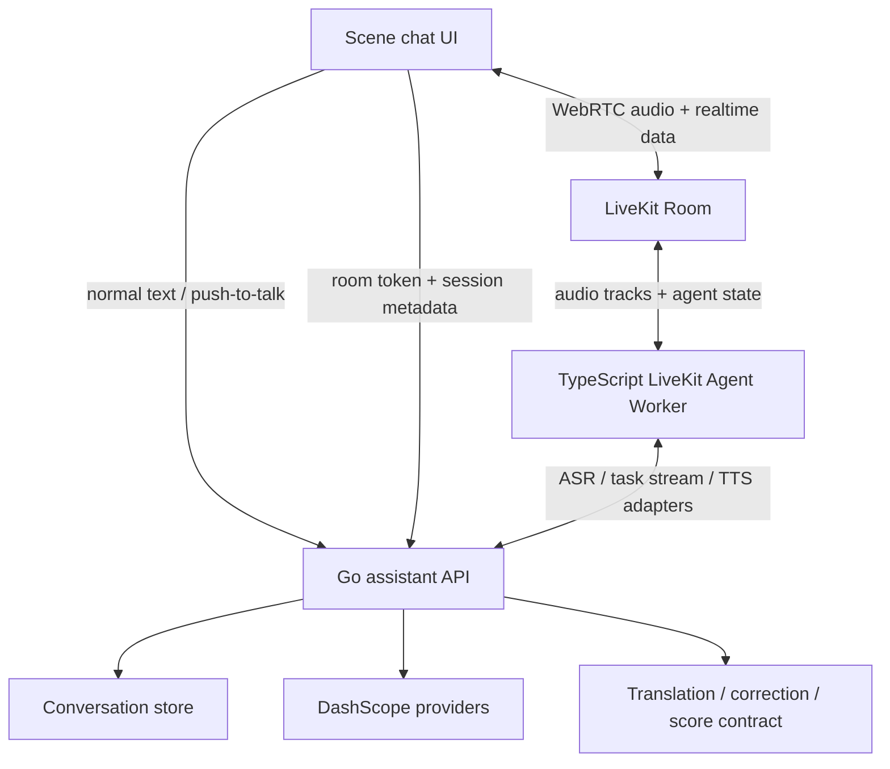
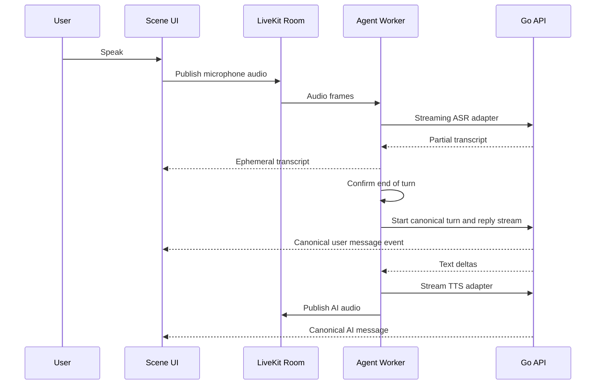
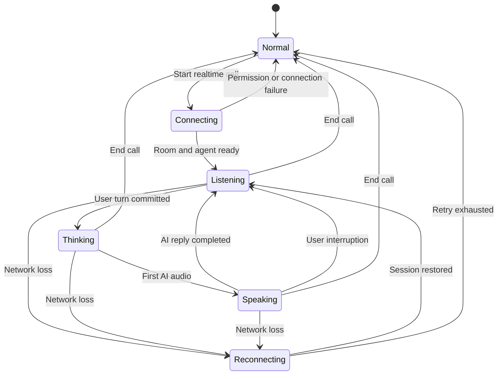

# feat: Add LiveKit hybrid voice conversations

## Goal Capsule

- **Objective:** 在场景对话中同时提供“普通一问一答”和“实时通话”两种模式，并允许用户在同一会话内切换。
- **User outcome:** 普通模式保持简洁、可控；实时模式能持续收音、自动判断轮次、支持打断，并尽快播放 AI 语音。
- **Canonical state:** Go 后端继续负责会话、消息、场景上下文和语言辅助结果；LiveKit 负责实时音频传输与通话生命周期。
- **Delivery shape:** 先完成可观测的低延迟基线与 LiveKit 技术验证，再逐步接入实时通话、持久化、容错和灰度开关。
- **Stop conditions:** 不把所有普通聊天迁移到 LiveKit，不在本计划中实现正式评分算法，不在未验证供应商兼容性前替换现有 DashScope 能力。

---

## Product Contract

### Summary

场景对话保留当前普通消息流，并新增一个显式的“实时通话”入口。两种模式共用 `thread_id`、场景上下文和历史消息，切换模式不会重开对话，也不会重复生成同一轮 AI 回复。

实时通话使用 LiveKit Room 承载浏览器音频、参与者状态和 Agent 音频。LiveKit Agent Worker 通过现有 Go 后端调用 DashScope 的识别、回复和合成能力，避免在两个服务中复制 Prompt、API Key 和供应商逻辑。

### Problem Frame

当前普通语音链路需要在停止录音后等待最终转写、上传录音、提交消息和 AI 回复，用户气泡与 AI 反馈的出现被串行步骤拖慢。这个链路适合按轮次提交，但不适合持续实时通话，因为它缺少自动断句、自然打断、持续房间音频和通话状态管理。

直接把所有聊天改成 LiveKit 会扩大改动面，并削弱普通模式的可控性。更合适的边界是保留现有 HTTP/SSE 消息模式，同时为实时通话建立独立的 WebRTC 通道，再由 Go 后端统一两种模式产生的最终消息。

### Requirements

**Dual-mode experience**

- R1. 场景对话必须提供普通模式与实时通话模式，并让用户通过明确按钮主动切换。
- R2. 模式切换必须沿用同一个 `thread_id` 和场景上下文，不得清空历史或创建互不关联的对话。
- R3. 普通模式必须保留文本输入、按一下开始录音、再按一下结束并发送的交互。
- R4. 用户结束普通模式录音后，用户气泡必须立即出现；录音上传和 AI 回复不得阻塞气泡展示。

**Realtime conversation**

- R5. 实时模式必须持续传输麦克风音频，自动识别用户开始和结束说话，并在轮次结束后自动生成 AI 回复。
- R6. 用户在 AI 说话期间开口时，系统必须停止或压低当前 AI 播放，并把新的用户语音作为下一轮输入。
- R7. UI 必须展示连接中、聆听中、思考中、说话中、重连中和失败等可理解状态。
- R8. 用户必须能随时退出实时模式；退出后普通模式仍可继续使用同一段上下文。

**Message and language tools**

- R9. 只有确认完成的最终用户转写和最终 AI 回复可以写入长期消息记录；中间转写只用于实时 UI。
- R10. 每个最终用户语音消息必须能关联自己的录音，每个 AI 消息必须继续支持重读和翻译。
- R11. 用户消息必须继续支持简短纠错与详情卡片；纠错、翻译和评分占位不得阻塞对话主链路。
- R12. 普通模式与实时模式必须使用同一套场景 Prompt、用户上下文和历史裁剪规则。

**Reliability and measurement**

- R13. LiveKit 不可用、麦克风权限被拒绝或实时连接失败时，页面必须保留普通模式并给出可恢复提示。
- R14. 每轮必须记录关键时间点，以区分收音、断句、转写、首个文本、首段语音和持久化各阶段的延迟。
- R15. 同一轮在重连、重试或模式切换时必须使用稳定幂等键，避免重复用户气泡或重复 AI 回复。

### Acceptance Examples

- AE1. 用户在普通模式录音后第二次点击麦克风，页面先立即显示带“处理中”状态的用户气泡，再异步补齐转写和录音；AI 回复稍后独立出现。Covers R3, R4, R10.
- AE2. 用户从普通模式切到实时通话，说完一句后不再点击发送；系统自动确认轮次、显示最终用户气泡并播放 AI 回复。Covers R1, R2, R5, R9.
- AE3. AI 正在说话时用户提出补充，AI 音频在目标时间内停止，新语音成为下一轮，旧回复不会再次完整播放。Covers R6, R15.
- AE4. 实时房间断线后自动重连；重连失败时退出到普通模式，已确认的消息仍保留，未确认的中间转写不进入历史。Covers R8, R9, R13.
- AE5. 用户退出实时通话后点击上一条 AI 消息的翻译或重读，功能与普通模式消息一致。Covers R8, R10, R11.

### Scope Boundaries

**In scope**

- 场景对话页的双模式入口、实时通话状态和消息同步。
- LiveKit token/session 接口、LiveKit Agent Worker、Go 后端的实时会话协调与最终消息归档。
- 普通语音消息的乐观展示与非阻塞录音上传。
- 翻译、纠错、重读和录音回放对两种模式最终消息的兼容。
- 延迟指标、断线重连、功能开关和失败降级。

**Outside this delivery**

- 正式的流利度、发音和地道度评分算法；本计划只保留队友可接入的数据位和 UI 契约。
- 视频通话、虚拟人、多人房间和电话 SIP 接入。
- 将所有文字聊天、历史页或非场景页面迁移到 LiveKit。
- 训练自有 VAD、端点检测或降噪模型。

### Deferred to Follow-Up Work

- 生产级录音存储生命周期、用户导出和批量删除。
- 自建 LiveKit 集群与多区域部署；首阶段按可替换配置接入 LiveKit Cloud 开发环境。
- 基于真实用户语料自动调参端点检测阈值。

---

## Planning Contract

### Key Technical Decisions

- KTD1. **采用混合架构，而不是全量迁移。** 普通模式继续使用现有 HTTP/WebSocket/SSE 路径；只有实时通话进入 LiveKit Room。这样能控制回归范围并满足 R1-R4。
- KTD2. **Go 后端是会话和最终消息的唯一事实来源。** LiveKit Worker 只持有通话期状态，通过稳定的 `thread_id`、`live_session_id`、`turn_id` 和幂等键读取上下文并回写最终轮次，防止双写和重复消息。Governs R2, R9, R12, R15.
- KTD3. **首版使用 STT-LLM-TTS 级联管线。** 该方案有完整的实时转写文本，便于气泡、翻译、纠错、审计和上下文持久化；纯 speech-to-speech 模型留作后续实验。Governs R5, R9-R12.
- KTD4. **新增 TypeScript LiveKit Agent Worker。** 项目已有 Node 运行时，LiveKit Node Agent SDK 能复用团队现有 TypeScript 工具链；Worker 通过适配器调用 Go 后端已有的 DashScope ASR、任务流和 TTS 能力，API Key 仍由 Go 侧持有。
- KTD5. **最终转写驱动持久化，中间转写只驱动 UI。** Worker 可以推送 partial transcript，但只有 turn committed 事件能创建正式用户消息和触发语言辅助。Governs R4, R5, R9, R11.
- KTD6. **录音上传与对话生成解耦。** 普通模式停止录音后先创建乐观气泡并提交最终文本，同时后台上传音频，再用消息 ID 关联附件；上传失败不撤销已发送的文字轮次。Governs R4, R10, R13.
- KTD7. **实时模式默认启用语义轮次检测、可打断和 LLM 预生成。** 首版关闭预生成 TTS，避免转写变化时浪费播放；基于延迟指标再决定是否开启。Governs R5, R6, R14.
- KTD8. **独立功能开关控制灰度。** `LIVEKIT_VOICE_ENABLED` 关闭或配置不完整时不展示实时入口，普通模式完全可用。Governs R1, R13.
- KTD9. **LiveKit 浏览器客户端由外层 React 主机管理。** 当前场景 UI 位于静态 iframe，外层 `frontend/app/page.tsx` 可以正常打包 LiveKit SDK；两层之间只通过校验 `origin`、`source` 和事件 schema 的 `postMessage` 交换控制与状态，避免在 public 目录引入 CDN 或手工 vendored SDK。Governs R1, R5-R8, R13.
- KTD10. **实时用户录音由 Worker 按确认轮次切片。** Worker 只缓冲当前未确认 turn 的必要音频帧，turn committed 后异步上传为消息附件，取消或 partial turn 立即丢弃；生产启用前必须落实同意与留存规则。Governs R9, R10, R13.

### High-Level Technical Design

#### Component topology

#### Realtime turn sequence

#### Client mode and call state

### Data and Event Contract

Every realtime event carries `thread_id`, `live_session_id`, `turn_id`, `client_message_id`, `mode`, `occurred_at` and `sequence`. Canonical message responses additionally carry the existing message ID and attachment metadata. Event names should distinguish ephemeral events such as `transcript.partial` from canonical events such as `turn.user_committed`, `turn.assistant_committed` and `attachment.linked`. The final transcript enters Go through one idempotent task-stream request that first commits the user message and emits its canonical event, then streams the assistant reply; Worker must not call a second message-commit path for the same turn.

The Worker may cache a bounded conversation window during a call, but it loads the initial context from Go and treats Go responses as authoritative after reconnect. The frontend reconciles optimistic entries by `client_message_id` instead of appending a second copy.

### Success Metrics

These are initial engineering targets and must be measured before being treated as product SLOs:

| Metric | Initial target |
|---|---:|
| Normal mode stop-recording to optimistic bubble | p95 under 100 ms |
| Final user audio to committed transcript | p50 under 600 ms; p95 under 1.2 s |
| Committed transcript to first AI text delta | p50 under 700 ms; p95 under 1.5 s |
| User end-of-turn to first AI audio | p50 under 1.5 s; p95 under 2.5 s |
| User interruption to AI audio stop | p50 under 250 ms; p95 under 500 ms |
| Duplicate canonical turns after retry/reconnect | 0 |

### Dependencies and Assumptions

- LiveKit Cloud is used for development and proof-of-concept, while room URL and credentials remain environment-driven.
- Existing Go routes for streaming transcription, task streaming and TTS remain the provider gateway; the Worker adds SDK adapters instead of duplicating DashScope prompts and credentials.
- New cross-cutting backend and frontend changes require a separate follow-up branch or coordinated PR because they exceed the original file boundary in `docs/ms2/agent-demo/docs/team-tasks/01-ai-dialogue-and-prompts.md`.
- Audio recording and transcript retention must follow the product's consent policy before production rollout.

### Risks and Mitigations

| Risk | Impact | Mitigation |
|---|---|---|
| Worker and Go both create messages | Duplicate turns and broken context | KTD2, stable idempotency keys, canonical commit acknowledgements |
| Current DashScope adapters do not fit LiveKit streaming interfaces | POC stalls or gains latency | Prove adapter contracts before UI integration; retain normal-mode fallback |
| Background speech causes false interruptions | AI stops too often | Start with adaptive interruption, minimum duration and false-interruption recovery; expose metrics |
| Mode switching races with an active turn | Lost or duplicate replies | Explicit client state machine and server-side session finalization |
| Audio upload failure blocks text conversation | Perceived send failure | KTD6, retry attachment separately and keep committed text |
| Token leakage or overly broad room grants | Security exposure | Server-generated short-lived tokens scoped to one room and participant |
| Recording/transcript retention lacks consent | Privacy risk | Visible call state, explicit entry/exit, retention policy gate before rollout |

---

## Implementation Units

### U1. Define realtime contracts and latency instrumentation

- **Goal:** 建立两种模式共用的标识、事件、状态和延迟测量契约。
- **Requirements:** R2, R7, R9, R14, R15.
- **Dependencies:** None.
- **Files:**
  - Modify `docs/ms2/agent-demo/backend/internal/assistant/model.go`
  - Modify `docs/ms2/agent-demo/backend/internal/assistant/ports.go`
  - Create `docs/ms2/agent-demo/backend/internal/assistant/live_contract_test.go`
  - Modify `docs/ms2/agent-demo/frontend/public/prototype/assets/agent-backend-bridge.js`
  - Modify `docs/ms2/agent-demo/frontend/tests/rendered-html.test.mjs`
- **Approach:**
  1. 定义 live session、turn、client message 和模式字段的稳定语义，并保持现有消息 JSON 向后兼容。
  2. 在浏览器、Worker 和 Go 的边界记录统一时间点，输出可关联的结构化延迟事件。
  3. 用 `client_message_id` 作为乐观气泡与 canonical message 的对账键。
- **Patterns to follow:** 复用现有 `IdempotencyKey`、`InteractionMode`、TaskRun 和前端 optimistic message 的命名与错误处理。
- **Test scenarios:**
  1. 相同 `client_message_id` 的重复提交返回同一 canonical turn，不新增消息。
  2. 缺失 `thread_id`、`turn_id` 或非法 mode 的 live event 被拒绝且不写入历史。
  3. partial transcript 事件可展示但不会被序列化为正式消息。
  4. 延迟事件包含同一轮的关联 ID 和单调递增时间点。
- **Verification:** 契约测试明确区分 ephemeral 与 canonical 数据；旧普通消息仍能正常反序列化。

### U2. Remove normal-mode serial blocking

- **Goal:** 用户停止普通录音后立即看到自己的气泡，并让转写确认、消息提交、录音上传和 AI 回复按依赖关系并行。
- **Requirements:** R3, R4, R10, R13, R15; Covers AE1.
- **Dependencies:** U1.
- **Files:**
  - Modify `docs/ms2/agent-demo/frontend/public/prototype/assets/agent-backend-bridge.js`
  - Modify `docs/ms2/agent-demo/backend/internal/assistant/http.go`
  - Modify `docs/ms2/agent-demo/backend/internal/assistant/service.go`
  - Create `docs/ms2/agent-demo/backend/internal/assistant/http_message_attachment_test.go`
  - Modify `docs/ms2/agent-demo/backend/internal/assistant/http_audio_attachment_test.go`
  - Modify `docs/ms2/agent-demo/frontend/tests/rendered-html.test.mjs`
- **Approach:**
  1. 第二次点击麦克风时立即冻结本地录音、创建乐观气泡，并使用已有最终流式转写；仅在流式转写不存在时才走一次离线转写。
  2. 最终文本可用后立即启动消息任务，不等待原始录音上传；task stream 在开始生成 AI 前先返回 canonical user message 事件供前端对账。
  3. 后台上传录音后通过 canonical message ID 关联附件；失败时只标记录音可重试，不撤销文字消息或重复请求 AI。
- **Execution note:** 先为当前串行行为增加可复现的集成测试，再调整并发顺序。
- **Patterns to follow:** `optimisticUserMessage`、附件上传 API、`sendMessage` 的流式回复与幂等处理。
- **Test scenarios:**
  1. Covers AE1. 停止录音后在网络请求完成前立即渲染用户气泡。
  2. 流式最终转写已存在时不再调用离线转写接口。
  3. 录音上传延迟时 AI 文本流仍可开始，上传完成后录音按钮变为可播放。
  4. 录音上传失败时文字轮次和 AI 回复保留，重试上传不产生第二个用户消息。
  5. 转写失败且没有可用最终文本时保留录音并显示可重试状态，不发送占位文本。
- **Verification:** 时间轴证明气泡展示和 AI 请求不再依赖附件上传完成；现有文字发送与录音回放无回归。

### U3. Add LiveKit session and token control plane

- **Goal:** 由 Go 后端创建、授权、结束和恢复实时会话，并把 LiveKit 房间绑定到现有 thread。
- **Requirements:** R1, R2, R8, R13, R15; Covers AE4.
- **Dependencies:** U1.
- **Files:**
  - Modify `docs/ms2/agent-demo/backend/cmd/server/main.go`
  - Modify `docs/ms2/agent-demo/backend/internal/assistant/http.go`
  - Modify `docs/ms2/agent-demo/backend/internal/assistant/service.go`
  - Modify `docs/ms2/agent-demo/backend/internal/assistant/model.go`
  - Create `docs/ms2/agent-demo/backend/internal/assistant/live_session.go`
  - Create `docs/ms2/agent-demo/backend/internal/assistant/live_session_test.go`
  - Create `docs/ms2/agent-demo/backend/internal/assistant/http_live_session_test.go`
  - Modify `docs/ms2/agent-demo/.env.example`
- **Approach:**
  1. 增加 start、resume 和 end live session 的受控接口；token 只授予单个房间所需权限并设置短有效期。
  2. room metadata 只保存定位现有 thread 和场景所需的非敏感标识，不嵌入 Prompt、API Key 或完整历史。
  3. session finalization 等待正在 commit 的 turn 完成或明确取消，确保模式切换不会留下双写。
- **Patterns to follow:** `HTTPHandler.Register`、Service command、内存 store 和现有 HTTP handler 测试。
- **Test scenarios:**
  1. 有效 thread 可创建绑定正确 room metadata 的短期 token。
  2. 不存在或无权访问的 thread 无法创建 live session。
  3. 同一 live session 的重复 start/resume 不创建第二个 room 绑定。
  4. 结束会话时已 committed turn 保留，partial turn 被丢弃。
  5. 未配置 LiveKit 或开关关闭时接口返回可识别的不可用状态，普通 API 不受影响。
- **Verification:** token 权限、幂等和结束语义有自动化覆盖；密钥不进入响应、日志或 room metadata。

### U4. Build the TypeScript LiveKit Agent Worker

- **Goal:** 建立可持续接收房间音频、判断轮次、调用现有 Go 能力并发布 AI 音频的 Worker。
- **Requirements:** R5, R6, R9, R12, R14, R15; Covers AE2, AE3.
- **Dependencies:** U1, U3.
- **Files:**
  - Create `docs/ms2/agent-demo/live-agent/package.json`
  - Create `docs/ms2/agent-demo/live-agent/tsconfig.json`
  - Create `docs/ms2/agent-demo/live-agent/src/worker.ts`
  - Create `docs/ms2/agent-demo/live-agent/src/session-context.ts`
  - Create `docs/ms2/agent-demo/live-agent/src/providers/go-stt.ts`
  - Create `docs/ms2/agent-demo/live-agent/src/providers/go-llm.ts`
  - Create `docs/ms2/agent-demo/live-agent/src/providers/go-tts.ts`
  - Create `docs/ms2/agent-demo/live-agent/src/turn-committer.ts`
  - Create `docs/ms2/agent-demo/live-agent/src/turn-audio-buffer.ts`
  - Create `docs/ms2/agent-demo/live-agent/tests/session.test.ts`
  - Create `docs/ms2/agent-demo/live-agent/tests/providers.test.ts`
  - Modify `docs/ms2/agent-demo/package.json`
- **Approach:**
  1. 为现有 Go streaming ASR、assistant task stream 和 streaming TTS 实现 LiveKit SDK 适配器，保留 Go 侧的 DashScope 配置与 Prompt 所有权。
  2. 使用 AgentSession 的 turn detection、adaptive interruption、false-interruption recovery 和 preemptive LLM generation。
  3. 把 partial transcript 作为 realtime data 发布，把 finalized turn 通过 `turn-committer` 发起唯一一次幂等 task stream；该请求同时负责 canonical 用户消息和 AI 回复，避免先 commit 再调用 task API 造成双写。
  4. 按 KTD10 缓冲当前用户 turn 的音频，commit 后异步上传并关联 canonical message；未确认、取消和失败 turn 不保留录音。
  5. 用户打断时立即取消当前播放和不再需要的生成；仅已 committed 的内容进入历史。
- **Execution note:** 先完成无 UI 的房间级技术验证，证明 ASR、打断、TTS 和回写，再接入页面。
- **Patterns to follow:** Go 接口返回的消息模型和错误 envelope；LiveKit 官方 Node AgentSession 生命周期。
- **Test scenarios:**
  1. 音频帧经 STT adapter 产生 partial 和 final transcript，只有 final 触发 commit。
  2. final transcript 触发一次场景感知回复，并按文本增量驱动 TTS。
  3. Covers AE3. speaking 状态下出现合格用户语音后取消当前 speech handle，并开始新一轮。
  4. 短促背景声被识别为 false interruption 时恢复原回复且不创建新 turn。
  5. Go adapter 超时或断开时 Worker 取消当前 turn、发布错误状态且不写入半条消息。
  6. 相同 turn 重试 commit 时 Go 只保留一份用户与 AI 消息。
  7. 已确认 turn 的音频只上传一次；取消、partial 和超出大小限制的 turn 不会留下附件或无限增长的内存缓冲。
- **Verification:** 在受控测试房间完成连续三轮对话、一次打断和一次 adapter 故障，canonical 历史顺序正确且无重复。

### U5. Add realtime mode to the scene conversation UI

- **Goal:** 在不破坏简洁普通页面的前提下提供实时通话入口、状态反馈、控制和消息对账。
- **Requirements:** R1, R2, R5-R8, R13; Covers AE2, AE4.
- **Dependencies:** U3, U4.
- **Files:**
  - Modify `docs/ms2/agent-demo/frontend/package.json`
  - Modify `docs/ms2/agent-demo/frontend/app/page.tsx`
  - Create `docs/ms2/agent-demo/frontend/app/components/live-conversation-host.tsx`
  - Create `docs/ms2/agent-demo/frontend/app/lib/livekit-session.ts`
  - Modify `docs/ms2/agent-demo/frontend/public/prototype/assets/agent-backend-bridge.js`
  - Modify `docs/ms2/agent-demo/frontend/public/prototype/assets/agent-backend-bridge.css`
  - Create `docs/ms2/agent-demo/frontend/tests/livekit-message-bridge.test.mjs`
  - Create `docs/ms2/agent-demo/frontend/tests/live-call-flow.test.mjs`
  - Modify `docs/ms2/agent-demo/frontend/tests/rendered-html.test.mjs`
- **Approach:**
  1. 普通模式只增加一个清晰的实时通话入口；进入后把输入区替换为通话状态、静音和结束按钮，不展开额外说明卡片。
  2. 按 KTD9 在外层 React client component 管理 room、microphone track、agent audio 和 data events，静态 iframe 只负责呈现与发出用户意图。
  3. 建立最小 `postMessage` schema；父页面验证 iframe `source`，iframe 验证同源父页面，双方拒绝未知事件和超长 payload。
  4. partial transcript 只显示在当前通话提示区；canonical message 到达后再进入现有气泡列表。
  5. 退出或降级时释放麦克风和音频资源，并恢复普通 composer 与已有消息。
- **Patterns to follow:** 当前 `page.tsx` 的 prototype host、`renderAgentChat`、单一事件委托、录音状态 UI、toast 和底部卡片视觉语言。
- **Test scenarios:**
  1. 功能开关关闭时不显示实时入口，普通输入和录音功能照常工作。
  2. 点击入口后依次展示连接、聆听、思考和说话状态，且屏幕阅读器可识别状态变化。
  3. Covers AE2. 用户无需点击发送即可从 final transcript 得到 canonical 用户气泡和 AI 回复。
  4. Covers AE4. 断线进入重连状态；重试耗尽后回到普通模式且保留已确认消息。
  5. 麦克风拒绝授权时显示恢复提示，不留下错误的“通话中”状态。
  6. 结束通话后 room、tracks、listeners 和本地 audio URL 均被释放。
  7. 来自非目标 iframe、错误 origin 或未知 schema 的 `postMessage` 不会触发麦克风、token 请求或房间操作。
- **Verification:** 桌面与移动窄屏均能完成进入、连续对话、打断和退出；未操作实时按钮时页面仍保持当前简洁布局。

### U6. Reconcile final messages with language assistance and recordings

- **Goal:** 让实时模式产生的最终消息复用现有翻译、纠错、重读、用户录音和评分占位。
- **Requirements:** R9-R12; Covers AE5.
- **Dependencies:** U2, U4, U5.
- **Files:**
  - Modify `docs/ms2/agent-demo/backend/internal/assistant/http.go`
  - Modify `docs/ms2/agent-demo/backend/internal/assistant/service.go`
  - Modify `docs/ms2/agent-demo/backend/internal/assistant/ports.go`
  - Create `docs/ms2/agent-demo/backend/internal/assistant/live_turn_persistence_test.go`
  - Modify `docs/ms2/agent-demo/backend/internal/assistant/http_language_assistance_test.go`
  - Modify `docs/ms2/agent-demo/frontend/public/prototype/assets/agent-backend-bridge.js`
  - Modify `docs/ms2/agent-demo/frontend/tests/rendered-html.test.mjs`
- **Approach:**
  1. 用 canonical message shape 表达来源模式和录音附件，现有气泡渲染不按传输方式分叉。
  2. turn committed 后异步允许翻译、纠错和评分接口消费文本；不在通话主链路内等待这些结果。
  3. 实时用户录音的可播放资源只在上传和关联完成后启用；AI 重读继续走现有 TTS。
- **Patterns to follow:** `languageAssistanceState`、`correctionPreviewHTML`、`scoreBarHTML`、附件 content endpoint。
- **Test scenarios:**
  1. Covers AE5. realtime AI message 可展开翻译并触发重读。
  2. realtime user message 可展开简短纠错并打开详情卡片。
  3. 评分数据为空时保留兼容结构但不渲染误导性正式分数；演示数据只在显式 demo 标志下显示。
  4. 录音尚未关联时按钮显示处理中或不可用，关联后无需重复气泡即可播放。
  5. 语言辅助失败只影响对应按钮，并提供重试，不影响后续实时轮次。
- **Verification:** 两种模式的最终消息使用同一套语言工具交互；不存在 realtime 专用的重复气泡实现。

### U7. Add resilience, rollout controls, and end-to-end proof

- **Goal:** 完成断线、重连、降级、观测和灰度验证，使实时模式可安全启用。
- **Requirements:** R6-R8, R13-R15; Covers AE3, AE4.
- **Dependencies:** U2-U6.
- **Files:**
  - Modify `docs/ms2/agent-demo/backend/cmd/server/main.go`
  - Modify `docs/ms2/agent-demo/backend/internal/assistant/live_session.go`
  - Modify `docs/ms2/agent-demo/frontend/public/prototype/assets/agent-backend-bridge.js`
  - Modify `docs/ms2/agent-demo/live-agent/src/worker.ts`
  - Create `docs/ms2/agent-demo/backend/internal/assistant/live_reconnect_test.go`
  - Create `docs/ms2/agent-demo/live-agent/tests/reconnect.test.ts`
  - Create `docs/ms2/agent-demo/frontend/tests/live-call-e2e.test.mjs`
  - Modify `docs/ms2/agent-demo/README.md`
  - Modify `docs/ms2/agent-demo/.env.example`
- **Approach:**
  1. 为 room disconnect、Worker unavailable、provider timeout、token expiry 和 browser backgrounding 定义有限重试与降级策略。
  2. 用功能开关分离代码部署与入口开放，并支持按环境关闭实时模式。
  3. 汇总分阶段延迟、打断、重连、失败和重复 turn 指标，依据真实数据调整 endpointing 与 preemptive TTS。
  4. 记录本地开发、LiveKit 配置、隐私提示和回滚条件。
- **Patterns to follow:** 当前 health endpoint、结构化 logger、前端 retry toast 和环境变量文档。
- **Test scenarios:**
  1. token 过期时进行一次受控刷新并恢复同一 live session，不重复已确认 turn。
  2. Worker 在 speaking 期间退出时 UI 停止播放、显示重连并最终降级普通模式。
  3. 浏览器短暂离线后只补交已确认但未确认写入的 turn。
  4. 功能开关在部署后关闭时新用户看不到入口，已有通话收到明确结束信号。
  5. 延迟埋点可还原一次完整轮次，并能区分 ASR、LLM、TTS 和网络耗时。
  6. 完整回归覆盖普通文字、普通语音、实时三轮、打断、翻译、纠错、录音播放和退出后继续聊天。
- **Verification:** 在故障注入下无重复 canonical 消息、无悬挂麦克风轨道，关闭开关即可回到现有普通模式。

---

## Verification Contract

| Gate | Applies to | Done signal |
|---|---|---|
| Go unit and integration tests via existing backend test script | U1-U3, U6-U7 | live contract、token、幂等、附件关联和重连测试全部通过 |
| Frontend build and rendered HTML tests via existing frontend test script | U1-U2, U5-U7 | 普通模式与实时模式状态、气泡和辅助按钮契约通过 |
| Live Agent unit tests | U4, U7 | provider adapters、turn commit、interrupt 和 reconnect 测试通过 |
| Browser end-to-end flow | U2, U5-U7 | AE1-AE5 在真实浏览器音频权限与测试 room 中通过 |
| Manual audio quality check | U4-U5, U7 | 连续三轮、一次打断、一次短促误触发均符合预期 |
| Latency dashboard or structured trace review | U1-U2, U4, U7 | 能计算所有初始目标且无无法关联的关键时间点 |
| Secret and permission review | U3-U4, U7 | 浏览器仅获得短期 room token，DashScope 与 LiveKit secret 不进入前端 |

---

## Definition of Done

- R1-R15 均由至少一个通过的自动化或浏览器验收场景覆盖。
- 普通模式在 LiveKit 未配置和功能开关关闭时保持完整可用。
- 实时模式能完成连续三轮、用户打断、断线重连或降级，并且 canonical 历史无重复。
- 用户停止普通录音后，乐观气泡展示不等待录音上传或 AI 回复。
- 两种模式最终消息共用翻译、纠错、重读、录音回放和评分占位契约。
- Go 是最终消息和会话历史的唯一事实来源，Worker 重启后可从 thread 恢复。
- 所有新增 token、room 和 provider 配置均有最小权限、环境变量说明和关闭路径。
- 初始延迟指标可观测，未达目标的阶段能被单独定位。
- 原任务边界之外的跨前后端改动通过独立分支或明确协作 PR 交付，不混入仅 Prompt 范围的提交。

---

## Sources and Research

- LiveKit recommends an STT-LLM-TTS pipeline as the default for most production agents and notes that it preserves realtime transcription and a full text trail: `https://docs.livekit.io/agents/models/pipelines/`.
- LiveKit turn-taking guidance covers semantic turn detection, adaptive interruption, false-interruption recovery and preemptive generation: `https://docs.livekit.io/agents/logic/turns/tuning/`.
- LiveKit's React frontend guidance separates session management, token authentication, room audio rendering and agent state: `https://docs.livekit.io/frontends/start/react-quickstart/`.
- Existing local patterns to preserve are in `docs/ms2/agent-demo/frontend/public/prototype/assets/agent-backend-bridge.js`, `docs/ms2/agent-demo/backend/internal/assistant/http.go`, `docs/ms2/agent-demo/backend/internal/assistant/service.go` and `docs/ms2/agent-demo/backend/internal/assistant/dashscope.go`.
