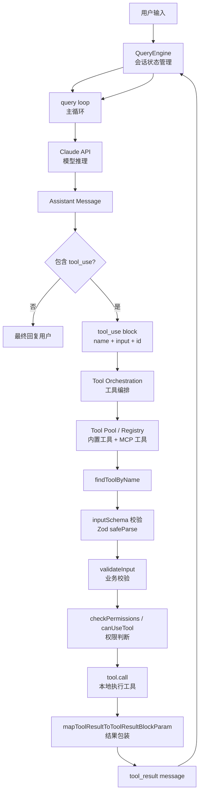
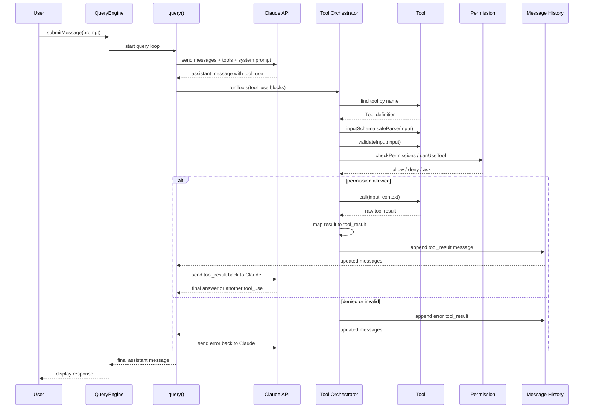

Claude Code 的工具调用本质是一个 **LLM tool-use loop**，但它把“模型决策”和“本地执行”分得很清楚。

核心流程是：

```text
用户输入
  -> QueryEngine.submitMessage()
  -> query() 调 Claude API
  -> Claude 返回 assistant message，里面可能包含 tool_use block
  -> Claude Code 本地找到对应 Tool
  -> 校验参数
  -> 权限判断
  -> 执行 tool.call()
  -> 把结果包装成 tool_result message
  -> 再发回 Claude
  -> Claude 基于结果继续回答或继续调工具
```

关键代码位置：

- Tool 抽象：[Tool.ts](/Users/apple/Documents/AI英语陪练/Claude-Code-main/src/Tool.ts:362)
- 工具池组装：[tools.ts](/Users/apple/Documents/AI英语陪练/Claude-Code-main/src/tools.ts:345)
- 会话入口：[QueryEngine.ts](/Users/apple/Documents/AI英语陪练/Claude-Code-main/src/QueryEngine.ts:101)
- 主循环：[query.ts](/Users/apple/Documents/AI英语陪练/Claude-Code-main/src/query.ts:186)
- 工具编排：[toolOrchestration.ts](/Users/apple/Documents/AI英语陪练/Claude-Code-main/src/services/tools/toolOrchestration.ts:1)
- 单个工具执行：[toolExecution.ts](/Users/apple/Documents/AI英语陪练/Claude-Code-main/src/services/tools/toolExecution.ts:600)

**1. 每个工具都是一个对象**

Claude Code 的每个工具都实现统一结构：

```ts
{
  name,
  inputSchema,
  outputSchema,
  prompt,
  description,
  validateInput,
  checkPermissions,
  isReadOnly,
  isConcurrencySafe,
  call,
  mapToolResultToToolResultBlockParam
}
```

比如 `FileReadTool` 会声明：

```text
工具名：Read
输入 schema：file_path / offset / limit / pages
是否只读：true
是否可并发：true
权限检查：检查文件读权限
执行：读取文件
结果：包装成 Claude 能理解的 tool_result
```

**2. 工具先注册成工具池**

`tools.ts` 里有 `getAllBaseTools()`，集中列出所有内置工具：

```text
AgentTool
BashTool
FileReadTool
FileEditTool
FileWriteTool
WebFetchTool
WebSearchTool
TodoWriteTool
MCP tools ...
```

然后通过 `assembleToolPool()` 合并内置工具和 MCP 工具，并根据权限过滤。

也就是说，Claude 不是随便调用任何函数。它只能看到当前工具池里被允许暴露的工具。

**3. 模型只返回 tool_use，不直接执行**

Claude API 返回的 assistant message 里可能包含类似：

```json
{
  "type": "tool_use",
  "id": "toolu_123",
  "name": "Read",
  "input": {
    "file_path": "/path/to/file"
  }
}
```

这个只是“调用请求”。真正执行发生在 Claude Code 本地。

**4. 执行前会做严格校验**

`toolExecution.ts` 里执行顺序很关键：

```text
inputSchema.safeParse(input)
  -> validateInput()
  -> pre-tool hooks
  -> checkPermissions()
  -> canUseTool()
  -> tool.call()
  -> post-tool hooks
  -> map result
```

所以模型即使生成了错误参数，也不会直接跑。比如读文件路径非法、命令危险、权限不足，都会返回一个错误型 `tool_result` 给模型。

**5. 只读工具可以并发，写入工具串行**

`toolOrchestration.ts` 会把同一轮里的多个工具调用分批：

```text
isConcurrencySafe = true
  -> 并发执行

isConcurrencySafe = false
  -> 串行执行
```

例如读文件、搜索可以并发；写文件、编辑、执行命令通常更保守。

**6. 工具结果会回到模型上下文**

工具执行完后，不是直接展示给用户，而是包装成：

```json
{
  "type": "tool_result",
  "tool_use_id": "toolu_123",
  "content": "..."
}
```

然后追加到消息历史，再继续调用 Claude。这样 Claude 能看到“我刚才读文件的结果”，再决定下一步。

**对你们的启发**

SpeakUp 可以照这个模式做：

```text
LLM 负责：
理解用户意图，选择工具，生成结构化参数

Agent Runtime 负责：
校验参数、鉴权、执行工具、写审计、返回结果

业务工具负责：
创建面试计划、启动实时面试、检索知识库、生成 Review
```

不要让模型直接跳页面、直接查库、直接写记忆。让它只产生 tool call，真正动作都由你们后端控制。

可以，Claude Code 工具调用可以画成这两张图。

**整体架构图**



**执行流程图**



**最关键的分层**

```text
QueryEngine
  管会话、消息、状态、预算、取消

query loop
  管模型调用、tool_use/tool_result 循环

Tool Orchestrator
  管多个工具调用的并发/串行执行

Tool Execution
  管单个工具的校验、权限、执行、日志、结果包装

Tool
  真正的业务能力，例如 Read、Edit、Bash、WebSearch、Agent、MCP Tool
```

**简化版心智模型**

```text
Claude：我想调用 Read({ file_path: "xxx" })

Claude Code：
  1. 这个工具存在吗？
  2. 参数符合 schema 吗？
  3. 这个路径合法吗？
  4. 用户/权限允许吗？
  5. 执行读取
  6. 把读取结果作为 tool_result 还给 Claude

Claude：
  看完 tool_result 后，再决定继续调工具还是回答用户
```

对 SpeakUp 来说，可以直接映射成：