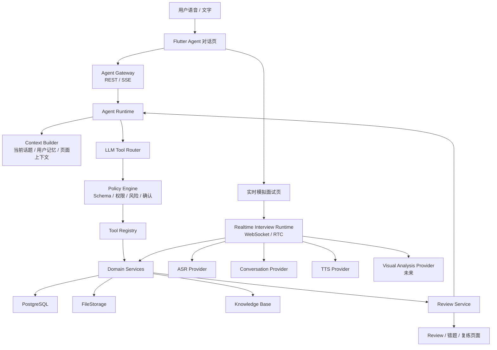

# SpeakUp Agent 化产品架构总结

> 日期：2026-07-20
> 作者：张思成
> 范围：Agent 入口、实时模拟面试、群面、Review、知识库与未来视频分析的整体架构
> 参考：Claude Code 工具调用架构、SpeakUp 长期 Agent 方向讨论、MS1 系统架构设计

## 0. 一句话结论

SpeakUp 不应把所有能力都塞进聊天页，而应采用：

```text
Agent 对话页 = 统一入口、长期上下文和任务编排
实时模拟页 = 语音/视频面试的沉浸式会话容器
Review 页 = 评分、错题、证据反馈和复练工作台
知识库 = Agent 和 Review 按需检索的支撑能力
```

Agent 的职责不是替代所有页面，而是替代用户手动找功能、填表、选择入口和重复配置的过程。

## 1. 产品形态

当前产品仍以外企英文面试为高价值核心场景，但主入口从“选择功能”升级为“和 SpeakUp 说话”。

用户可以直接说：

- “我下周有个外企产品经理面试，帮我练一下。”
- “按 Amazon behavioral round 的风格面我一轮。”
- “刚才这个回答帮我复盘一下。”
- “我想练一个三人群面。”
- “根据我简历里的支付项目追问我。”

Agent 需要完成的是：

```text
理解用户目标
  -> 读取用户背景、简历、岗位、历史表现和知识库
  -> 判断应该直接练习、创建面试计划、进入实时面试还是生成 Review
  -> 用 Action Card 让用户确认
  -> 跳转或启动对应业务会话
  -> 会话结束后把结果沉淀回长期记忆和 Review
```

## 2. 总体架构



核心原则：

- Agent Runtime 负责理解和编排，不直接拥有面试、Review、知识库等业务状态。
- 业务状态由 Domain Service 和 PostgreSQL 拥有。
- 模型输出一律视为不可信输入，必须经过 Schema 校验、权限校验和业务校验。
- 实时电话、群面和视频分析不走普通聊天 turn loop，而走专门的实时会话链路。
- 前端跳转由后端返回稳定 Action Contract，Flutter 用受控路由表执行，不让模型生成页面路由。

## 3. 三类 Agent 能力

### 3.1 Conversational Agent

这是用户默认看到的 SpeakUp。

职责：

- 承接语音和文字输入；
- 判断多段语音是否属于同一件事；
- 结合长期记忆理解用户目标；
- 询问缺失信息；
- 直接给出英文表达建议；
- 推荐或创建模拟面试、短练习、Review、错题复练；
- 将真实事件、学习弱点和用户偏好沉淀为可见记忆。

不负责：

- 低延迟实时通话；
- 多面试官实时发问调度；
- 视频帧分析；
- 直接写数据库或跳转页面。

### 3.2 Session Agent / Realtime Runtime

这是实时模拟面试页背后的运行时。

职责：

- 管理实时语音电话；
- 控制一对一面试和群面节奏；
- 处理 ASR、LLM 追问、TTS 播放；
- 保存音频、转写、问题、回答、时间戳和事件流；
- 为 Review 生成可引用证据。

未来视频面试时，视频帧和关键片段也在这里接入视觉模型。

### 3.3 Review Agent

这是面试结束后的分析和复练能力。

职责：

- 基于转写、音频指标、知识库和未来视频证据生成评分；
- 产出错题、表达问题、优化版本和复练建议；
- 支持同题重答和多版本对比；
- 把稳定弱点写入长期学习记忆。

## 4. Agent 工具分层

参考 Claude Code 的工具调用架构，SpeakUp 也应该建立统一 Tool Contract：

```text
Tool Definition
  -> name
  -> description
  -> input_schema
  -> output_schema
  -> risk_level
  -> is_read_only
  -> requires_confirmation
  -> validate
  -> authorize
  -> call
```

首期建议工具：

| 工具 | 类型 | 说明 | 是否直接跳页 |
|---|---|---|---|
| `memory.get_profile.v1` | 只读 | 读取岗位、英语水平、目标、偏好 | 否 |
| `memory.propose_patch.v1` | 写入候选 | 提出记忆更新，用户可见可删除 | 否 |
| `knowledge.search_interview_materials.v1` | 只读 | 检索岗位、公司、题库、面经、表达素材 | 否 |
| `interview.create_plan.v1` | 写入 | 创建一套面试计划 | 返回计划卡片 |
| `interview.start_live_session.v1` | 写入/启动 | 启动一对一实时语音面试 | 是 |
| `interview.start_panel_session.v1` | 写入/启动 | 启动多面试官群面 | 是 |
| `interview.end_session.v1` | 写入 | 结束会话并触发分析 | 可跳 Review |
| `review.generate_report.v1` | 写入 | 生成评分、错题和改进建议 | 返回 Review 卡片 |
| `review.create_retry_practice.v1` | 写入 | 根据错题创建复练 | 可跳复练页 |

关键约束：

- `user_id` 不允许出现在模型可填参数里，必须来自服务端认证上下文。
- 创建计划、启动会话、写入记忆、生成 Review 都需要幂等键。
- 高风险或长时任务必须返回确认卡片。
- 工具只调用 Domain Service，不直接访问数据库。

## 5. 为什么实时面试要跳转页面

实时电话和普通 Agent 聊天的技术形态不同。

普通 Agent 链路：

```text
语音/文字
  -> ASR
  -> LLM tool call
  -> Tool execution
  -> Action Card / 文本语音回复
```

实时面试链路：

```text
Flutter 实时模拟页
  -> WebSocket / RTC
  -> 音频流上传
  -> 实时 ASR
  -> 面试官追问生成
  -> TTS 音频下发
  -> Turn / Evidence 保存
```

因此，`interview.start_live_session.v1` 应该返回 `Session Launch`，由 Flutter 跳转：

```json
{
  "type": "session_launch",
  "mode": "live_voice_interview",
  "session_id": "is_123",
  "requires_navigation": true,
  "target_screen": "live_interview",
  "rtc_token": "short_lived_token",
  "expires_at": "2026-07-20T20:30:00+08:00"
}
```

聊天页负责发起和承接结果；实时模拟页负责沉浸体验。

## 6. 群面架构

群面不建议第一版实现为多个完全自由 Agent 互相对话。更稳妥的结构是：

```text
PanelInterviewRuntime
  -> Moderator：控制节奏、决定谁发问
  -> Interviewer A：技术面试官
  -> Interviewer B：业务/项目面试官
  -> Interviewer C：HR/行为面试官
  -> Candidate：用户
```

多个面试官可以拥有独立 persona、评分关注点和追问策略，但会话状态由同一个 `PanelInterviewRuntime` 统一管理。

这样可以避免：

- 多个模型同时抢话；
- 问题重复；
- 群面时间不可控；
- Review 无法归因到具体面试官；
- 用户体验混乱。

## 7. 视频与微表情分析

未来视频分析可以作为实时会话中的 Provider 或内部工具，但不适合作为聊天页直接回复型工具。

推荐链路：

```text
LiveInterviewPage 开启摄像头
  -> 服务端按策略抽帧或截取关键片段
  -> VisualAnalysisProvider 分析镜头表现
  -> 输出结构化 evidence
  -> 存入 Session Evidence
  -> Review 引用 evidence 生成反馈
```

工具或 Provider 输出示例：

```json
{
  "segment_id": "seg_123",
  "time_range": ["00:01:20", "00:01:38"],
  "signals": [
    {
      "type": "eye_contact",
      "score": 0.62,
      "confidence": "medium"
    },
    {
      "type": "facial_tension",
      "level": "medium",
      "confidence": "low"
    }
  ]
}
```

产品表达必须谨慎。建议使用：

- 镜头表现；
- 眼神稳定性；
- 表情紧张感；
- 停顿与语速；
- 回答状态变化。

避免使用：

- 判断用户是否撒谎；
- 判断心理疾病；
- 给出人格结论；
- 将低置信度视觉信号当作硬评分依据。

## 8. Review 与知识库

Review 不应只靠模型自由评价，而应基于可追溯证据：

```text
Turn 原始音频
  -> ASR 转写
  -> 词级/句级时间戳
  -> 面试官问题
  -> 用户回答
  -> 知识库检索结果
  -> 未来视频 evidence
  -> 结构化评分和错题
```

知识库可以分为三类：

| 类型 | 示例 | 使用方式 |
|---|---|---|
| 岗位知识 | PM、SDE、Data、Consulting 常见题 | 面试计划和追问 |
| 公司知识 | Amazon LP、Googleyness、STAR 面试法 | 模拟风格和评分 Rubric |
| 用户知识 | 简历、项目经历、历史弱点 | 个性化追问和复练 |

知识库是 Agent 和 Review 的工具，不是替代业务表的数据库。简历、面试计划、Session、Turn、Review、错题仍然应由 PostgreSQL 保存结构化关系。

## 9. 数据对象建议

```text
Conversation
ConversationTurn
UtteranceGroup
UserMemory
MemoryCandidate

InterviewPlan
InterviewRound
InterviewerPersona
InterviewSession
PanelSession
Turn
AudioAsset
VideoSegment
SessionEvidence

ReviewReport
ReviewScore
FeedbackItem
MistakeItem
RetryAttempt

KnowledgeDocument
KnowledgeChunk
KnowledgeCitation
```

其中：

- `Conversation` 保存用户与 SpeakUp 的长期对话。
- `UtteranceGroup` 保存连续多段语音归组结果。
- `MemoryCandidate` 保存待确认或可撤销的记忆更新。
- `InterviewSession` 保存一对一实时面试。
- `PanelSession` 保存群面配置和多面试官状态。
- `SessionEvidence` 统一保存文本、音频、视频等分析证据。
- `ReviewReport` 引用 evidence，不凭空生成结论。

## 10. 端到端流程

### 10.1 从语音进入一对一面试

```text
用户：我想练 Meta 产品经理 behavioral 面试
  -> Agent 读取用户背景和历史弱点
  -> 检索知识库中的 Meta / PM / behavioral 面试材料
  -> 询问缺失信息或直接创建计划
  -> 返回“开始一轮 20 分钟模拟面试”卡片
  -> 用户确认
  -> 创建 InterviewSession
  -> 跳转 LiveInterviewPage
  -> 实时语音面试
  -> 结束后生成 Review
  -> Review 摘要回到 Agent 对话
```

### 10.2 从聊天进入群面

```text
用户：帮我模拟一个三人群面，难一点
  -> Agent 创建 PanelInterviewPlan
  -> 配置 3 位面试官 persona
  -> 返回群面启动卡片
  -> 用户确认
  -> 跳转 PanelInterviewPage
  -> Moderator 控制发问顺序
  -> 多面试官轮流追问
  -> 结束后按面试官维度生成 Review
```

### 10.3 从 Review 回到长期 Agent

```text
Review 发现：
  - STAR 的 Result 部分不足
  - 项目影响量化不清
  - 语速偏快

系统生成 MemoryCandidate：
  - 用户常在行为面试中弱化结果指标
  - 用户需要练习 30 秒版本项目总结

用户可接受、编辑或删除
Agent 下次面试前自动带入
```
