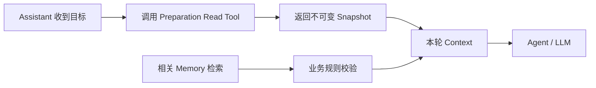
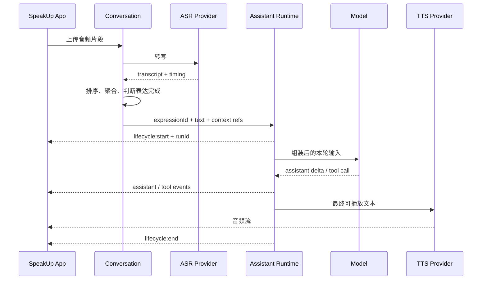
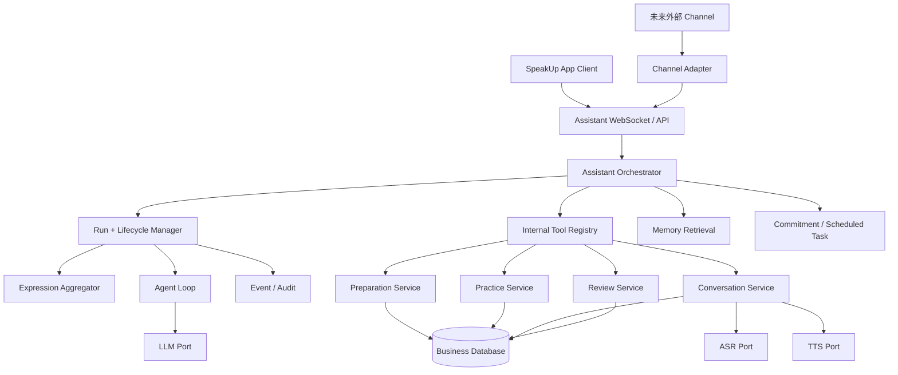

# SpeakUp 功能与 OpenClaw 机制借鉴映射报告

> 目标：回答“SpeakUp 的什么功能，可以借鉴 OpenClaw 的什么机制，以及哪些部分仍必须由 SpeakUp 自己实现”。
> 对应 Issue：[Issue #60：调研 Claude Code、Hermes 与 OpenClaw 的 Agent 实现方式](https://github.com/1024XEngineer/XE3-ESL/issues/60)
> 当前证据：SpeakUp 产品与模块设计、相关 Issue / PR 描述、OpenClaw 当前官方文档、已安装 OpenClaw 并跑通微信通信。
> 证据限制：当前 Vault 没有 SpeakUp 实现仓库；OpenClaw 尚未固定 Tag / Commit，也没有完成源码、测试和故障注入验证。

## 一、先给结论

### 总体判断：选择性借鉴，暂不整体采用

**建议将 OpenClaw 作为 SpeakUp“Agent 编排机制”的参考实现，而不是把 OpenClaw 直接变成 SpeakUp 的业务后端。**

具体来说：

- 借鉴 Gateway 的统一入口和运行事件模型；
- 借鉴 Agent Loop、Queue 和 Session lane 的执行与并发控制；
- 借鉴 Tool、Skill、Plugin、Hook 的扩展分层；
- 借鉴长期记忆、短期 Commitment 和精确定时任务的分工；
- 借鉴 Tool Policy、Approval 和 Sandbox 的分层安全思想；
- 不把 OpenClaw Session 当作 SpeakUp Topic、Practice Session 或现实事项；
- 不把 `MEMORY.md` 当作用户档案、训练计划或学习结果数据库；
- 不让 Hook 或模型自由文本负责关键业务写入；
- P0 不建设 Multi-agent、通用 Tool 市场和无限能力 Agent。

这与 SpeakUp 已经形成的方向一致：Assistant 负责理解目标和组织能力调用，但不拥有 Preparation、Practice、Conversation、Review 的业务状态。OpenClaw 最适合填补的是“运行编排层”，不是替换现有业务模块。

### 借鉴等级说明

| 等级     | 含义                                            |
| ------ | --------------------------------------------- |
| 直接借鉴设计 | 问题和边界基本一致，可以直接采用协议或模式；不代表已经决定复用 OpenClaw 源码   |
| 垂直化改造  | OpenClaw 机制有用，但必须加入 SpeakUp 的语音、教学、业务状态或多用户约束 |
| 小范围试验  | 有潜力，但必须先用一个低风险纵向实验验证                          |
| 暂缓采用   | 当前收益不足以覆盖复杂度，先不进入 MS2 主链路                     |


## 二、SpeakUp 当前边界

SpeakUp 不是通用 Agent，而是围绕真实职业英语任务持续推进的表达教练。当前项目已经形成五个主要边界：

| 模块 | 当前职责 |
|---|---|
| Assistant | 理解用户目标、选择能力、组织调用；不拥有训练业务状态 |
| Preparation | 管理岗位、JD、个人经历、角色背景和训练要求 |
| Practice | 管理计划、专项 Session、阶段和过程策略 |
| Conversation | 管理 Question、Turn、音频、转写和实时语音交互 |
| Review | 管理分析、证据反馈、重答请求、复练和历史投影 |

现有方向还包括：

- Conversation 使用 WebSocket 组织实时语音；
- ASR、LLM、TTS 通过窄 Port 接入，业务模块不绑定具体 Provider；
- Review 通过 `RetryRequest → RetryTurnPort` 请求 Conversation 创建普通新 Turn；
- Assistant 首期采用受限、只读、单步 Tool 路由，不建设自由循环的自主 Agent；
- 产品范围明确不做角色市场、自定义工作流和无限能力 Agent。

因此，新编排层必须适配这些边界，而不是重新发明一套重叠的 Session、Practice 或 Review 模型。

## 三、一张表看清 SpeakUp 功能怎样借鉴 OpenClaw

| SpeakUp 功能        | 当前问题                                  | 可借鉴的 OpenClaw 机制                                    | SpeakUp 必须保留或补充                             | 等级             | 优先级 |
| ----------------- | ------------------------------------- | --------------------------------------------------- | ------------------------------------------- | -------------- | --- |
| 统一 Assistant 入口   | 用户不应先寻找功能                             | Gateway、Client、统一 RPC / WebSocket 入口                | 用户身份、App 导航、业务 Tool Registry                | 直接借鉴设计         | P0  |
| Agent 运行状态        | 需要知道一次回复正在做什么、何时结束                    | `runId`、`assistant/tool/lifecycle` 事件               | `TaskRun`、业务请求 ID、前端状态机                     | 直接借鉴设计         | P0  |
| 受控能力调用            | 模型需调用 Preparation / Practice / Review | Tool Schema、Skill 工作流、Tool Policy                   | Internal Tool Registry、身份校验、业务 Service      | 直接借鉴设计         | P0  |
| 多段语音形成一次表达        | ASR 片段可能乱序，Agent 容易抢答                 | `collect`、`steer`、`interrupt`、`message:transcribed` | 录音状态、ASR 完成状态、片段排序、语义完整性                    | 垂直化改造          | P0  |
| 实时语音问答            | 需要流式文本、工具状态、可打断回复                     | Agent Loop 事件流、Abort、Queue                          | Conversation WebSocket、音频流、ASR / TTS、低延迟策略  | 垂直化改造          | P0  |
| 面试 / 场景练习 Session | 专项练习需独立执行和恢复                          | Session lane、Transcript、独立 Session                  | Practice 状态机、计划、角色快照、完成规则                   | 垂直化改造          | P0  |
| 结果返回原话题           | 练习后要继续现实事项或原对话                        | 结构化 Tool Result、`after_tool_call`、Session 关联        | `sourceTopicId`、`practiceSessionId`、幂等写回事务  | 垂直化改造          | P0  |
| 面试报告异步生成          | 用户不应等待报告生成                            | Background Task / Sub-agent、完成 Announce 模式          | Review Job、可重试状态、报告持久化、证据引用                 | 小范围试验          | P1  |
| Feedback → Retry  | 从问题诊断进入同题复练                           | Tool 调用与稳定幂等标识                                      | `RetryRequest`、`RetryTurnPort`、新 Turn 归属规则  | 直接借鉴设计         | P0  |
| 跨 Session 用户背景    | 新对话仍需理解岗位与目标                          | `MEMORY.md` 分层、`memory_search`、`memory_get`         | 结构化用户档案、来源、同意、版本和删除                         | 垂直化改造          | P1  |
| 学习记忆与薄弱点          | 需要追踪已改善与未解决问题                         | 长期摘要、每日工作记忆、语义检索                                    | 学习状态、证据、掌握度、复查时间和冲突更新                       | 垂直化改造          | P1  |
| 跨天自然跟进            | 用户现实沟通后需要复盘                           | Commitment + Heartbeat                              | 用户通知偏好、打扰限制、现实事项状态                          | 小范围试验          | P1  |
| 精确提醒              | 用户指定时间准备或复练                           | Cron / Scheduled Task                               | 时区、取消、业务对象关联、通知送达                           | 垂直化改造          | P1  |
| 运行观测与故障定位         | 需要还原语音到报告的完整链路                        | `runId`、Tool 事件、Lifecycle、Audit 思路                  | 业务事件、Trace、PII 脱敏、指标和重放工具                   | 直接借鉴设计         | P0  |
| 多角色面试             | 不同面试官有不同视角                            | Agent Workspace / Persona 的思想                       | Preparation 角色与快照；P0 不需要多个长期 Agent          | 暂缓 Multi-agent | P2  |
| 多用户隔离             | 不同用户数据不能混合                            | `dmScope`、Per-agent Session、Tool Policy、Sandbox     | 应用身份、Tenant / User Ownership、数据库 Row Policy | 垂直化改造          | P0  |
| 微信 / WhatsApp 接入  | 未来可能增加 App 外入口                        | Channel Provider、Gateway Binding                    | 账号体系映射、合规、送达与用户身份合并                         | 暂缓或单独试验        | P2  |

## 四、Assistant：借鉴 Gateway 和 Agent Loop，不接管业务状态

### 4.1 可以借鉴什么

SpeakUp Assistant 与 OpenClaw Gateway / Agent Runtime 解决了相近问题：统一接收用户意图，确定上下文，选择受控能力，并把执行过程流式返回给 Client。

建议借鉴：

1. **统一运行入口**：App 只面对一套 Assistant API，不直接理解每个业务模块的内部接口；
2. **运行标识**：每次处理生成 `runId`，关联模型调用、Tool Call、流式事件和最终结果；
3. **三类事件**：`assistant` 表示文本增量，`tool` 表示业务能力执行，`lifecycle` 表示开始、结束和错误；
4. **Session 串行**：同一个用户对话在同一时刻只允许一个主要 Run 修改上下文；
5. **结构化 Tool**：模型只选择和填写 Tool 参数，后端完成授权、业务校验和持久化。

### 4.2 怎样映射到现有 Assistant

```text
OpenClaw runId            → SpeakUp TaskRun.id
OpenClaw toolCallId       → SpeakUp ToolCall.id
OpenClaw Tool Registry    → SpeakUp Internal Tool Registry
OpenClaw Tool Policy      → SpeakUp Tool Allowlist + Risk Policy
OpenClaw lifecycle event  → Assistant Run 状态事件
OpenClaw Session lane     → AssistantThread 串行执行策略
```

这与 [Issue #42：Assistant 编排骨架](https://github.com/1024XEngineer/XE3-ESL/issues/42) 中的 `Planner`、`ToolRegistry`、`ConversationStore`、`AssistantThread`、`TaskRun`、`ToolCall`、`ConfirmationRequest` 基本同向。

### 4.3 不应该借鉴什么

- 不让 Assistant 保存 Preparation、Practice、Conversation 或 Review 的领域对象；
- 不让模型提供可信的 `userId`，身份必须来自认证上下文；
- 不允许模型绕过 Internal Tool Registry 直接调用 Repository；
- 不在首期开放多轮自主规划和任意 Tool 链；
- 不把 Gateway Token 暴露给普通 App 用户。

### 4.4 当前最小落地

继续遵循 [Issue #44：首版 Function Calling 与 Tool Registry](https://github.com/1024XEngineer/XE3-ESL/issues/44) 已冻结的方向：

```text
自然语言输入
→ 最多一次模型判断
→ 最多一次白名单 Tool Call
→ 需要时请求用户确认
→ Tool Executor 调用 Domain Service
→ 返回结构化结果或 Deep Link
```

现阶段 OpenClaw 的价值是验证这套运行边界，而不是把首版重新扩大成完整自主 Agent。

## 五、Preparation：借鉴 Context Assembly，不借鉴 Memory 作为事实库

### 5.1 SpeakUp 的需求

Agent 在创建面试或帮助表达时，需要使用岗位、JD、简历、个人经历、面试官视角和训练目标。但这些信息具有明确所有权、版本和业务关系，不能只作为 Prompt 文本存在。

### 5.2 可以借鉴什么

- OpenClaw 在模型调用前统一完成 Context Assembly；
- `before_prompt_build` 可在 Session 已加载后注入当前任务需要的上下文；
- Workspace Bootstrap 适合放稳定规则，不适合放每次变化的业务数据；
- `memory_search` 适合从大量历史中找到相关背景，再由业务层校验。

### 5.3 建议映射



建议 Tool：

```json
{
  "name": "preparation.get_context.v1",
  "input": {
    "actorUserId": "来自认证上下文，不由模型填写",
    "preparationId": "",
    "purpose": "interview | workplace_expression"
  },
  "output": {
    "snapshotId": "",
    "role": {},
    "background": {},
    "constraints": []
  }
}
```

### 5.4 必须由 SpeakUp 自己负责

- JD、简历、角色和知识的 Schema；
- Snapshot 版本与来源；
- 用户文件和职业隐私权限；
- 哪些信息可以进入 Prompt；
- 信息过期、冲突和删除。

`MEMORY.md` 可以保存“用户是后端工程师，正在准备英文面试”这样的精简长期摘要，但不能成为简历、JD 或 Preparation Snapshot 的权威来源。

## 六、Conversation：重点借鉴 Agent Loop、事件流和 Queue

### 6.1 实时语音主链路

SpeakUp Conversation 已经定义为 Question、Turn、音频和转写的所有者，并通过 WebSocket 组织实时交互。这里最值得借鉴 OpenClaw 的是 Run 与事件模型，而不是替换 Conversation WebSocket。



### 6.2 多段语音：只能部分借鉴 Queue

OpenClaw 提供：

- `collect`：安静窗口后，把多条已排队文本合并为一个后续 Turn；
- `steer`：把用户补充注入当前 Run 的下一次模型调用；
- `interrupt`：中止当前 Run，只处理最新输入；
- `message:transcribed`：音频完成转写后的事件点。

但 OpenClaw 官方机制没有解决：

- 用户是否仍在录音；
- 多个音频上传是否都已完成；
- ASR 第二段比第三段更晚返回时怎样排序；
- 哪些片段属于同一次完整表达；
- 语义上是否已经说完；
- TTS 已经播放的内容怎样停止或修正。

因此应采用两层模型：

```text
第一层：SpeakUp Expression Aggregator
音频 → ASR → 片段排序 → 录音状态 → 时间窗 → 语义完整性

第二层：OpenClaw 风格的 Queue
完整 Expression → steer / followup / collect / interrupt → Agent Run
```

### 6.3 Turn 完成规则属于 Conversation

OpenClaw Session 只知道消息和 Run，不知道 SpeakUp 的有效回答标准。下列规则必须保留在 Conversation：

- Turn 必须包含实际问题；
- 必须有一次有效英语回答；
- 音频和可用转写都必须存在；
- 发出声音或上传一个片段不等于 Turn 完成；
- ASR 失败时如何保留 Attempt，但不错误创建 Turn；
- 用户打断、重答和恢复时旧内容怎样标记。

### 6.4 建议直接借鉴的运行事件

| SpeakUp 事件 | 借鉴来源 | 用途 |
|---|---|---|
| `agent.run.accepted` | Gateway accepted + `runId` | 前端立即进入运行态 |
| `agent.assistant.delta` | `assistant` stream | 显示流式文本 |
| `agent.tool.started/ended` | `tool` stream | 显示正在创建计划、查找报告等状态 |
| `agent.run.ended/failed` | `lifecycle` stream | 结束 Loading、保存最终状态 |
| `conversation.expression.aggregated` | SpeakUp 自研 | 记录哪些音频组成一次表达 |
| `conversation.turn.completed` | SpeakUp 自研 | 记录业务有效 Turn |

## 七、Practice：借鉴 Session 串行和 Skill / Tool，不借鉴通用 Multi-agent

### 7.1 专项练习怎样进入 Agent

建议流程：

```text
普通对话识别到表达困难
→ Skill 告诉 Agent 应先提供帮助，再轻量邀请练习
→ 用户明确接受
→ Assistant 调用 start_practice_session Tool
→ Practice 创建独立 Session
→ Conversation 执行 Question / Turn
→ Practice 完成
→ 结构化结果返回原 Topic
```

Skill 负责“什么时候建议练习以及怎样过渡”，Tool 负责真正创建 Practice Session。用户没有确认时，模型不能仅凭推断启动练习。

### 7.2 建议 Tool 契约

```json
{
  "name": "practice.start_session.v1",
  "input": {
    "requestId": "幂等请求 ID",
    "actorUserId": "可信认证身份",
    "sourceTopicId": "",
    "sourceRunId": "",
    "preparationSnapshotId": "",
    "practiceType": "interview | scenario | short_rehearsal",
    "goal": "",
    "userConfirmed": true
  },
  "output": {
    "practiceSessionId": "",
    "status": "created | already_exists | rejected | failed",
    "nextAction": ""
  }
}
```

### 7.3 OpenClaw Session 可以做什么

- 保持一场 Practice 中的 Agent 上下文；
- 通过 Session lane 保证同一场练习的 Run 串行；
- 保存模型和 Tool 的 Transcript；
- 在对话过长时进行 Compaction；
- 为独立专项练习建立不同 `sessionKey`。

但 Practice 的计划、阶段、参与者、完成条件、快照和恢复点仍由 Practice 模块管理。

### 7.4 多个面试官不等于多个 Agent

当前面试官角色首先是 Preparation 中的角色、知识和策略配置，不必为 HR、技术面试官、系统设计面试官各运行一个长期 OpenClaw Agent。

只有出现以下情况才重新评估 Multi-agent：

- 不同角色需要完全隔离的 Tool 和数据权限；
- 多个角色必须真正并行完成独立任务；
- 独立 Session + Persona 已无法满足需求；
- 合并多个 Agent 结果的收益已经通过用户实验验证。

## 八、Review：借鉴后台任务和结果回传，但业务 Job 是权威

### 8.1 Review 的核心不是生成一段总结

SpeakUp Review 需要保存：

- 用户原回答和转写证据；
- 问题诊断；
- 改进建议；
- 同题复练请求；
- 修改前后版本；
- 未解决薄弱点和历史投影。

这些都是可查询、可重试、可比较的业务对象，不能只存在于 Sub-agent Transcript 或 Agent 最终文本中。

### 8.2 可以借鉴什么

- OpenClaw Background Task / Sub-agent 的非阻塞启动模式；
- 独立 Session 避免长报告阻塞实时 Conversation；
- 完成后 Announce 回请求者的事件思路；
- `runId`、状态、时长和 Token Usage 的观测字段；
- Tool Result 结构化返回，主 Agent 再决定怎样呈现。

### 8.3 推荐实现

```text
Conversation 完成并持久化 Turn
→ Review 创建 ReviewJob（数据库权威状态）
→ 异步 Worker 或受控 Sub-agent 生成分析
→ Review 校验引用证据和结果 Schema
→ ReviewJob 标记 completed / failed
→ 发送 review.completed 事件
→ Assistant 或 Client 展示报告入口
```

Sub-agent 只适合承担“分析计算者”，不能成为 Job 状态、重试次数或报告记录的唯一保存位置。OpenClaw 的完成 Announce 是运行回传机制，不等于业务消息队列或事务 Outbox。

### 8.4 Feedback → Retry

当前 `RetryRequest → RetryTurnPort → Conversation 创建普通新 Turn` 的设计应继续保留。可借鉴 OpenClaw 的是：

- 每次 Retry 使用独立 `requestId`；
- Tool Call 返回 `created` 或 `already_exists`；
- 新 Turn 关联原 Question、Review Finding 和 Practice Session；
- Tool 成功后再由 Agent 生成自然语言确认。

不建议使用 Queue `interrupt` 或 Session Reset 来实现同题复练，因为复练是业务上的新 Turn，不是对当前 Agent Run 的简单中断。

## 九、Memory：借鉴分层与检索，自研学习记忆治理

### 9.1 建议的三类 SpeakUp Memory

| SpeakUp 记忆 | 示例 | 借鉴的 OpenClaw 思路 | 权威存储 |
|---|---|---|---|
| 用户背景 | 岗位、目标、稳定偏好 | `MEMORY.md` 的精简长期层 | Preparation / User Profile 数据库 |
| 事件上下文 | 周五与 Alex 讨论延期 | 每日工作记忆 + 按需检索 | Reality Matter / Topic 数据库 |
| 学习记忆 | 容易回避直接结论，某表达已改善 | Memory Search + 长期摘要 | Learning Memory 数据库 |

### 9.2 每条记忆至少需要的字段

```text
memoryId
userId
type
content
sourceMessageIds / sourceReviewIds
confidence
status
createdAt / updatedAt
expiresAt
visibility
deletionState
```

### 9.3 OpenClaw Memory 适合与不适合的部分

适合：

- 区分精简长期摘要和每日详细上下文；
- 用语义检索加关键词检索按需召回；
- 在 Prompt 过长前将重要上下文写入 Memory；
- 让 Agent 通过 `memory_get` 查看原始条目。

不适合直接承担：

- 用户档案的唯一来源；
- Practice / Review 状态机；
- 记忆冲突合并；
- 训练掌握度；
- 用户隐私删除的事务保证；
- 多租户访问控制。

### 9.4 读取顺序建议

```text
当前 Topic / Practice 的业务上下文
→ Preparation Snapshot
→ 当前 Reality Matter
→ 少量相关学习记忆
→ 必要时才做跨历史语义检索
```

不要每轮加载全部面试历史，也不要让向量相似度独自决定什么是事实。

## 十、跨天跟进：Commitment 可以试验，Heartbeat 不能自由发挥

### 10.1 三种时间机制

| 用户需求 | 机制 | SpeakUp 示例 |
|---|---|---|
| 系统判断之后可能值得问一下 | Commitment | “明天与 Alex 沟通后，可以自然询问结果” |
| 用户指定具体时间 | Scheduled Task / Cron | “明天下午 3 点提醒我练习” |
| 周期检查是否有值得提示的事项 | Heartbeat | 检查是否存在到期且允许通知的 Reality Matter |

### 10.2 垂直化限制

SpeakUp 的主动跟进必须同时满足：

- 有明确来源 Topic 和 Reality Matter；
- 用户允许该类型通知；
- 处于允许打扰的时间段；
- 同一事项没有重复 Commitment；
- 已完成、删除或取消的事项不会再次触发；
- 每日和每周有通知上限；
- 用户可以查看、Snooze（稍后提醒）或 Dismiss（不再提醒）。

OpenClaw Commitment 可以作为机制试验，但不能直接替代学习计划、间隔复习算法或通知策略。

## 十一、权限与安全：借鉴分层，不把 OpenClaw 当多租户边界

### 11.1 可借鉴的安全层

| OpenClaw 机制 | SpeakUp 映射 |
|---|---|
| Gateway Auth / Device Pairing | 服务间认证、管理端认证 |
| Channel Allowlist | 外部 Channel 身份准入 |
| Tool Allow / Deny | 不同 Agent 场景可见的业务 Tool |
| `before_tool_call` | Tool 执行前的策略和参数检查 |
| Approval | 创建、发送、删除等高风险动作的用户确认 |
| Sandbox | 未来文件分析、浏览器或代码工具的执行隔离 |
| Audit Event | Run、Tool、结果和操作者审计 |

### 11.2 SpeakUp 必须自己负责

- 登录用户身份和 Token；
- `actorUserId` 与资源所有权检查；
- 数据库级用户隔离；
- 简历、JD、音频和转写的隐私策略；
- Tool 是否允许修改业务状态；
- 用户确认的持久化与恢复；
- 日志脱敏和保留周期。

OpenClaw 官方安全边界更接近“一位受信任用户对应一个 Gateway”。SpeakUp 是多用户产品，不能只依靠 `dmScope`、Per-agent Workspace 或 Sandbox 实现 Tenant 隔离。

## 十二、观测与审计：这是最值得直接借鉴的部分之一

### 12.1 建议的关联标识

```text
userId
→ topicId
→ messageId / audioSegmentId
→ expressionId
→ runId
→ toolCallId / requestId
→ practiceSessionId / reviewJobId
→ deliveryId
```

### 12.2 建议的最小事件

```text
message.received
audio.uploaded
audio.transcription.completed / failed
expression.aggregated
agent.run.accepted / started / ended / failed / aborted
tool.call.started / ended / failed
practice.session.created / completed
review.job.created / completed / failed
memory.written / updated / deleted
reply.sent / failed
```

事件用于还原发生了什么；业务写入仍通过事务和幂等 Service 完成。不要把“事件已经发出”当作“业务数据一定已写入”。

### 12.3 P0 指标

- 音频上传耗时；
- ASR 延迟和失败率；
- 从最后一段有效音频到 Expression 完成的时间；
- Agent 首个文本增量延迟；
- TTS 首包延迟；
- 抢答率；
- 用户打断成功率；
- Tool Call 成功率和重复率；
- Review Job 完成时间；
- Feedback → Retry 转化率。

## 十三、明确暂缓的 OpenClaw 能力

### 13.1 Multi-agent

暂不把 Preparation、Practice、Conversation、Review 拆成多个 Agent。它们是业务模块，不是独立人格或自治主体。

### 13.2 通用 Plugin / Tool 市场

首期只开放内部白名单 Tool。第三方 Plugin 会带来代码执行、凭据、升级和供应链风险，与 MS2 验证目标无关。

### 13.3 Node 设备能力

SpeakUp App 首先是 Client。除非未来需要让 Agent 主动调用相机、系统录屏或位置，否则不需要实现 OpenClaw Node 角色。

### 13.4 任意 Shell、Browser 和 Elevated Exec

当前业务 Tool 应直接调用 Domain Service，不应通过 Shell 操作生产数据。Sandbox 和 Exec Approval 可作为未来外部文件分析的安全参考，但不进入 P0。

### 13.5 广泛 Heartbeat 自动化

不让 Agent 周期性自由扫描所有用户数据并决定采取动作。第一版只处理白名单、可解释、用户可关闭的 Commitment。

## 十四、建议的目标架构



OpenClaw 主要影响上图的 Assistant Orchestrator、Run Manager、Agent Loop、Tool Registry、Memory Retrieval、Follow-up 和 Event / Audit；Preparation、Practice、Conversation、Review 及 Business Database 继续由 SpeakUp 掌握。

## 十五、按优先级落地

### P0：立即借鉴

1. 为 Assistant 建立 `runId + lifecycle + tool event` 协议；
2. 保持 Internal Tool Registry 的只读、单步、白名单边界；
3. Tool Call 强制携带可信 `actorUserId`、`requestId` 和权限上下文；
4. 为 AssistantThread 建立同线程串行执行；
5. Conversation 自研 Expression Aggregator；
6. 先打通一个 `Review Search` Tool 和一个 `Start Practice` Tool；
7. Practice 结果使用结构化 Tool Result 幂等写回；
8. 建立 Run、Tool、Conversation、Review 的最小事件链。

### P1：完成 P0 后试验

1. 三类 Memory Schema 与删除链路；
2. Commitment 驱动的跨天结果跟进；
3. Review 报告的受控 Sub-agent / Worker 对照实验；
4. 精确定时练习提醒；
5. Tool Approval 和确认恢复；
6. Queue `collect / steer / interrupt` 的连续语音实验。

### P2：有明确证据再考虑

1. Multi-agent；
2. 微信 / WhatsApp 等多 Channel；
3. Node 设备能力；
4. 第三方 Plugin 市场；
5. 浏览器、Shell 和通用自动化；
6. 多角色并行协作。

## 十六、两个最小验证实验

### 实验 A：现有范围内的 Review Search

验证当前已冻结的第一步 Agent 路由：

```text
用户：“帮我找到上次系统设计回答的问题”
→ Assistant 解析意图
→ 调用 interview.search_reviews.v1
→ 返回候选报告
→ 用户确认
→ 打开指定 Review
```

需要验证：身份不能由模型伪造、最多一次 Tool Call、歧义时澄清、无权限结果不可见、Run / Tool 事件可追踪。

### 实验 B：Alex 项目延期纵向闭环

验证 OpenClaw 机制对长期 Agent 主循环的真实价值：

```text
连续三段语音
→ Expression Aggregator 形成一次表达
→ Agent 帮助组织英文
→ 用户确认进入两分钟排练
→ Practice 创建独立 Session
→ 练习结果写回原 Topic
→ Commitment 在次日询问现实结果
→ Review 更新学习记忆
```

只有实验 B 能稳定满足不抢答、不乱序、不重复创建、跨天恢复和可删除记忆后，才有理由进一步引入 OpenClaw Runtime 或更复杂主动机制。

## 十七、采用边界与反转条件

### 当前建议

**Trial：先在低风险纵向链路中试用 OpenClaw 的运行模式，不承诺整体接入 OpenClaw Runtime。**

满足以下条件才继续扩大：

- 固定 OpenClaw Tag / Commit；
- 源码和测试确认 Queue、Session、Hook 与重试边界；
- 不要求改写 Preparation、Practice、Conversation、Review 的领域所有权；
- 能接入现有 Internal Tool Registry 与身份上下文；
- 多用户数据和关键写入仍由 SpeakUp 事务控制；
- 连续语音与 Review 两个实验达到通过标准；
- 运行成本、延迟和升级成本在 MS2 可接受范围内。

出现以下任一情况，应停止 Runtime 接入，只保留设计借鉴：

- 必须把 Topic、Practice 或 Review 状态迁入 OpenClaw Session / Memory；
- 无法可靠传递可信用户身份与资源所有权；
- Queue 无法满足实时语音时序与打断要求；
- Hook / Sub-agent 完成语义无法满足业务一致性；
- OpenClaw 升级频率使适配成本超过自研小型编排层；
- 多用户安全要求必须依赖“一用户一 Gateway”才能成立。

## 十八、最终建议

SpeakUp 与 OpenClaw 的正确关系不是“把 SpeakUp 做成 OpenClaw”，也不是“完全不用 OpenClaw”。更合适的做法是：

> **SpeakUp 保持职业英语产品、训练状态机和用户数据的最终控制权；选择性吸收 OpenClaw 在统一入口、Agent Run、Queue、Session 串行、Tool / Skill 分层、Memory 检索、主动任务与安全控制方面的成熟机制。**

近期最有价值的工作不是继续扩充 OpenClaw 功能清单，而是把这些机制压缩成两个可运行实验：一个验证现有 Review Tool 路由，一个验证“连续表达—短排练—结果写回—跨天跟进”的长期主循环。

## 参考资料

### SpeakUp 项目材料

- [[Project/AI_English_Speaking_Coach/ms1/2026-07-09-产品概念定义.md]]
- [[Project/AI_English_Speaking_Coach/ms1/speakup-ms1-roadshow-script.md]]
- [[Project/openclaw/2026-07-20-OpenClaw架构调研与SpeakUp实现学习指南.md]]
- [[Project/openclaw/2026-07-20-OpenClaw架构学习资料与笔记.md]]
- [[Project/openclaw/2026-07-20-Issue60-OpenClaw-Agent实现方式调研报告.md]]

### SpeakUp Issues / PRs

- [Issue #9：SpeakUp 两个月产品范围](https://github.com/1024XEngineer/XE3-ESL/issues/9)
- [Issue #40：统一超级 Agent 入口](https://github.com/1024XEngineer/XE3-ESL/issues/40)
- [Issue #42：Assistant 编排骨架](https://github.com/1024XEngineer/XE3-ESL/issues/42)
- [Issue #44：首版 Function Calling 与 Tool Registry](https://github.com/1024XEngineer/XE3-ESL/issues/44)
- [PR #43：Assistant Skeleton](https://github.com/1024XEngineer/XE3-ESL/pull/43)

### OpenClaw 官方文档

- [Gateway Architecture](https://docs.openclaw.ai/concepts/architecture)
- [Agent Loop](https://docs.openclaw.ai/concepts/agent-loop)
- [Command Queue](https://docs.openclaw.ai/concepts/queue)
- [Session Management](https://docs.openclaw.ai/concepts/session)
- [Memory](https://docs.openclaw.ai/concepts/memory)
- [Tools](https://docs.openclaw.ai/tools)
- [Skills](https://docs.openclaw.ai/tools/skills)
- [Hooks](https://docs.openclaw.ai/automation/hooks)
- [Commitments](https://docs.openclaw.ai/concepts/commitments)
- [Scheduled Tasks](https://docs.openclaw.ai/automation/cron-jobs)
- [Sub-agents](https://docs.openclaw.ai/tools/subagents)
- [Multi-agent Routing](https://docs.openclaw.ai/concepts/multi-agent)
- [Security](https://docs.openclaw.ai/gateway/security)
- [Sandboxing](https://docs.openclaw.ai/gateway/sandboxing)
