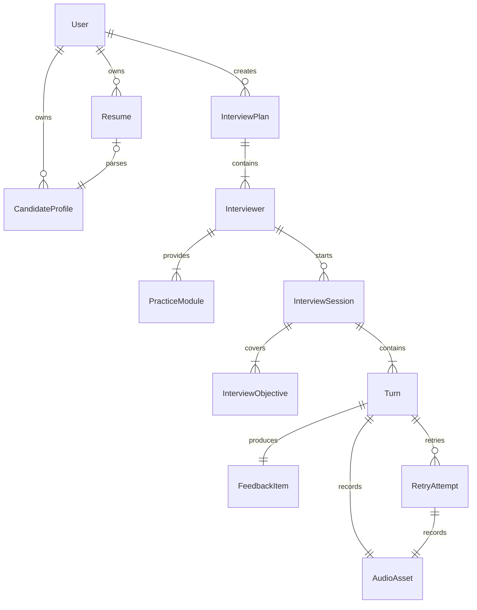
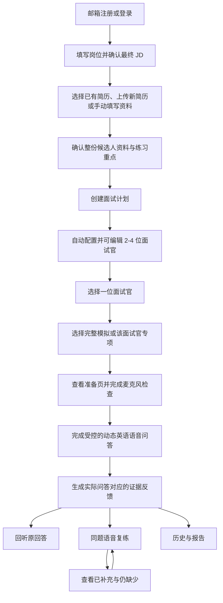
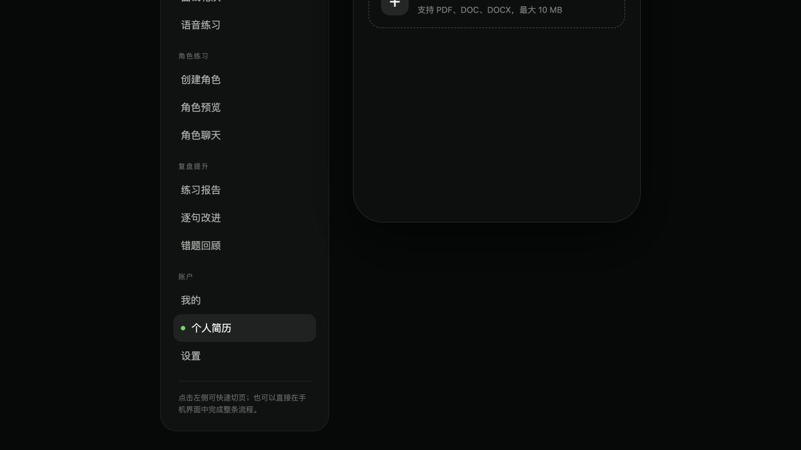
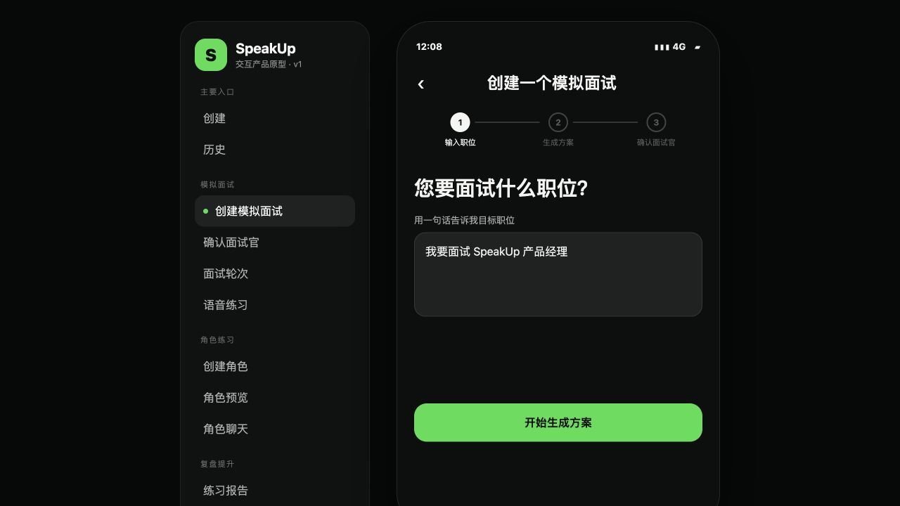
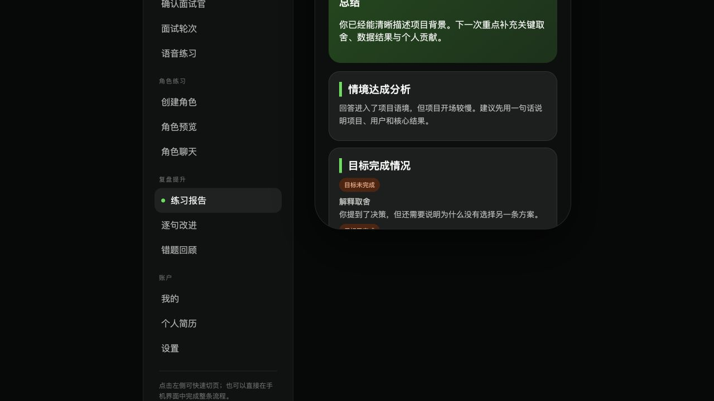
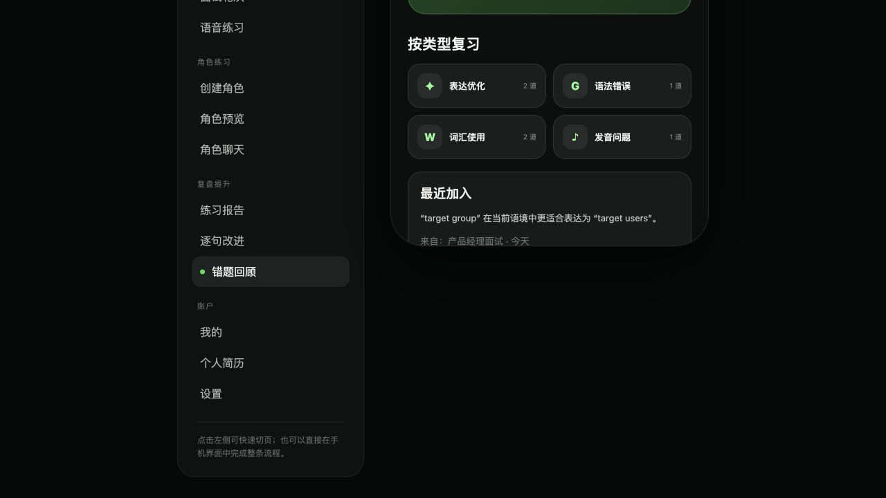

# SpeakUp MS1 面试主链路图文 PRD

> 状态：已按面试主链路细化结论更新，待团队评审<br>
> 日期：2026-07-15<br>
> 视觉基线：[SpeakUp 最新线上原型](https://speakup-product-prototype.wendymcdonald606998.chatgpt.site/)<br>
> 产品范围来源：[SpeakUp 两个月产品方案与功能边界](../../week1/issues/milestone1/proposal-drafts/issue-09-product-proposal.md)
> 详细交互来源：[MS1 面试主链路细化稿](../../week2/覃迦迎/2026-07-14-MS1面试主链路第7至10节细化稿.md)

## 1. 文档目的

本文定义 MS1 中需要真实跑通的面试主链路，并把线上原型中的终局页面映射为可实现、可验收的产品行为。本文是后续领域建模、架构 Proposal、数据存储设计和接口契约的输入，不提前指定数据库表、API 协议、语音厂商或模型厂商。

MS1 聚焦以下闭环：

```text
注册/登录
  -> 填写岗位并确认 JD
  -> 上传并解析整份简历，或手动补充候选人资料
  -> 系统自动配置 2-4 位面试官，用户可在首次练习前编辑
  -> 选择一位面试官的完整模拟或专项练习
  -> 在时间与问题上限内完成动态英文语音问答
  -> 查看按实际问答生成的证据反馈与原音
  -> 对任一问题反复复练
  -> 在历史中查看所有面试和复练版本
```

### 1.1 MS1 真实交付

- 邮箱与密码注册、登录、退出和注销。
- 最多 3 份 PDF 简历的上传与整份内容解析；无简历时可手动填写候选人资料。
- 岗位名称、JD、候选人资料和练习重点均支持缺省，仍可通过明确的示例体验正常进入。
- 一个面试计划下自动配置 2-4 位可编辑面试官，并提供完整模拟和面试官专属专项。
- 默认采用一问一答的真实英语语音练习，按时长、问题上限和目标覆盖情况动态推进。
- 每次回答对应一条基于原话证据的专业反馈。
- 原音回听、同题重复复练、前后差异和完整历史。

### 1.2 明确不作为 MS1 真实验收

- 手机号、邮箱验证、密码找回、第三方登录和账号绑定。
- DOC、DOCX 简历、超过 3 份简历、简历编辑和 ATS 评分。
- 多位面试官同时在线、互相接话或共享进行中会话。
- 实时通话模式的切换、自然打断和全双工交互；本期只预留入口，详细规则后续确认。
- 逐词发音评分、完整语言课程、角色练习、会员、订单和支付。
- 复杂成长分数、排行榜、社交关系和公开分享。

## 2. 原型使用规则

本文中的截图记录了 2026-07-14 的线上原型。截图用于说明信息架构与视觉基线，不代表截图中的每项功能都进入 MS1。

每个页面使用以下标记：

| 标记 | 含义 |
|---|---|
| `保持` | 沿用现有页面结构和主要交互 |
| `修改` | 保留页面，但 MS1 行为与原型不同 |
| `新增` | 线上原型尚未表达，MS1 必须补充 |
| `暂不实现` | 终局原型保留，但不进入 MS1 真实验收 |

## 3. 核心概念与关系

| 概念 | 定义 |
|---|---|
| `User` | 使用邮箱和密码登录、拥有所有个人数据的用户 |
| `Resume` | 用户上传的 PDF 原文件及其解析状态 |
| `CandidateProfile` | 由整份简历解析或手动填写形成的候选人资料，包含教育、工作/实习、项目、技能等 |
| `InterviewPlan` | 一次岗位准备计划，锁定岗位、最终 JD、候选人资料和练习重点快照 |
| `Interviewer` | 隶属于计划的一位独立面试官，包含职责、风格与关注点 |
| `PracticeModule` | 某位面试官可反复练习的完整模拟或专属专项 |
| `InterviewSession` | 用户与一位面试官进行的一场独立面试 |
| `InterviewObjective` | 本场需要覆盖的岗位能力或面试目标，不等同于固定题目 |
| `Turn` | 一个 AI 问题、一个用户有效回答及相关音频与转录 |
| `FeedbackItem` | 对一个 Turn 的证据引用、判断和改进目标 |
| `RetryAttempt` | 针对原 Turn 的一次新语音回答和缺口对比 |
| `AudioAsset` | 原回答或复练回答对应的受保护音频 |



必须满足以下关系约束：

- 一个用户最多保存 3 份简历。
- 一份简历解析为完整候选人资料，不要求用户先选择一条具体经历。
- 一个面试计划锁定最终 JD、候选人资料、练习重点和示例模式标记。
- 一个面试计划由系统自动配置 2-4 位面试官，用户不先选择预设类型。
- 每位面试官可以产生多场相互独立的面试。
- 完整模拟和专项练习都可以重复创建 Session，新场次不覆盖旧记录。
- 每场面试的 Turn 数量由时长、问题上限和目标覆盖情况共同决定。
- 每个 Turn 必须产生一个 FeedbackItem，可以产生任意多次 RetryAttempt。
- 原回答与每次复练分别保存自己的音频和转录，不互相覆盖。

## 4. 端到端用户流程



## 5. 注册与登录

**原型映射：`新增`。** 当前线上原型没有注册/登录页面，设置页仍展示手机号；MS1 需要在进入现有主导航前新增邮箱身份流程。

### 5.1 页面行为

- 注册只要求邮箱、密码和确认密码。
- 邮箱在系统内唯一；已注册邮箱不能重复创建账户。
- 登录只要求邮箱与密码。
- 登录后进入“历史”或最近使用的受保护页面。
- 退出后立即返回登录页，不继续展示简历、音频、报告或历史。
- MS1 不提供邮箱验证、密码找回、手机号登录和第三方登录。

### 5.2 异常

- 邮箱格式无效、密码不一致、邮箱已注册或凭证错误时，在当前表单内说明原因。
- 网络失败时保留用户已输入的邮箱，不清空密码之外的表单状态。
- 未登录用户访问受保护页面时跳转登录页；登录后返回原目标页面。

### 5.3 验收

- 新邮箱可以注册并进入产品；同一邮箱不能重复注册。
- 退出后无法通过历史链接或音频地址继续访问个人数据。

## 6. 简历管理与候选人资料



**原型映射：`保持` 页面布局；`修改` 文件格式、数量与解析状态。**

### 6.1 简历规则

- 每个账户最多保存 3 份简历。
- MS1 仅支持 PDF，单份最大 10 MB。
- 原型中的 DOC、DOCX 文案不进入 MS1，应改为“支持 PDF，最大 10 MB”。
- 简历状态为：`上传中`、`解析中`、`可用`、`解析失败`。
- 用户可以设置默认简历，也可以在创建面试时切换简历。
- 达到 3 份上限后禁用新增入口，并提示先删除一份。

### 6.2 整份简历解析与手动资料

- 系统解析整份简历并按字段提取姓名、教育、工作/实习、项目、技能、优势等内容，不要求用户选择某一条具体经历。
- 解析完成后先展示摘要，用户可以直接继续，也可以展开修改具体字段。
- 无简历时提供手动填写入口，所有字段选填；缺失字段不得使用 mock 内容补齐。
- 手动资料至少支持姓名、学校/学历、工作或实习经历、项目经历、技能和个人优势。
- 解析失败时同时提供重新解析、更换简历和改为手动填写，已填写的岗位信息不得丢失。

### 6.3 快照与删除

- 创建计划时保存用户确认后的最终 JD 与整份候选人资料文本快照。
- 后续重新解析、修改或删除简历，不改变历史计划和报告中的快照。
- 删除简历时删除原 PDF 和当前解析结果；历史计划只保留确认后的文本，不保留对已删除文件的引用。

### 6.4 异常与验收

- 非 PDF、超过 10 MB、上传失败、内容为空和解析失败均需显示具体原因及重试入口。
- 上传一份包含多段经历的 PDF 后，应展示结构化候选人资料摘要而不是强制选择单条经历。
- 用户修改解析结果后，生成的面试计划使用修改后的完整资料。

## 7. 创建面试计划

### 7.1 输入目标岗位



**原型映射：`修改`。**

- 创建流程按“岗位信息 → 候选人资料 → 练习重点”三步渐进展开，选择界面保持简洁。
- 岗位名称和 JD 均可不填；零输入时明确进入“示例体验”，不得伪装成用户真实资料。
- 只填岗位名称时，系统自动生成可查看、可修改的 JD 摘要；用户填写 JD 时以用户内容为准。
- 只提供部分真实信息时，不得混入 mock 事实补齐缺失内容。

### 7.2 选择候选人资料与练习重点


**原型映射：`修改`。** 保留职位名称、职位描述、简历和练习范围布局，并补充以下行为：

- 候选人资料入口首先只展示：使用已保存简历、上传新简历、手动填写、示例体验；选择后只展开对应内容。
- 简历按整份内容解析，用户无需选择具体经历。
- 练习重点支持预设标签多选和自由文本，两者均可跳过。
- 所有字段都有可用缺省路径，用户不填写也能正常创建计划。
- 创建后形成不可变的 InterviewPlan 背景快照。
- 创建成功立即在历史首页增加一张计划卡；重复请求最终只创建一份计划。

### 7.3 异常与验收

- 简历仍在解析时显示进度；用户也可改用手动资料继续。
- 简历解析失败时允许改为手动填写，不阻塞面试创建。
- 生成失败时保留岗位、最终 JD、候选人资料和练习重点，用户可重试。

## 8. 面试官配置与独立场次


**原型映射：`修改` 卡片信息、自动配置方式与场次关系。**

### 8.1 配置规则

- 系统按岗位族从内部预设中自动选择 2-4 种差异化视角，用户不需要先选择面试官类型。
- 一次轻量 AI 适配结合 JD、候选人资料和练习重点，生成虚拟姓名、具体职位、职责、风格、关注点和默认音色。
- 同一次适配还生成每位面试官的完整模拟环节，以及 2-5 个专属专项的名称和简短说明；此时不生成正式问题。
- 生成完成后自动保存并进入计划详情，不设置额外确认页；失败时支持重试或使用系统预设结果。
- 首次练习前允许编辑、添加、删除和排序面试官及练习内容；任一练习开始后锁定整组内容配置。
- 用户可随时试听和更换音色；更换只影响之后的播放，不改变历史音频、报告或场次快照。

### 8.2 多面试官语义

多面试官表示多场相互独立的面试，不表示多人同场面试：

- 每次 Session 只有一位面试官。
- 每位面试官拥有独立进度、问答、报告和复练历史。
- 面试官共享岗位、最终 JD 和候选人资料快照，但不共享进行中的会话状态。
- 完成面试官 A 的面试，不会自动完成面试官 B。
- 用户可以针对同一位面试官开始多场 Session，每场均保留独立记录。
- 每场 Session 保存计划、面试官、完整模拟或专项配置的快照，之后的音色调整也不改写历史。

## 9. 面试轮次与场次选择


**原型映射：`修改`。** 计划详情用简洁的面试官轮播承载完整模拟、专项练习和历史入口。

### 9.1 页面行为

- 一次只展示一位面试官，用户可左右切换，不要求按顺序完成。
- 面试官卡片以“完整模拟”为主操作，“更多练习”打开该面试官 2-5 个专项的简洁选择面板。
- 完整模拟和专项开始前均进入准备页，展示面试官、练习类型、预计时长和大致环节/考察方向，但不提前展示正式问题。
- 未开始时可创建新 Session；进行中时恢复原 Session；完成或提前结束后可查看报告或再练一场。
- 计划详情提供统一历史入口，面试官详情也提供该面试官的历史入口；两者指向同一批场次记录。

### 9.2 验收

- 一个包含 2 位面试官的计划可以分别开始两场独立面试。
- 两场面试的进度、转录、报告和复练互不覆盖。
- 完整模拟和任一专项均可反复创建 Session，新记录不覆盖旧记录。

## 10. 实时语音面试


**原型映射：`修改` 为一问一答主流程；`新增` 动态问题控制、时长约束和失败恢复。**

### 10.1 开始前检查

- 进入面试前请求麦克风权限。
- 展示输入音量并要求完成一次短试音；试音不保存。
- 权限拒绝、没有输入设备或无有效声音时不能进入面试，并给出修复入口。

### 10.2 时长与问题数量控制

用户开始前不选择时长或问题数量，系统按练习类型使用默认控制目标：

| 练习类型 | 默认时长 | 主问题上限 | 单个主问题追问上限 |
|---|---:|---:|---:|
| 完整模拟 | 约 15 分钟 | 最多 6 个 | 最多 1 个 |
| 专项练习 | 约 8 分钟 | 最多 3 个 | 最多 1 个 |

- 上限不是必须问满的配额。系统同时检查剩余时间、剩余目标和追问次数，决定追问、进入下一目标或结束。
- 已覆盖核心目标时可以少于问题上限正常完成；剩余时间不足时不得为了凑数开启新主题。
- 用户可以随时提前结束，保留已完成 Turn，并生成标记为“未完整完成”的阶段性报告。
- 完整模拟是否以自我介绍开场由岗位和面试官职责决定；专项只有选择“自我介绍”时才固定练习该目标。

### 10.3 动态问题生成

- 开始 Session 时，系统根据最终 JD、候选人资料、面试官职责与关注点、练习类型、练习重点和时间预算，生成本场隐藏的面试目标提纲，并只生成第一道具体问题。
- 每个有效回答保存后，系统提取用户真实说出的事实与证据，更新目标覆盖状态，再决定下一步。
- 问题优先来自“JD 要求 × 候选人经历”的交集，并体现当前面试官的职责侧重点。
- 后续问题可以引用用户前文中的项目、任务、方案和结果，不得发明用户没有提供的客户、数据、职级或决策。
- 当前回答缺少关键证据且时间允许时最多追问一次；追问后仍不完整则记录为部分覆盖并继续，不得无限循环。
- 每次只问一个主问题；问题文本必须先保存再播放，播放失败只重播同一问题。
- AI 面试官使用英文提问，用户使用英文回答；页面状态、异常和诊断使用中文。

### 10.4 一问一答与实时通话边界

- 本期默认采用一问一答：AI 播放问题后用户回答，回答结束并保存后才生成下一问。
- 页面预留“实时通话”按钮，供用户熟练后进入更真实的连续对话模式。
- 实时通话的进入时机、切换确认、自然打断、说话权切换和异常恢复尚未确认，不作为当前验收项。

### 10.5 状态与失败恢复

```text
连接中 -> 问题生成中 -> AI 提问中 -> 用户回答中 -> 回答处理中
       -> 控制器判断追问/换题/结束 -> 报告生成中
```

- 当前回答连接中断：保留当前问题，丢弃未完成音频，重新连接后重答当前题。
- 问题生成失败：重试生成当前问题，不跳到下一目标；问题已保存但播放失败时只重播同一文本。
- 已完成 Turn、简历和计划不因当前语音连接失败而丢失。
- 报告生成失败可以单独重试，不要求重新完成面试。

## 11. 报告与逐题反馈



**原型映射：`保持` 总结结构；`新增` 按实际 Turn 生成的回答复盘卡。**

### 11.1 报告结构

- 顶部保留面试用时、目标完成情况、总结和情境达成分析。
- 在汇总下按实际问答顺序展示回答复盘卡。
- 每个有效 Turn 必须生成一张卡，不能只反馈问题最明显的回答。

每张卡包含：

1. 第几问及 AI 原问题。
2. 用户完整转录。
3. “回听原回答”按钮，播放该 Turn 对应音频。
4. `证据完整` 或 `需要补充` 状态。
5. 引用用户原话的具体证据。
6. 对个人贡献、方案取舍、判断依据、验证或结果的诊断。
7. 下一次改进目标。
8. “同题复练”入口。

### 11.2 反馈原则

- 反馈只评价用户是否把真实项目证据讲清楚，不冒充权威技术正确性或录用判断。
- 诊断与改进理由使用中文，引用的用户原话和示例表达保留英文。
- 已完成目标的回答也必须反馈，但应说明哪段证据有效以及为什么有效。
- 不为了凑满固定条数而制造不存在的问题。
- 示例表达不能虚构用户没有提供的项目事实、指标或成果。
- MS1 不以裸总分、发音分或排行榜作为报告核心。

## 12. 逐句改进与错题回顾




**原型映射：`暂不实现`。**

- 线上原型中的逐句改进、逐词发音和按表达/语法/词汇/发音分类的错题回顾属于终局语言能力模块。
- MS1 保留页面与未来入口，但不把它们冒充真实交付。
- MS1 的专业证据复练直接从报告中的回答复盘卡进入。

## 13. 同题复练与版本对比

### 13.1 复练流程

```text
回答复盘卡
  -> 查看原问题与本次改进目标
  -> AI 再次提出同一问题
  -> 用户提交新的语音回答
  -> 保存新音频与转录
  -> 只检查原诊断缺口
  -> 展示“已补充 / 仍缺少”
```

### 13.2 版本规则

- 同一道题可以重复复练，不限制次数。
- 每次复练创建新的 RetryAttempt，不覆盖原回答或更早的复练。
- 对比只围绕原 FeedbackItem 的缺口，不重新生成一套无关总评分。
- 报告卡显示最近一次复练结果，并可展开查看全部版本。
- 每个版本保存独立转录和音频。

## 14. 历史


**原型映射：`保持` 主入口；`修改` 层级与状态。**

### 14.1 聚合层级

```text
面试计划
  -> 面试官
     -> 多场 InterviewSession
        -> 多个实际 Turn
           -> FeedbackItem
              -> 多次 RetryAttempt
```

### 14.2 页面行为

- 历史首页按面试计划展示岗位、最近面试官、最近时间和总体状态。
- 进入计划后查看各位面试官及其未开始、进行中、已完成或提前结束状态。
- 进行中的 Session 恢复到当前问题；未完成音频必须重答。
- 已完成或提前结束的 Session 进入对应报告，并能查看全部实际回答及复练版本。
- 删除或修改简历不改变历史计划使用的经历快照。

## 15. 我的、设置与数据删除


**原型映射：`保持` 布局；`修改` 身份字段和商业化入口。**

### 15.1 MS1 调整

- 设置页手机号改为当前登录邮箱。
- 权益中心和订单在真实 MS1 版本中隐藏。
- 保留个人简历、设置、退出和注销入口。
- 音频使用受保护地址，不能生成永久公开链接。

### 15.2 注销账号

- 注销需要二次确认，并明确将删除的数据范围。
- 确认后删除账户、简历原文件、解析结果、经历、计划、面试官、场次、音频、转录、报告、反馈和复练记录。
- 删除完成后退出登录，所有历史地址与音频地址均不可继续访问。
- 删除失败时保持账户可用并提示重试，不能先显示已注销再留下数据。

## 16. 端到端验收场景

### 场景 1：注册、简历解析与候选人资料

1. 用户使用新邮箱和密码注册。
2. 上传一份小于 10 MB、包含多个项目与实习的 PDF。
3. 系统展示解析状态并输出包含教育、经历、项目和技能的候选人资料摘要。
4. 用户无需选择具体经历，可以直接继续或展开修改任意字段。
5. 面试计划保存最终 JD、完整候选人资料和练习重点快照。

### 场景 2：配置多位独立面试官

1. 系统根据岗位自动配置 2-4 位差异化面试官，用户不先选择预设类型。
2. 用户在首次练习前编辑面试官信息、专项或音色。
3. 两位面试官均可开始独立 Session。
4. 两场面试的进度、转录、报告和复练互不覆盖。

### 场景 3：动态问题与时长控制

1. 用户完成麦克风试音后进入面试。
2. 系统基于 JD、候选人资料、面试官职责和练习类型生成隐藏目标提纲及第一问。
3. 每次有效回答保存后，系统根据目标覆盖、剩余时间和问题上限决定追问、换题或结束。
4. 完整模拟不超过约 15 分钟和 6 个主问题；专项不超过约 8 分钟和 3 个主问题，每题最多追问一次。
5. 用户提前结束后保留已完成问答并生成“未完整完成”的阶段性报告。

### 场景 4：逐题证据反馈与回听

1. 报告按实际有效 Turn 生成回答复盘卡。
2. 每张卡引用对应回答原话，说明证据完整或缺少内容。
3. 每张卡均能播放对应原回答音频。
4. 已完成目标的回答说明有效证据，不生成虚假问题。

### 场景 5：重复复练

1. 用户从任一回答卡进入同题复练。
2. 新回答只对比原反馈缺口，显示已补充和仍缺少。
3. 用户再次复练后，原回答和前一次复练仍可查看。
4. 所有版本的音频、转录和时间关系正确。

### 场景 6：失败恢复

1. 简历解析失败时可以手动填写经历。
2. 当前回答断线时保留问题并重答本题，已完成 Turn 不丢失。
3. 报告生成失败可以单独重试，不要求重做面试。

### 场景 7：数据权限与注销

1. 用户 A 不能访问用户 B 的简历、音频、报告和历史。
2. 用户退出后，受保护地址不能继续读取个人数据。
3. 用户注销后，账户、简历、音频、转录、报告和复练记录均不可访问。

## 17. 架构设计输入与边界

后续架构 Proposal 必须从本文推导：

- 模块边界与职责。
- 简历解析的异步状态和失败回退。
- 面试计划、候选人资料、面试官、练习模块、面试目标、场次、Turn、反馈与复练的生命周期。
- 问题控制与问题生成的职责边界：控制器决定追问、换题或结束，生成器根据选定目标生成具体问题。
- 一问一答模式下的音频输入、AI 音频输出、有效回答判断和未完成音频丢弃规则。
- 实时通话入口与当前一问一答主流程的隔离边界。
- 关系数据、简历文件、回答音频和受保护访问方式。
- 账号注销的全量删除流程。
- Mock 与真实厂商的替换边界。

本文不决定：

- PostgreSQL、MySQL 或其他数据库。
- REST、WebSocket、WebRTC 或具体消息格式。
- Go、FastAPI 或其他后端框架。
- ASR、LLM、TTS 或端到端语音厂商。
- 具体表结构、对象存储产品和部署拓扑。

这些决策必须在架构 Proposal 中基于本文的行为、数据关系、风险和验收要求作出，并说明备选方案与取舍依据。
