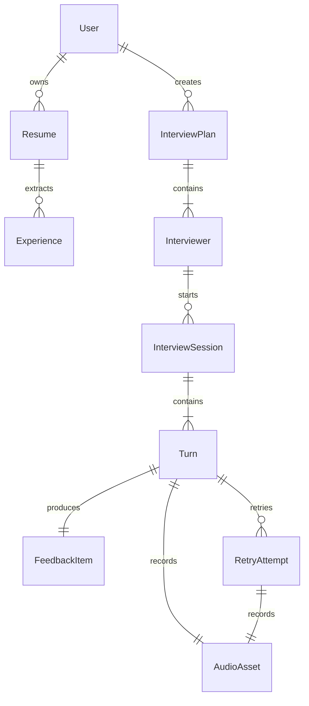
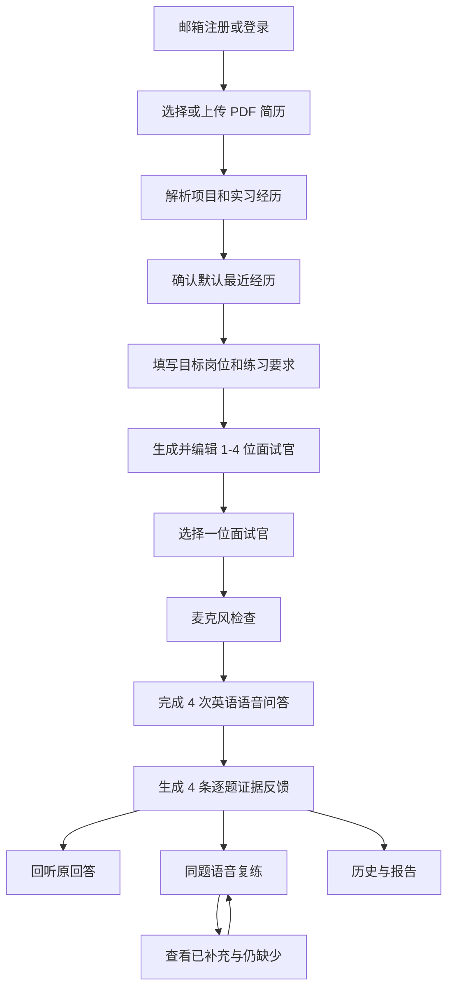

# SpeakUp MS1 面试主链路图文 PRD

> 状态：已确认，待团队按本文评审架构设计<br>
> 日期：2026-07-14<br>
> 视觉基线：[SpeakUp 最新线上原型](https://speakup-product-prototype.wendymcdonald606998.chatgpt.site/)<br>
> 产品范围来源：[SpeakUp 两个月产品方案与功能边界](../../week1/issues/milestone1/proposal-drafts/issue-09-product-proposal.md)

## 1. 文档目的

本文定义 MS1 中需要真实跑通的面试主链路，并把线上原型中的终局页面映射为可实现、可验收的产品行为。本文是后续领域建模、架构 Proposal、数据存储设计和接口契约的输入，不提前指定数据库表、API 协议、语音厂商或模型厂商。

MS1 聚焦以下闭环：

```text
注册/登录
  -> 上传并解析简历
  -> 确认岗位与一条项目/实习经历
  -> 配置 1-4 位面试官
  -> 选择一位进入独立面试
  -> 完成 4 次真实英文语音问答
  -> 查看 4 条证据反馈与原音
  -> 对任一问题反复复练
  -> 在历史中查看所有面试和复练版本
```

### 1.1 MS1 真实交付

- 邮箱与密码注册、登录、退出和注销。
- 最多 3 份 PDF 简历的上传、解析和经历确认。
- 一个面试计划下 1-4 位可编辑面试官。
- 每位面试官相互独立的多场项目深挖面试。
- 可打断的真实英语语音问答，每场固定 4 次有效回答。
- 每次回答对应一条基于原话证据的专业反馈。
- 原音回听、同题重复复练、前后差异和完整历史。

### 1.2 明确不作为 MS1 真实验收

- 手机号、邮箱验证、密码找回、第三方登录和账号绑定。
- DOC、DOCX 简历、超过 3 份简历、简历编辑和 ATS 评分。
- 多位面试官同时在线、互相接话或共享进行中会话。
- 完整四轮面试全部真实实现；MS1 只验收项目深挖场次。
- 逐词发音评分、完整语言课程、角色练习、会员、订单和支付。
- 复杂成长分数、排行榜、社交关系和公开分享。

## 2. 原型使用规则

本文中的截图记录了 2026-07-14 的线上原型。截图用于说明信息架构与视觉基线，不代表截图中的每项功能都进入 MS1。

每个页面使用以下标记：

| 标记 | 含义 |
|---|---|
| `保持` | 沿用现有页面结构和主要交互 |
| `修改` | 保留页面，但 MS1 行为与原型不同 |
| `新增` | 线上原型尚未表达，MS1 必须补充 |
| `暂不实现` | 终局原型保留，但不进入 MS1 真实验收 |

## 3. 核心概念与关系

| 概念 | 定义 |
|---|---|
| `User` | 使用邮箱和密码登录、拥有所有个人数据的用户 |
| `Resume` | 用户上传的 PDF 原文件及其解析状态 |
| `Experience` | 从简历识别出的项目、实习或工作经历 |
| `InterviewPlan` | 一次岗位准备计划，锁定岗位和经历快照 |
| `Interviewer` | 隶属于计划的一位独立面试官，包含职责、风格与关注点 |
| `InterviewSession` | 用户与一位面试官进行的一场独立面试 |
| `Turn` | 一个 AI 问题、一个用户有效回答及相关音频与转录 |
| `FeedbackItem` | 对一个 Turn 的证据引用、判断和改进目标 |
| `RetryAttempt` | 针对原 Turn 的一次新语音回答和缺口对比 |
| `AudioAsset` | 原回答或复练回答对应的受保护音频 |



必须满足以下关系约束：

- 一个用户最多保存 3 份简历。
- 一份简历可以解析出多条项目、实习或工作经历。
- 一个面试计划锁定一条用户确认后的经历快照。
- 一个面试计划包含 1-4 位面试官，默认生成 4 位。
- 每位面试官可以产生多场相互独立的面试。
- 每场完整面试固定包含 4 个有效 Turn。
- 每个 Turn 必须产生一个 FeedbackItem，可以产生任意多次 RetryAttempt。
- 原回答与每次复练分别保存自己的音频和转录，不互相覆盖。

## 4. 端到端用户流程



## 5. 注册与登录

**原型映射：`新增`。** 当前线上原型没有注册/登录页面，设置页仍展示手机号；MS1 需要在进入现有主导航前新增邮箱身份流程。

### 5.1 页面行为

- 注册只要求邮箱、密码和确认密码。
- 邮箱在系统内唯一；已注册邮箱不能重复创建账户。
- 登录只要求邮箱与密码。
- 登录后进入“历史”或最近使用的受保护页面。
- 退出后立即返回登录页，不继续展示简历、音频、报告或历史。
- MS1 不提供邮箱验证、密码找回、手机号登录和第三方登录。

### 5.2 异常

- 邮箱格式无效、密码不一致、邮箱已注册或凭证错误时，在当前表单内说明原因。
- 网络失败时保留用户已输入的邮箱，不清空密码之外的表单状态。
- 未登录用户访问受保护页面时跳转登录页；登录后返回原目标页面。

### 5.3 验收

- 新邮箱可以注册并进入产品；同一邮箱不能重复注册。
- 退出后无法通过历史链接或音频地址继续访问个人数据。

## 6. 简历管理与经历确认


**原型映射：`保持` 页面布局；`修改` 文件格式、数量与解析状态。**

### 6.1 简历规则

- 每个账户最多保存 3 份简历。
- MS1 仅支持 PDF，单份最大 10 MB。
- 原型中的 DOC、DOCX 文案不进入 MS1，应改为“支持 PDF，最大 10 MB”。
- 简历状态为：`上传中`、`解析中`、`可用`、`解析失败`。
- 用户可以设置默认简历，也可以在创建面试时切换简历。
- 达到 3 份上限后禁用新增入口，并提示先删除一份。

### 6.2 经历解析与默认选择

- 解析结果同时包含项目经历与实习/工作经历。
- 按结束日期倒序排列，默认选中最近一条经历。
- 日期缺失时，默认选中简历中最先出现的一条经历。
- 用户可以切换经历，并在开始面试前修改项目名称、背景、个人职责和识别出的成果。
- 解析失败或没有识别到经历时，提供手动填写入口，不要求重新上传。

### 6.3 快照与删除

- 创建计划时保存用户确认后的岗位与经历文本快照。
- 后续重新解析、修改或删除简历，不改变历史计划和报告中的快照。
- 删除简历时删除原 PDF 和当前解析结果；历史计划只保留确认后的文本，不保留对已删除文件的引用。

### 6.4 异常与验收

- 非 PDF、超过 10 MB、上传失败、内容为空和解析失败均需显示具体原因及重试入口。
- 上传一份含多个项目/实习的 PDF 后，应展示多条经历并默认选中最近一条。
- 用户修改默认经历后，生成的面试计划使用修改后的内容。

## 7. 创建面试计划

### 7.1 输入目标岗位


**原型映射：`保持`。**

- 用户使用自然语言填写目标岗位。
- 岗位不得被原型中的“SpeakUp 产品经理”写死。
- 岗位为空时不能进入下一步。

### 7.2 选择简历与经历


**原型映射：`修改`。** 保留职位名称、职位描述、简历和练习范围布局，并补充以下行为：

- 展示当前默认简历，允许切换或上传新 PDF。
- 展示解析出的经历列表，默认选中最近一条。
- 用户必须确认或修改选中经历，才能生成面试官。
- 目标岗位必填；练习重点和补充要求选填。
- 创建后形成不可变的 InterviewPlan 背景快照。

### 7.3 异常与验收

- 简历仍在解析时不能生成面试官，应显示解析进度。
- 简历解析失败时允许改为手动填写，不阻塞面试创建。
- 生成失败时保留岗位、简历、经历和补充要求，用户可重试。

## 8. 面试官配置与独立场次


**原型映射：`保持` 卡片结构；`修改` 数量与场次关系。**

### 8.1 配置规则

- 系统默认根据岗位和经历生成 4 位面试官。
- 用户可以编辑姓名、职责、风格和关注点。
- 用户可以删除面试官，也可以重新添加，最终必须保留 1-4 位。
- 不能保存 0 位或超过 4 位面试官的计划。

### 8.2 多面试官语义

多面试官表示多场相互独立的面试，不表示多人同场面试：

- 每次 Session 只有一位面试官。
- 每位面试官拥有独立进度、问答、报告和复练历史。
- 面试官共享岗位和经历快照，但不共享进行中的会话状态。
- 完成面试官 A 的面试，不会自动完成面试官 B。
- 用户可以针对同一位面试官开始多场 Session，每场均保留独立记录。

## 9. 面试轮次与场次选择


**原型映射：`修改`。** 现有页面展示完整四轮和专项练习；MS1 需要真实表达每位面试官的独立状态。

### 9.1 页面行为

- 以面试官为单位展示：未开始、进行中、已完成。
- 未开始的面试官可以开始新 Session。
- 进行中的面试官进入当前未完成问题。
- 已完成的面试官可以查看报告或再练一场。
- MS1 只真实实现项目深挖；其他终局轮次标记“后续开放”或在真实版本中隐藏。

### 9.2 验收

- 一个包含 2 位面试官的计划可以分别开始两场独立面试。
- 两场面试的进度、转录、报告和复练互不覆盖。

## 10. 实时语音面试


**原型映射：`保持` 实时语音视觉；`新增` 可打断状态、四问目标和失败恢复。**

### 10.1 开始前检查

- 进入面试前请求麦克风权限。
- 展示输入音量并要求完成一次短试音；试音不保存。
- 权限拒绝、没有输入设备或无有效声音时不能进入面试，并给出修复入口。

### 10.2 四次问答

一场完整 Session 固定完成 4 次有效问答：

- AI 面试官使用英文提问，用户使用英文回答。
- 页面操作、异常提示和报告诊断使用中文。
- 报告中的用户原话与优化示例保留英文，关键解释可提供中英对照。
- MS1 不新增面试语言或反馈语言切换。

| 次序 | 固定目标 | 动态要求 |
|---|---|---|
| 1 | 项目概览 | 结合岗位与经历快照询问项目背景 |
| 2 | 个人贡献 | 引用第一次回答中的角色或任务继续追问 |
| 3 | 方案取舍 | 引用已提到的方案，追问替代方案与依据 |
| 4 | 验证与结果 | 追问验证方式、边界、结果或量化证据 |

- 四个目标固定，具体问题措辞必须结合前面回答动态生成。
- 只有获得可用转录的回答才计为完成一个 Turn。
- 空白、过短或识别失败的回答停留在当前问题，不增加次数。
- 第四次有效回答保存后自动结束并进入报告生成。
- 用户可以提前结束，但只生成未完成报告，不进入同题复练。

### 10.3 可打断行为

- AI 播放问题时持续监听用户输入。
- 检测到用户持续开口后，停止 AI 播放并转为接收回答。
- 被打断的 AI 内容标记为“已中断”；界面只展示用户实际听到的部分。
- 未播放文本不能被当作 AI 已经说过的内容进入用户可见历史。
- 用户打断后的回答仍归属于当前问题，不额外增加 Turn。
- 环境短噪声不触发打断；误触发后允许重新播放当前问题并重答。
- AI 不得在用户持续说话时抢话。

### 10.4 状态与失败恢复

```text
连接中 -> AI 提问中 -> 用户回答中 -> AI 处理中
       -> 下一次提问 -> 第 4 次回答完成 -> 报告生成中
```

- 当前回答连接中断：保留当前问题，丢弃未完成音频，重新连接后重答当前题。
- AI 生成或语音播放失败：重新生成当前问题，不增加次数。
- 已完成 Turn、简历和计划不因当前语音连接失败而丢失。
- 报告生成失败可以单独重试，不要求重新完成面试。

## 11. 报告与四条逐题反馈


**原型映射：`保持` 总结结构；`新增` 4 张回答复盘卡。**

### 11.1 报告结构

- 顶部保留面试用时、目标完成情况、总结和情境达成分析。
- 在汇总下按问答顺序展示 4 张回答复盘卡。
- 每个有效 Turn 必须生成一张卡，不能只反馈问题最明显的回答。

每张卡包含：

1. 第几问及 AI 原问题。
2. 用户完整转录。
3. “回听原回答”按钮，播放该 Turn 对应音频。
4. `证据完整` 或 `需要补充` 状态。
5. 引用用户原话的具体证据。
6. 对个人贡献、方案取舍、判断依据、验证或结果的诊断。
7. 下一次改进目标。
8. “同题复练”入口。

### 11.2 反馈原则

- 反馈只评价用户是否把真实项目证据讲清楚，不冒充权威技术正确性或录用判断。
- 诊断与改进理由使用中文，引用的用户原话和示例表达保留英文。
- 已完成目标的回答也必须反馈，但应说明哪段证据有效以及为什么有效。
- 不为了凑满 4 条而制造不存在的问题。
- 示例表达不能虚构用户没有提供的项目事实、指标或成果。
- MS1 不以裸总分、发音分或排行榜作为报告核心。

## 12. 逐句改进与错题回顾


**原型映射：`暂不实现`。**

- 线上原型中的逐句改进、逐词发音和按表达/语法/词汇/发音分类的错题回顾属于终局语言能力模块。
- MS1 保留页面与未来入口，但不把它们冒充真实交付。
- MS1 的专业证据复练直接从报告中的回答复盘卡进入。

## 13. 同题复练与版本对比

### 13.1 复练流程

```text
回答复盘卡
  -> 查看原问题与本次改进目标
  -> AI 再次提出同一问题
  -> 用户提交新的语音回答
  -> 保存新音频与转录
  -> 只检查原诊断缺口
  -> 展示“已补充 / 仍缺少”
```

### 13.2 版本规则

- 同一道题可以重复复练，不限制次数。
- 每次复练创建新的 RetryAttempt，不覆盖原回答或更早的复练。
- 对比只围绕原 FeedbackItem 的缺口，不重新生成一套无关总评分。
- 报告卡显示最近一次复练结果，并可展开查看全部版本。
- 每个版本保存独立转录和音频。

## 14. 历史


**原型映射：`保持` 主入口；`修改` 层级与状态。**

### 14.1 聚合层级

```text
面试计划
  -> 面试官
     -> 多场 InterviewSession
        -> 4 个 Turn
           -> FeedbackItem
              -> 多次 RetryAttempt
```

### 14.2 页面行为

- 历史首页按面试计划展示岗位、最近面试官、最近时间和总体状态。
- 进入计划后查看各位面试官及其未开始、进行中、已完成状态。
- 进行中的 Session 恢复到当前问题；未完成音频必须重答。
- 已完成 Session 进入原报告，并能查看 4 次原回答及全部复练版本。
- 删除或修改简历不改变历史计划使用的经历快照。

## 15. 我的、设置与数据删除


**原型映射：`保持` 布局；`修改` 身份字段和商业化入口。**

### 15.1 MS1 调整

- 设置页手机号改为当前登录邮箱。
- 权益中心和订单在真实 MS1 版本中隐藏。
- 保留个人简历、设置、退出和注销入口。
- 音频使用受保护地址，不能生成永久公开链接。

### 15.2 注销账号

- 注销需要二次确认，并明确将删除的数据范围。
- 确认后删除账户、简历原文件、解析结果、经历、计划、面试官、场次、音频、转录、报告、反馈和复练记录。
- 删除完成后退出登录，所有历史地址与音频地址均不可继续访问。
- 删除失败时保持账户可用并提示重试，不能先显示已注销再留下数据。

## 16. 端到端验收场景

### 场景 1：注册、简历解析与默认经历

1. 用户使用新邮箱和密码注册。
2. 上传一份小于 10 MB、包含多个项目与实习的 PDF。
3. 系统展示解析状态并输出多条经历。
4. 默认选中结束日期最近的一条；日期缺失时选中简历中第一条。
5. 用户切换并修改经历后，面试计划保存修改后的快照。

### 场景 2：配置多位独立面试官

1. 系统默认生成 4 位面试官。
2. 用户编辑一位、删除两位，最终保留 2 位。
3. 两位面试官均可开始独立 Session。
4. 两场面试的进度、转录、报告和复练互不覆盖。

### 场景 3：全双工打断与四次问答

1. 用户完成麦克风试音后进入面试。
2. AI 播放问题时用户开口，AI 自动停播并接收回答。
3. 环境短噪声不推进 Turn。
4. 四次有效回答分别覆盖概览、贡献、取舍、验证结果。
5. 第四次回答保存后进入报告生成。

### 场景 4：四条证据反馈与回听

1. 报告生成 4 张回答复盘卡。
2. 每张卡引用对应回答原话，说明证据完整或缺少内容。
3. 每张卡均能播放对应原回答音频。
4. 已完成目标的回答说明有效证据，不生成虚假问题。

### 场景 5：重复复练

1. 用户从任一回答卡进入同题复练。
2. 新回答只对比原反馈缺口，显示已补充和仍缺少。
3. 用户再次复练后，原回答和前一次复练仍可查看。
4. 所有版本的音频、转录和时间关系正确。

### 场景 6：失败恢复

1. 简历解析失败时可以手动填写经历。
2. 当前回答断线时保留问题并重答本题，已完成 Turn 不丢失。
3. 报告生成失败可以单独重试，不要求重做面试。

### 场景 7：数据权限与注销

1. 用户 A 不能访问用户 B 的简历、音频、报告和历史。
2. 用户退出后，受保护地址不能继续读取个人数据。
3. 用户注销后，账户、简历、音频、转录、报告和复练记录均不可访问。

## 17. 架构设计输入与边界

后续架构 Proposal 必须从本文推导：

- 模块边界与职责。
- 简历解析的异步状态和失败回退。
- 面试计划、面试官、场次、Turn、反馈与复练的生命周期。
- 实时音频输入、AI 音频输出、用户打断和未完成音频丢弃规则。
- 关系数据、简历文件、回答音频和受保护访问方式。
- 账号注销的全量删除流程。
- Mock 与真实厂商的替换边界。

本文不决定：

- PostgreSQL、MySQL 或其他数据库。
- REST、WebSocket、WebRTC 或具体消息格式。
- Go、FastAPI 或其他后端框架。
- ASR、LLM、TTS 或端到端语音厂商。
- 具体表结构、对象存储产品和部署拓扑。

这些决策必须在架构 Proposal 中基于本文的行为、数据关系、风险和验收要求作出，并说明备选方案与取舍依据。
