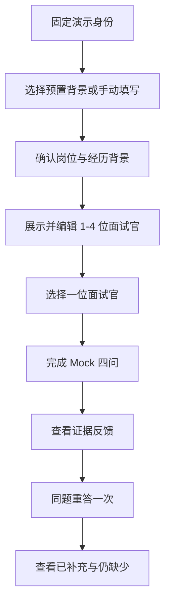

# SpeakUp MS1 面试主链路图文 PRD

> 状态：修订草案，跟踪 Issue [#16](https://github.com/1024XEngineer/XE3-ESL/issues/16)<br>
> 日期：2026-07-14<br>
> 产品决策来源：[#9](https://github.com/1024XEngineer/XE3-ESL/issues/9)、[#10](https://github.com/1024XEngineer/XE3-ESL/issues/10)、[#11](https://github.com/1024XEngineer/XE3-ESL/issues/11)、[#12](https://github.com/1024XEngineer/XE3-ESL/issues/12)、[#14](https://github.com/1024XEngineer/XE3-ESL/issues/14)<br>
> 视觉基线：[SpeakUp 在线原型](https://speakup-product-prototype.wendymcdonald606998.chatgpt.site/)

## 1. 文档职责

本文只定义 MS1 图文原型需要表达的页面、主流程、Mock 边界和演示验收，不定义数据库、接口字段、模型 Prompt 或供应商协议。

截图是信息架构和视觉基线，不代表截图中的全部能力已经实现。若本文与已接受 Proposal 冲突，以 Proposal 为准，并通过 #16 修订本文。

### 1.1 权威关系

- #16 评审完成并合入后，本文是 MS1 产品实施与验收的主基线。
- #9、#10～#14 用于记录产品决策、评审状态和变更原因，不与本文维护两套完整规格。
- 本文处于草案阶段时，已接受 Proposal 优先；本文正式合入后，团队日常开发优先查本文。
- 后续范围变化必须先在对应 Issue 形成结论，再同步本文；不能只改 Issue 评论或只改文档其中一处。

## 2. MS1 范围

### 2.1 必须交付

- 使用一个固定演示身份进入产品，不实现真实注册登录。
- 使用预置简历背景或手动背景，不实现真实文件上传和解析。
- 输入并确认目标岗位、经历背景、个人职责、成果和训练重点。
- 一个计划展示 1–4 位面试官；用户选择其中一位进入独立 Session。
- 一场 Session 展示固定四问，至少一次追问引用上一轮回答。
- 展示基于原回答证据的反馈；至少一张反馈卡可进入同题重答。
- 保存并展示原回答与一次复练版本，说明已补充和仍缺少的内容。
- 明确标注哪些内容为 Mock、固定数据或后续实现。

### 2.2 不作为 MS1 真实验收

- 邮箱、手机号、第三方账号的真实注册、登录、找回和注销。
- PDF、DOC、DOCX 的真实上传、解析、删除和多简历管理。
- 真实 ASR、LLM、TTS、连续实时语音、自动打断和弱网恢复。
- 四位面试官同场、完整四轮面试体系和专项练习。
- 独立复练清单、错题分类、跨会话成长画像和完整历史恢复。
- 自定义角色、数字人、口型、复杂表情、会员、订单和支付。
- 音素级发音评分、裸总分、排行榜或录用概率。

## 3. 核心概念

| 概念 | MS1 含义 |
|---|---|
| `DemoUser` | 固定演示身份，只用于串联页面和数据归属概念 |
| `ConfirmedContext` | 用户确认的岗位、经历、职责、成果和训练重点快照 |
| `InterviewPlan` | 基于确认背景生成的面试计划，包含 1–4 位面试官 |
| `Interviewer` | 一位独立面试官，拥有职责、风格和关注点 |
| `InterviewSession` | 用户选择一位面试官后开始的一场独立四问练习 |
| `Turn` | 一个问题和一个有效回答；MS1 数据允许为预置或 Mock |
| `FeedbackItem` | 引用原回答证据的诊断和下一次改进目标 |
| `RetryAttempt` | 针对原问题的新回答版本，不覆盖原回答 |

必须保持以下产品关系：

```text
InterviewPlan
  -> Interviewer 1..4
     -> InterviewSession 0..n
        -> Turn 1..4
           -> FeedbackItem
              -> RetryAttempt 0..n
```

- 每个 Session 只属于一位面试官。
- 一场完整 Session 固定四个有效 Turn。
- 原回答、反馈和复练版本只追加，不互相覆盖。
- 多位面试官表示多场独立练习，不表示多人同时在线。

## 4. MS1 演示主流程



主流程必须使用同一份确认背景和同一位面试官，不能在页面间偷偷切换演示数据。

## 5. 页面与截图映射

### 5.1 历史


状态：`修改`。

- MS1 只展示固定演示记录，用于说明计划、面试官、Session 和报告的层级。
- 不验收跨设备、跨登录或弱网后的真实历史恢复。
- 页面文案必须标注演示数据，不冒充真实持久化结果。

### 5.2 简历与背景


状态：`修改`。

- MS1 将“上传简历”替换为“使用预置背景”或“手动填写背景”。
- 用户必须确认背景后才能创建计划。
- 不展示真实解析进度、三份简历上限或 DOC/DOCX 支持承诺。
- MS2 再实现一份文本型 PDF 的上传、解析、确认和删除。

### 5.3 输入目标岗位


状态：`保持`。

- 目标岗位由用户自由输入，演示岗位不能写死为产品规则。
- 岗位为空时不能进入下一步。

### 5.4 确认面试背景


状态：`修改`。

- 展示岗位、经历背景、个人职责、成果、训练重点和补充要求。
- 用户确认或修改后形成背景快照。
- MS1 不依赖真实简历文件；自动生成内容必须允许用户修改。

### 5.5 面试官配置


状态：`保持结构，修改语义`。

- 一个计划包含 1–4 位面试官，默认可展示 4 位。
- 用户可以编辑姓名、职责、风格和关注点。
- 每次只选择一位面试官开始独立 Session。
- 不表达四位面试官同场或共享进行中会话。

### 5.6 选择场次


状态：`修改`。

- 页面按面试官展示未开始、进行中或已完成状态。
- “四轮面试”和专项练习只作为终局信息架构，MS1 隐藏或标记后续开放。
- 选择面试官后进入该面试官的一场独立四问 Session。

### 5.7 四问语音练习


状态：`修改`。

- MS1 可以使用预置音频、浏览器本地交互或固定脚本模拟问答。
- 四问目标依次为项目概览、个人贡献、方案取舍、验证与结果。
- 至少一个后续问题应明确引用上一轮回答中的内容。
- 页面必须标明 Mock，不把固定脚本描述为真实模型生成。
- 真实点击说话、转录、播放和失败恢复放在 MS2。

### 5.8 报告与证据反馈


状态：`保持结构，修改验收`。

- 报告展示四问结果和证据反馈结构。
- 至少一张反馈卡引用用户原回答，包含诊断、改进目标和同题重答入口。
- 示例表达只能改写用户已经提供的事实，不虚构指标或成果。
- 不展示无解释的裸总分或录用概率。

### 5.9 逐句改进


状态：`后续实现`。

- MS1 不验收完整逐句改进和逐词发音能力。
- 页面可用于展示终局方向，但不得进入 MS1 完成度统计。

### 5.10 独立复练清单


状态：`MS3 再实现`。

- MS1/MS2 只从反馈卡直接同题重答。
- 不建设独立错题分类、跨会话薄弱项和成长画像。

### 5.11 我的


状态：`修改`。

- 使用固定演示身份和可复核的演示统计。
- 真实昵称、头像、账户管理和注销不进入 MS1。
- 会员、权益、订单和社交入口在开发版本中隐藏。

### 5.12 设置


状态：`修改`。

- MS1 不提供真实认证、退出和注销流程。
- 隐私与数据删除文案可以展示方向，但不能描述成已经实现。
- MS2 实现一种真实认证方式；完整注销和文件删除后置。

## 6. 四问与反馈行为

| 次序 | 固定目标 | Mock 验收 |
|---|---|---|
| 1 | 项目概览 | 问题结合确认背景，不残留其他演示岗位 |
| 2 | 个人贡献 | 至少引用第一问回答中的角色、任务或行动 |
| 3 | 方案取舍 | 追问替代方案、选择依据或边界 |
| 4 | 验证与结果 | 追问验证方式、结果或真实量化证据 |

反馈遵循以下规则：

- 重要判断能够定位到用户原回答。
- 证据不足时明确说明缺什么，不替用户编造事实。
- 同题重答只检查原改进目标。
- 原回答和每次重答都保留为独立版本。

## 7. MS1 端到端验收

1. 评审者以固定演示身份进入产品。
2. 使用预置背景或手动背景确认一个可替换的技术岗位。
3. 页面展示 1–4 位面试官，并能选择其中一位。
4. 完成一场固定四问，至少一次追问引用上一轮回答。
5. 报告至少有一张反馈卡引用原回答证据。
6. 从反馈卡完成一次同题重答，并展示已补充和仍缺少。
7. 演示全程说明固定数据、Mock 与真实实现边界。
8. 页面不把真实注册、PDF 解析、连续语音、自定义角色或独立复练清单描述成 MS1 已交付。

## 8. 后续 Milestone

| Milestone | 产品深度 |
|---|---|
| MS1 | 固定身份、预置/手动背景、Mock 四问、证据反馈和一次同题重答 |
| MS2 | 一种真实认证、一份文本型 PDF、一个面试官的真实点击说话四问和基础报告保存 |
| MS3 | 多面试官独立场次、完整历史、独立复练清单和跨会话薄弱项；重新评审自定义角色 |
| MS4 | 异常恢复、权限、隐私删除、稳定性、测试、部署和展示材料 |

## 9. 文档边界与追踪

- 系统架构与技术选型：[#15](https://github.com/1024XEngineer/XE3-ESL/issues/15)
- 图文 PRD 修订：[#16](https://github.com/1024XEngineer/XE3-ESL/issues/16)
- PostgreSQL 与 `TurnAnalysis`：[#17](https://github.com/1024XEngineer/XE3-ESL/issues/17)

本文完成 #16 评审并合入后，作为 #9 的图文产品基线；架构或数据库文档不得反向扩大本文产品范围。
