# SpeakUp MS1 系统架构设计

> 状态：团队评审稿<br>
> 日期：2026-07-14<br>
> 架构负责人：林锵<br>
> 评审参与：张思成、黄天宇、智铭威、覃迦迎<br>
> 产品输入：[SpeakUp MS1 面试主链路图文 PRD](./2026-07-14-ms1-interview-prd-design.md)<br>
> 视觉基线：[SpeakUp 最新线上原型](https://speakup-product-prototype.wendymcdonald606998.chatgpt.site/)

## 1. 文档目的

本文把已确认的产品 PRD 转换为可实施的系统架构，固定本阶段的系统边界、模块职责、数据归属、通信方式、运行时流程和关键技术决策。

本文解决以下问题：

1. 当前 Web 原型、Go/Gin 后端、PostgreSQL、本地文件和模型厂商如何协作。
2. 账户、简历、面试计划、实时场次、逐题反馈、复练和历史分别由哪个模块负责。
3. 普通 REST 请求、实时 WebSocket 事件和模型 Provider 的边界如何划分。
4. 本周 Live Demo 的 Mock 实现与后续真实实现如何保持一致边界。
5. 出现断线、转录失败、反馈失败或文件删除失败时由谁恢复。

本文不重复 PRD 中的页面与产品文案，也不替代后续的数据库字段设计、完整 OpenAPI 文档、WebSocket 事件字段文档和模型 Prompt 设计。

## 2. 架构目标与质量场景

### 2.1 架构目标

- 支撑“简历经历 → 面试计划 → 独立面试官 → 四问场次 → 逐题证据反馈 → 同题复练 → 历史追溯”的主链路。
- 保证每位面试官拥有独立场次、进度、报告和复练记录。
- 保证原回答、原音、反馈和每次复练都可追溯，不互相覆盖。
- 允许阿里云百炼、火山引擎和 Mock 实现通过统一能力边界替换。
- 允许本周 Live Demo 不依赖外部模型稳定性，同时保持与正式系统一致的业务对象和状态。
- 让五名成员能够沿清晰模块边界并行工作，避免通过共享内部实现产生隐式耦合。

### 2.2 质量场景

| 优先级 | 质量属性 | 可验证场景 |
|---|---|---|
| P0 | 可恢复性 | WebSocket 断开后，已完成 Turn 保留；重新进入场次时只重试当前回答。 |
| P0 | 可追溯性 | 任意反馈证据可定位到对应 Turn 的转录；任意复练可定位到原 Turn 和原诊断缺口。 |
| P0 | 厂商隔离 | 将 Mock 实时模型替换为阿里百炼或火山引擎时，面试场次、反馈和历史模块不修改业务规则。 |
| P0 | Demo 稳定性 | 关闭所有真实模型配置后，固定演示数据仍能连续三次跑通主链路。 |
| P0 | 数据隔离 | 未认证用户及其他用户不能访问简历、音频、转录、反馈和历史。 |
| P1 | 可演进性 | 本地文件切换为对象存储时，只替换 FileStorage 实现和配置，不修改 Resume、Turn、RetryAttempt。 |
| P1 | 可观测性 | 每场 Session、每个 Turn、每次 Provider 调用都能使用稳定 ID 串联日志。 |

## 3. 已确认约束

| 方向 | 本阶段约束 | 说明 |
|---|---|---|
| Web | 沿用当前原型进行修改 | 本周不重建前端技术栈。 |
| 后端 | Go + Gin | 作为业务、实时会话和 Provider 编排入口。 |
| 数据库 | PostgreSQL | 保存账户、业务对象、状态、转录、反馈和文件元数据。 |
| 文件 | Go 服务本地目录 | 本周保存 PDF 和音频；后续通过 FileStorage 切换对象存储。 |
| 普通接口 | REST JSON | 负责非实时业务和资源读取。 |
| 实时接口 | WebSocket | 负责音频、转录、AI 播放、打断、进度和恢复事件。 |
| 模型厂商 | 阿里云百炼、火山引擎 | 分别评估实时语音与反馈能力。 |
| 厂商隔离 | Provider 接口 | 业务模块不直接调用厂商 SDK。 |
| Live Demo | Mock 优先 | 外部服务不可用时不影响周五汇报。 |
| 时间 | 周四冻结，周五汇报 | 周五不增加新架构和新功能。 |

## 4. 系统范围与上下文

### 4.1 业务上下文

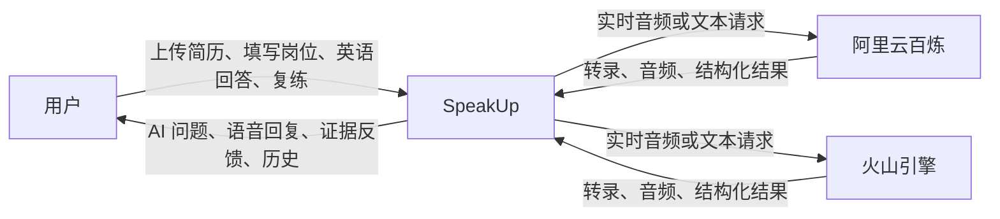

### 4.2 技术上下文

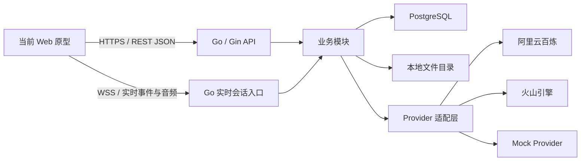

### 4.3 系统边界

SpeakUp 负责：

- 用户身份、个人数据隔离和账号注销。
- 简历文件、解析状态、经历确认和计划快照。
- 面试官配置、独立场次和四问进度。
- 音频资产、转录、逐题反馈、复练和历史聚合。
- 模型请求编排、超时、取消、错误归一化和结果校验。

SpeakUp 不负责：

- 模型厂商内部的推理、语音识别和语音合成实现。
- 本阶段的支付、会员、社交分享和完整英语课程。
- 本阶段的多位面试官同时在线或完整四轮真实面试。
- 本周 Live Demo 中的生产级扩缩容、容灾和跨区域部署。

## 5. 总体解决策略

当前 Web 原型作为本周用户交互和 Live Demo 入口。非实时业务通过 REST JSON 调用 Go/Gin 后端；实时面试通过 WebSocket 传输控制事件和音频数据。Go/Gin 后端按业务能力组织为模块化单体，在一个部署单元内保持明确模块边界，避免在五人团队和两个月周期内提前引入微服务运维成本。

PostgreSQL 保存关系型业务数据、状态、转录和结构化反馈；PDF 与音频保存到本地文件目录，数据库只保存文件键和元数据。实时语音、反馈生成、简历解析和文件存储均通过能力接口隔离具体实现。本周 Live Demo 使用 Mock Provider 与固定数据，后续按同一接口替换为真实厂商。

### 5.1 模块化单体而非微服务

选择模块化单体的原因：

- 当前团队规模为五人，主要风险是边界不清和主链路不通，不是独立扩容能力不足。
- 账户、简历、计划、场次和反馈之间存在一致性要求，单体事务边界更直接。
- Go package 和 interface 足以表达模块职责与依赖方向。
- 后续只有实时会话出现明确独立扩容需求时，才考虑拆分部署，不提前设计分布式事务。

### 5.2 同一业务对象贯穿 Mock 与真实实现

Mock 不创建另一套页面专用数据结构。Live Demo、后端桩实现和正式实现统一使用 PRD 中的领域概念、稳定 ID 和状态枚举。真实能力替换 Mock 时，只改变 Provider、Repository 或 FileStorage 的实现，不改变页面对业务含义的理解。

## 6. 构建块与模块职责

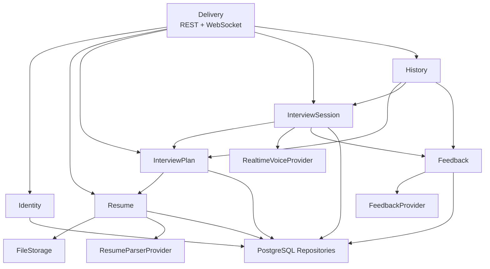

### 6.1 Delivery

| 项目 | 定义 |
|---|---|
| 职责 | HTTP 路由、WebSocket 建连、认证上下文、输入校验、错误映射和输出序列化。 |
| 不负责 | 业务规则、数据库查询细节和厂商事件解析。 |
| 输入 | REST JSON、WebSocket 事件、音频二进制或编码数据。 |
| 输出 | 标准 HTTP 响应、统一实时事件。 |
| 不变量 | Delivery 只依赖业务服务的公开接口，不直接访问数据库和厂商 SDK。 |

### 6.2 Identity

| 项目 | 定义 |
|---|---|
| 职责 | 邮箱注册、密码登录、认证身份、退出、注销编排。 |
| 不负责 | 简历、计划和历史的业务查询。 |
| 数据归属 | User、登录凭证和认证状态。 |
| 不变量 | 所有个人业务操作必须携带 User 身份；注销完成后该 User 的个人资源不可访问。 |

### 6.3 Resume

| 项目 | 定义 |
|---|---|
| 职责 | PDF 元数据、上传与解析状态、Experience 列表、默认经历、用户确认内容。 |
| 不负责 | 面试官生成和面试场次。 |
| 数据归属 | Resume、Experience，以及 PDF 文件键与元数据。 |
| 依赖 | FileStorage、ResumeParserProvider、Repository。 |
| 不变量 | 每个 User 最多保留 3 份 Resume；删除 Resume 不修改已创建 InterviewPlan 的经历快照。 |

### 6.4 InterviewPlan

| 项目 | 定义 |
|---|---|
| 职责 | 岗位信息、确认后的经历快照、1–4 位面试官及其配置。 |
| 不负责 | 实时音频、Turn 和逐题反馈。 |
| 数据归属 | InterviewPlan、Interviewer。 |
| 依赖 | Resume 的只读确认结果、Repository。 |
| 不变量 | Plan 创建后保存独立文本快照；最终至少 1 位、最多 4 位 Interviewer。 |

### 6.5 InterviewSession

| 项目 | 定义 |
|---|---|
| 职责 | 一位面试官的一场独立面试、四问顺序、当前题、有效回答、断线恢复和完成状态。 |
| 不负责 | 评价回答质量和管理其他面试官场次。 |
| 数据归属 | InterviewSession、Turn，以及原回答音频引用。 |
| 依赖 | InterviewPlan、RealtimeVoiceProvider、Feedback、Repository、FileStorage。 |
| 不变量 | 一个 Session 只属于一位 Interviewer；完整 Session 固定 4 个有效 Turn；失败只回滚当前未完成回答。 |

### 6.6 Feedback

| 项目 | 定义 |
|---|---|
| 职责 | 逐题证据反馈、诊断、改进目标、复练缺口比较和版本保留。 |
| 不负责 | 决定 Session 当前处于第几问。 |
| 数据归属 | FeedbackItem、RetryAttempt，以及复练音频引用。 |
| 依赖 | FeedbackProvider、Turn 只读数据、Repository、FileStorage。 |
| 不变量 | 一个有效 Turn 对应一条 FeedbackItem；RetryAttempt 只追加不覆盖；证据引用必须能在对应转录中定位。 |

### 6.7 History

| 项目 | 定义 |
|---|---|
| 职责 | 按 Plan 聚合 Interviewer、Session、报告、Turn、FeedbackItem 和 RetryAttempt。 |
| 不负责 | 修改历史业务对象和重新生成报告。 |
| 依赖 | Plan、Session、Feedback 的只读查询接口。 |
| 不变量 | History 是聚合读取模型，不拥有源数据。 |

### 6.8 Provider 与 FileStorage

| 能力 | 统一职责 | 首批实现 |
|---|---|---|
| RealtimeVoiceProvider | 实时建连、音频输入、转录、AI 音频、取消回复、关闭会话、错误归一化。 | Mock、阿里百炼、火山引擎。 |
| FeedbackProvider | 基于问题、经历快照和转录生成结构化反馈；基于原缺口比较复练。 | Mock、阿里百炼、火山引擎。 |
| ResumeParserProvider | 从 PDF 文本生成结构化 Experience 候选。 | Mock；真实文本模型实现后续接入。 |
| FileStorage | 保存、读取、删除 PDF 与音频，返回稳定文件键。 | LocalFileStorage；后续对象存储。 |

## 7. 架构不变量

以下规则是系统边界的一部分，代码、数据库和接口设计都不得绕过：

1. 所有个人业务对象都直接或间接归属一个 User。
2. InterviewPlan 保存岗位与经历文本快照，不在运行时回查 Resume 当前内容。
3. Interviewer 是 Plan 的配置，InterviewSession 是一次真实进度；两者不能合并成一个对象。
4. 一场 Session 只有一位 Interviewer，并固定包含四个有效 Turn。
5. Turn 只有在用户回答音频、最终转录和问题关联均成功后才标记有效。
6. FeedbackItem 只评价一个 Turn；整场总结只能聚合逐题反馈，不能替代逐题反馈。
7. RetryAttempt 追加新版本，不覆盖原 Turn、FeedbackItem 或先前 RetryAttempt。
8. AudioAsset 只保存文件元数据和归属，文件二进制不进入 PostgreSQL。
9. 业务模块只能依赖 Provider 接口，不依赖阿里百炼或火山引擎的具体事件类型。
10. WebSocket 断线不删除已完成 Turn；当前未完成回答允许从头重试。
11. Mock 和真实 Provider 返回相同的领域结果，不向页面暴露厂商差异。
12. History 只聚合读取，不通过历史页面修改源数据。

## 8. 核心领域关系与数据归属

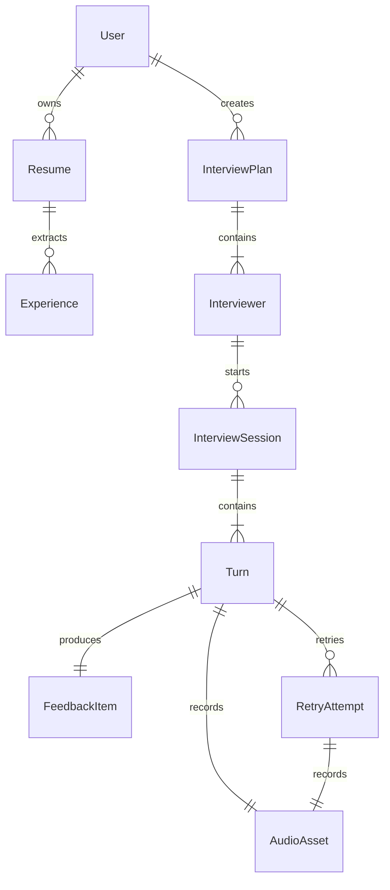

| 概念 | 写入模块 | 主要读取方 | 生命周期重点 |
|---|---|---|---|
| User | Identity | 所有受保护模块 | 注销触发全量个人数据删除。 |
| Resume | Resume | Plan、History | 最多 3 份，可删除。 |
| Experience | Resume | Plan | Plan 只复制确认后的快照。 |
| InterviewPlan | Plan | Session、History | 保留历史快照。 |
| Interviewer | Plan | Session、History | 1–4 位，可开始多场 Session。 |
| InterviewSession | Session | Feedback、History | 独立进度，可中断恢复。 |
| Turn | Session | Feedback、History | 完整场次固定 4 个有效版本。 |
| FeedbackItem | Feedback | History | 每个有效 Turn 仅一条原始反馈。 |
| RetryAttempt | Feedback | History | 只追加，不覆盖。 |
| AudioAsset | FileStorage 协作模块 | Session、Feedback、History | 原回答与复练分别保存。 |

数据库的物理表、字段类型、索引、级联策略和迁移方式由数据库详细设计承载；本节只固定领域关系、数据归属和不可破坏的生命周期规则。

## 9. 关键运行时视图

### 9.1 创建面试计划

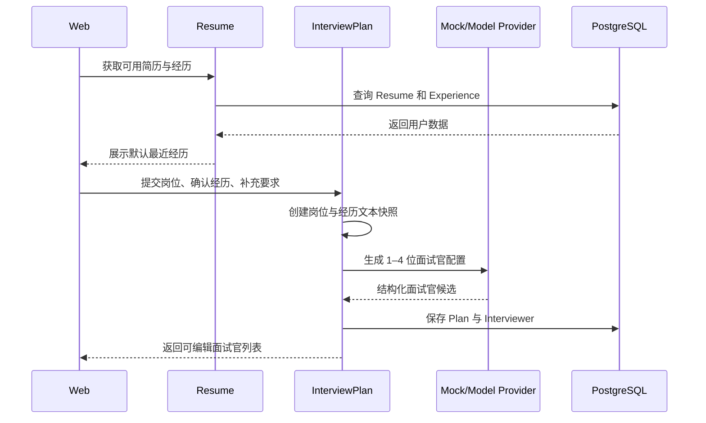

### 9.2 四问实时面试与逐题反馈

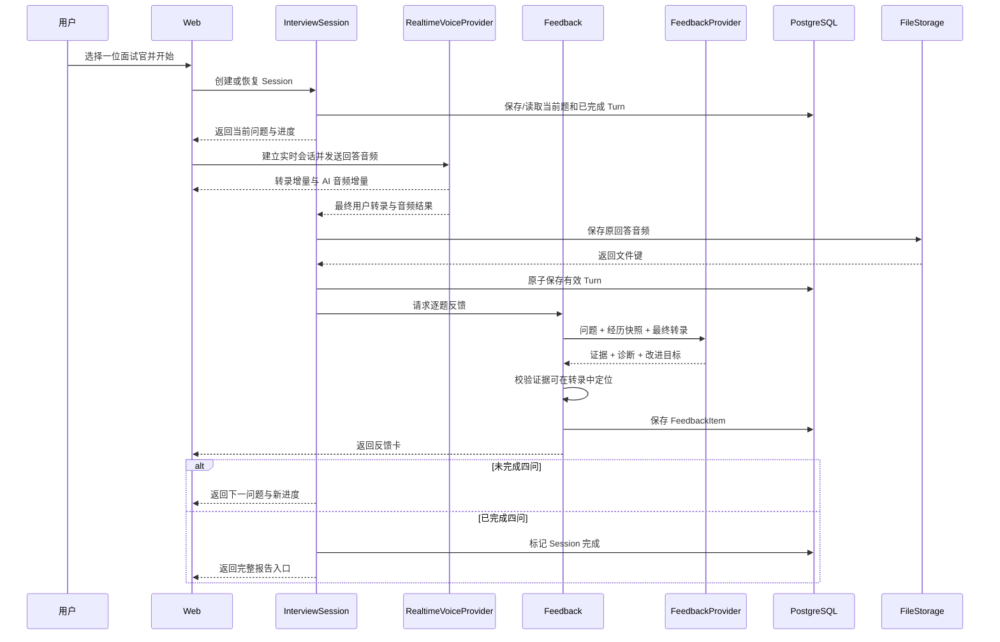

### 9.3 用户打断 AI 播放

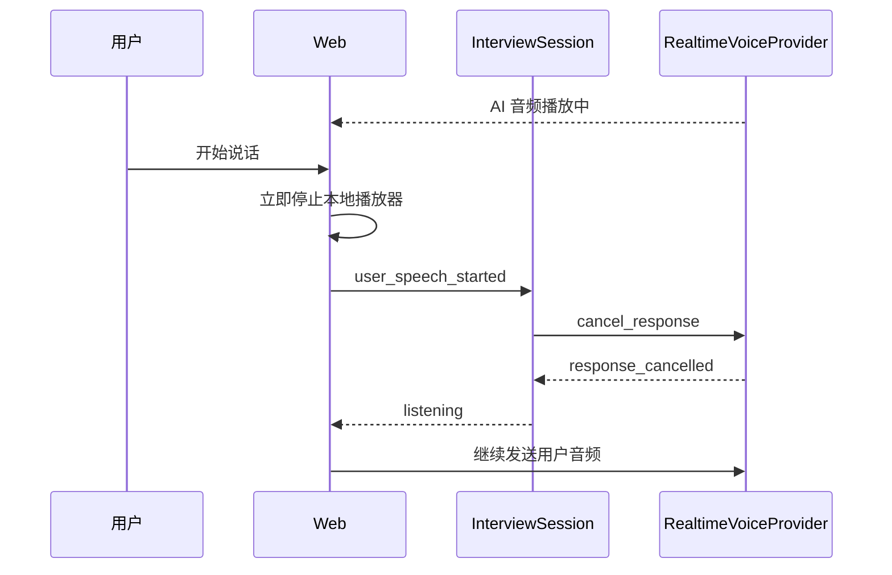

关键规则：停止本地播放不等待厂商确认；厂商取消失败不阻塞用户录音；被取消的 AI 音频不算用户 Turn。

### 9.4 断线与当前回答重试

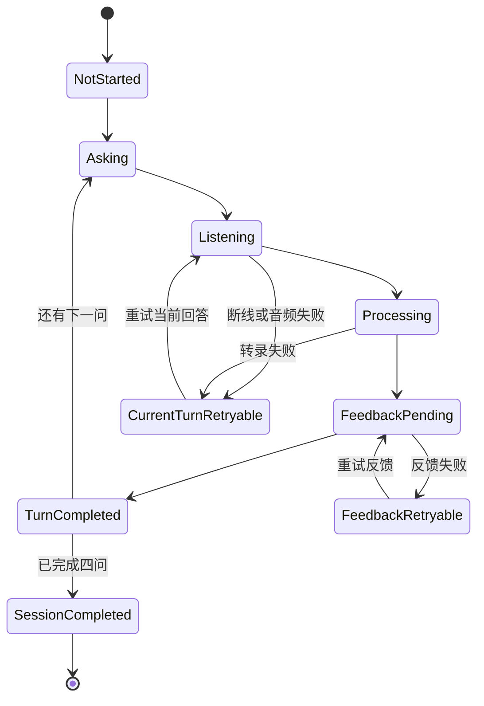

- `TurnCompleted` 之前不增加四问进度。
- 反馈失败时已完成 Turn 保留，只重试 FeedbackItem 生成。
- 用户重新进入 Session 时读取最后一个 `TurnCompleted` 位置。

### 9.5 同题复练

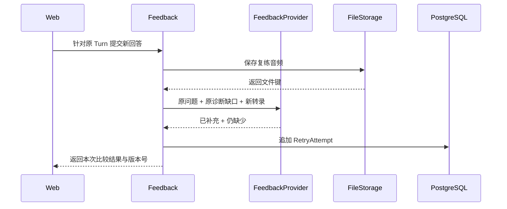

## 10. 接口边界

### 10.1 REST 资源边界

| 资源 | 主要操作 | 不通过 REST 承担的内容 |
|---|---|---|
| Auth | 注册、登录、退出、注销 | 实时会话认证事件。 |
| Resumes | 列表、上传确认、解析状态、经历确认、删除 | PDF 二进制长期中转。 |
| InterviewPlans | 创建、读取、更新面试官配置 | 实时四问音频。 |
| InterviewSessions | 创建、恢复摘要、结束、报告读取 | 音频流与播放流。 |
| Turns | 读取转录、原音元数据和反馈状态 | 实时转录增量。 |
| Retries | 创建复练任务、读取版本列表 | 实时复练音频流。 |
| History | 按 Plan 聚合读取 | 修改历史源数据。 |

REST 返回统一错误结构，至少区分：认证失败、权限不足、资源不存在、状态冲突、输入无效、外部能力暂不可用和内部错误。正式字段由 OpenAPI 设计固定。

### 10.2 WebSocket 生命周期边界

统一事件按语义分组，页面不消费厂商原始事件：

| 阶段 | 客户端语义 | 服务端语义 |
|---|---|---|
| 建连 | 认证、Session ID、能力声明 | 已连接、当前题、已完成进度。 |
| 输入 | 音频片段、开始说话、停止说话、取消、重试 | 已开始接收、输入状态。 |
| 转录 | 无 | 转录增量、最终转录。 |
| 回复 | 取消当前回复 | AI 文本增量、AI 音频增量、回复完成、回复取消。 |
| 进度 | 确认当前回答 | Turn 已完成、下一问、Session 已完成。 |
| 恢复 | 重连、恢复当前题 | 已完成 Turn、当前可重试状态。 |
| 错误 | 客户端设备错误 | 可重试错误、不可重试错误、建议动作。 |

### 10.3 Provider 边界

Provider 的统一结果使用 SpeakUp 领域语义：

- 厂商的连接 ID 只能作为元数据，不能成为 InterviewSession 主键。
- 厂商事件在适配层转换为统一实时事件。
- 厂商错误在适配层转换为统一错误分类。
- Provider 必须支持超时和取消；业务层决定是否重试。
- Provider 不直接写 PostgreSQL 和本地文件。
- API Key 只存在于后端配置，不下发到 Web 原型。

## 11. 数据一致性与事务边界

### 11.1 核心事务

| 操作 | 同一事务内完成 |
|---|---|
| 创建计划 | InterviewPlan 快照与初始 Interviewer。 |
| 完成回答 | Turn 最终转录、问题关联、音频元数据和进度推进。 |
| 保存反馈 | FeedbackItem 与 Turn 的反馈状态。 |
| 保存复练 | RetryAttempt、音频元数据和版本号。 |
| 注销业务数据 | 标记用户删除状态、阻止访问并建立文件清理任务。 |

文件系统与 PostgreSQL 无法共享事务，因此采用“先保存文件、再提交数据库；数据库失败则补偿删除文件”的顺序。删除账号时先阻止业务访问，再删除文件；文件删除失败进入可重试清理记录，不恢复用户访问。

### 11.2 幂等与重复请求

- 创建 Plan、Session、Turn 和 RetryAttempt 的写操作携带客户端请求 ID。
- 同一用户、同一请求 ID 的重复提交返回首次结果，不生成重复版本。
- WebSocket 重连不能自动重复提交已经标记 `TurnCompleted` 的回答。
- Provider 回调或最终事件重复到达时，以业务对象状态和厂商事件 ID 去重。

## 12. 文件存储设计

### 12.1 本周 LocalFileStorage

目录只表达逻辑分区，业务代码不拼接真实磁盘路径：

```text
data/
  users/{user-id}/
    resumes/{resume-id}/source.pdf
    sessions/{session-id}/turns/{turn-id}/answer.*
    sessions/{session-id}/turns/{turn-id}/retries/{retry-id}.*
```

数据库保存稳定文件键，例如：

```text
users/{user-id}/sessions/{session-id}/turns/{turn-id}/answer.webm
```

### 12.2 安全规则

- REST 和 WebSocket 在访问文件前验证文件归属用户。
- 文件下载不暴露任意磁盘路径，只使用受控文件键。
- 文件名、MIME 和大小均由服务端校验，不能信任浏览器声明。
- PDF 上限 10 MB；音频大小限制根据单题时长在实现计划中确定。
- 本地目录不进入 Git，不作为备份方案。
- 周五 Live Demo 使用固定测试账户和非敏感演示文件。

### 12.3 后续对象存储迁移

迁移只替换 FileStorage 实现和配置。业务表继续保存文件键，必要时通过后台任务把本地文件复制到对象存储并更新存储位置元数据；Resume、Turn 和 RetryAttempt 的业务 ID 不改变。

## 13. 安全、隐私与访问控制

| 风险 | 架构措施 |
|---|---|
| 越权访问他人简历或音频 | Repository 查询必须包含当前 User ID；不能只按资源 ID 查询。 |
| 浏览器泄漏模型密钥 | 所有真实 Provider 请求经过 Go 后端。 |
| 历史链接在退出后仍可访问 | REST、WebSocket 和文件读取统一执行身份校验。 |
| 上传伪造 PDF | 校验 MIME、文件头、大小和解析结果；文件名不作为类型依据。 |
| Prompt 注入影响系统规则 | 简历与用户补充内容作为数据输入，不拼接为高优先级系统指令。 |
| 模型返回虚构证据 | Feedback 保存前校验证据文本能在最终转录中定位。 |
| 注销后数据残留 | 先封禁访问，再事务删除业务数据并重试清理文件。 |

密码哈希算法、Token 形式和会话有效期在认证详细设计中确定；本架构只固定“凭证不明文保存、API Key 不下发、所有个人资源按 User 隔离”的边界。

## 14. 错误、恢复与降级

| 场景 | 负责模块 | 保存内容 | 用户恢复方式 |
|---|---|---|---|
| PDF 上传失败 | Resume | 不创建可用 Resume | 重新上传。 |
| PDF 解析失败 | Resume | 原文件、失败状态、错误分类 | 重试解析或手动填写经历。 |
| 生成面试官失败 | Plan | 岗位、经历快照、补充要求 | 重试生成，不重新填写。 |
| WebSocket 断线 | Session | 已完成 Turn、当前题 | 重连并重试当前回答。 |
| AI 播放被打断 | RealtimeVoice | 不创建 Turn | 停播并立即接收用户回答。 |
| 转录失败 | Session | 当前问题、临时错误 | 重试当前回答。 |
| 音频保存失败 | Session/Feedback | 不推进 Turn 或 RetryAttempt | 重试当前回答或复练。 |
| 反馈生成失败 | Feedback | 已完成 Turn | 只重试反馈生成。 |
| 反馈证据校验失败 | Feedback | Provider 原始错误日志，不保存正式反馈 | 重新生成或降级为“反馈生成中”。 |
| 真实 Provider 不可用 | Provider | 统一外部依赖错误 | 开发/Demo 可切 Mock；正式环境提示重试。 |
| 文件删除失败 | FileStorage | 删除任务和失败原因 | 后台重试，资源保持不可访问。 |

## 15. 可观测性

### 15.1 关联标识

日志至少携带：

- `request_id`
- `user_id`
- `interview_plan_id`
- `interviewer_id`
- `session_id`
- `turn_id`
- `retry_attempt_id`
- `provider_name`
- `provider_session_id`（存在时）

### 15.2 首批指标

- REST 请求成功率和耗时。
- WebSocket 活跃连接数、异常断开数和重连数。
- 每题从用户停止说话到收到首个 AI 音频的耗时。
- 用户开口到本地 AI 播放停止的耗时。
- 转录失败率、反馈生成失败率和 Provider 超时率。
- Session 完成四问的比例。
- 反馈证据校验失败次数。

本周 Mock Demo 至少输出结构化日志；真实指标采集与告警在真实 Provider 接入时补充。

## 16. 部署视图

### 16.1 本周 Live Demo

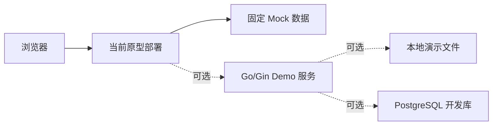

Live Demo 的硬性要求是主链路稳定表达产品行为；Go 服务、PostgreSQL 或真实模型未完成时，不阻塞 Mock 演示。演示页面必须明确哪些结果为 Mock，不能把预置结果描述为真实模型生成。

### 16.2 目标部署

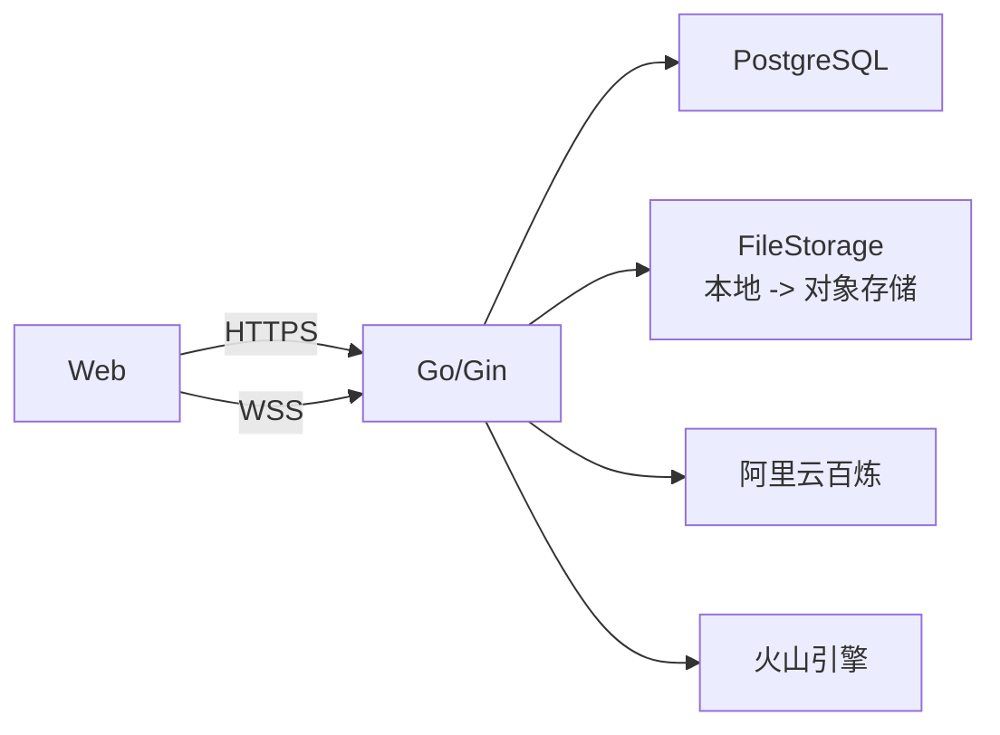

当前目标部署仍是单个 Go 服务。只有真实压测证明实时连接需要独立扩容时，才把 RealtimeVoice 从模块拆成独立部署单元。

## 17. Mock 与真实实现映射

| 能力 | 本周 Live Demo | 后续真实实现 | 业务边界是否改变 |
|---|---|---|---|
| 登录 | 固定演示用户 | 邮箱密码认证 | 否 |
| 简历 | 预置 PDF 与经历 | 上传、解析、确认 | 否 |
| 面试官 | 固定结构化结果 | 模型生成后编辑 | 否 |
| 四问 | 固定问题与进度 | 实时模型编排 | 否 |
| 语音 | 预置音频或浏览器本地模拟 | WebSocket + 实时 Provider | 否 |
| 转录 | 固定英文文本 | 实时转录 | 否 |
| 逐题反馈 | 固定结构化反馈 | FeedbackProvider | 否 |
| 复练 | 固定“已补充/仍缺少” | FeedbackProvider 比较 | 否 |
| 历史 | 固定聚合记录 | PostgreSQL 查询 | 否 |

## 18. 关键架构决策

### 18.1 使用模块化单体

| 项目 | 内容 |
|---|---|
| 状态 | 接受 |
| 备选 | 微服务、按功能独立部署。 |
| 决策 | Go/Gin 使用模块化单体，模块通过公开服务接口协作。 |
| 原因 | 团队小、周期短、业务事务强相关，优先降低联调和运维成本。 |
| 代价 | 单个部署单元故障影响面较大；后续独立扩容需拆模块。 |

### 18.2 使用 PostgreSQL

| 项目 | 内容 |
|---|---|
| 状态 | 接受 |
| 备选 | D1、SQLite、MongoDB。 |
| 决策 | PostgreSQL 作为正式业务数据库。 |
| 原因 | 核心对象关系明确，需要事务、约束、版本和历史查询。 |
| 代价 | 本地和部署环境需要管理数据库连接、迁移和备份。 |

### 18.3 REST 与 WebSocket 分工

| 项目 | 内容 |
|---|---|
| 状态 | 接受 |
| 备选 | 全部 WebSocket、JSON-RPC、WebRTC 直连厂商。 |
| 决策 | 普通业务使用 REST JSON，实时语音使用 WebSocket。 |
| 原因 | 两类交互生命周期不同；REST 易调试，WebSocket 适合双向增量事件。 |
| 代价 | 需要维护两套连接、认证和错误语义。 |

### 18.4 本周本地文件、后续对象存储

| 项目 | 内容 |
|---|---|
| 状态 | 接受 |
| 备选 | 立即接入 R2、OSS 或其他对象存储。 |
| 决策 | 本周使用 LocalFileStorage，同时固定可替换接口和稳定文件键。 |
| 原因 | 当前优先验证架构和 Demo，降低外部配置与网络依赖。 |
| 代价 | 不支持无状态多实例和生产级持久性，需要后续迁移。 |

### 18.5 Provider 隔离模型厂商

| 项目 | 内容 |
|---|---|
| 状态 | 接受 |
| 备选 | 业务模块直接使用阿里百炼或火山 SDK。 |
| 决策 | 分别建立 RealtimeVoiceProvider、FeedbackProvider、ResumeParserProvider。 |
| 原因 | 三类能力的输入输出和失败语义不同，同时需要 Mock 和厂商切换。 |
| 代价 | 需要维护统一语义和多个适配器，不能使用一个过度宽泛的万能接口。 |

### 18.6 实时对话与反馈分析分离

| 项目 | 内容 |
|---|---|
| 状态 | 接受 |
| 备选 | 让同一实时会话同时承担提问、转录、评分和报告。 |
| 决策 | 实时 Provider 负责对话体验；FeedbackProvider 基于最终转录生成结构化证据反馈。 |
| 原因 | 反馈要求稳定结构、证据校验和独立重试，不应被实时会话生命周期绑住。 |
| 代价 | 每题增加一次独立模型调用和等待状态。 |

## 19. 风险与技术债

| 优先级 | 风险/技术债 | 影响 | 缓解动作 |
|---|---|---|---|
| P0 | 当前原型不是正式业务前端 | Demo 代码不能直接视为完整 MVP | 明确 Mock 边界，后续单独评估工程化。 |
| P0 | 模型厂商事件和取消语义不同 | 适配层可能泄漏厂商细节 | 先定义统一领域事件，再分别完成 PoC。 |
| P0 | 技术术语转录准确率未验证 | 反馈证据可能基于错误文本 | 使用真实英文技术回答建立验证样例。 |
| P0 | 模型可能返回转录中不存在的证据 | 反馈可信度受损 | 保存前执行证据定位校验。 |
| P1 | 本地文件不适合无状态部署 | 重启或迁移可能丢文件 | 本周只用演示数据，后续迁移对象存储。 |
| P1 | WebSocket 断线恢复未经真实网络验证 | 用户可能重复回答或丢进度 | 用状态机和幂等 ID 做断网 PoC。 |
| P1 | PostgreSQL 与文件删除非同一事务 | 可能残留孤儿文件 | 补偿删除与可重试清理记录。 |
| P2 | 单体内实时连接与普通请求共享资源 | 后续高并发可能互相影响 | 先观测，再决定是否独立部署实时模块。 |

## 20. 团队职责与文档边界

| 负责人 | 本周方向 | 对本架构的输入 |
|---|---|---|
| 林锵 | 总体架构与项目推进 | 维护本文、裁决跨模块边界、组织评审和汇报。 |
| 覃迦迎 | 面试业务详细设计 | 四问规则、有效回答、场次状态、反馈与复练语义。 |
| 张思成 | 数据库设计 | PostgreSQL 表、字段、索引、约束、迁移和删除方案。 |
| 黄天宇 | Go/Gin 后端 | REST、WebSocket、Provider 和模块骨架的代码表达。 |
| 智铭威 | 原型与 Live Demo | Mock 数据、演示路径、演示部署和备用方案。 |

跨文档冲突时按以下优先级处理：

1. 产品行为以已确认 PRD 为准。
2. 系统边界、依赖方向和技术约束以本文为准。
3. 业务状态细节以面试详细设计为准，但不得破坏本文架构不变量。
4. 物理字段和索引以数据库设计为准，但不得改变领域数据归属。
5. Demo 可以降级为 Mock，但不得改变用户看到的核心业务含义。

## 21. 本周交付与评审节奏

| 时间 | 目标 | 退出条件 |
|---|---|---|
| 周二下午 | 技术裁决与架构初稿 | 本文第 1–8、18 节完成团队走读。 |
| 周三中午 | 专项设计初稿 | 面试规则、数据库结构、后端边界和 Demo 数据可互相对照。 |
| 周三下午 | 架构冻结 | 不再改变核心概念、模块归属、REST/WS/Provider 边界。 |
| 周四上午 | 骨架与 Demo 串联 | Mock 主链路可运行，文档与实现命名一致。 |
| 周四下午 | 交付冻结 | PR 合并、风险登记、汇报材料和演示环境完成。 |
| 周五 | 演练与汇报 | 不新增功能，只修复阻塞汇报的问题。 |

## 22. 架构验收标准

1. PRD 中账户、简历、计划、面试官、场次、四问、反馈、复练、历史和注销均能映射到明确模块。
2. 每个模块写清职责、不负责内容、数据归属、依赖和架构不变量。
3. `User` 至 `AudioAsset` 的核心关系与数据库设计一致。
4. 普通业务、实时语音、模型 Provider 和文件存储边界明确且不重叠。
5. 团队能够使用本文完整讲清一次四问面试、打断、断线恢复、反馈和复练流程。
6. Mock 与真实实现共享相同业务语义，外部厂商不可用时 Live Demo 仍可运行。
7. 关键失败场景均有唯一负责模块、保留内容和用户恢复路径。
8. 所有关键技术选择均记录备选、理由与代价，不只列技术名词。
9. 风险清单覆盖转录准确率、证据幻觉、本地文件、WebSocket 恢复和厂商差异。
10. 后续开发 Issue 能够从模块和运行时流程直接拆出，不需要重新讨论产品含义。

## 23. PRD 需求追踪

| PRD 能力 | 架构承接模块 | 关键数据 | 关键接口/流程 |
|---|---|---|---|
| 邮箱注册、登录、退出、注销 | Identity、Delivery | User | Auth REST；注销删除编排。 |
| 最多 3 份 PDF 简历 | Resume、FileStorage | Resume | Resumes REST；本地文件保存。 |
| 解析并确认项目/实习经历 | Resume、ResumeParserProvider | Experience | 解析状态与经历确认流程。 |
| 创建岗位与经历快照 | InterviewPlan | InterviewPlan | 创建计划运行时流程。 |
| 配置 1–4 位面试官 | InterviewPlan | Interviewer | Plans REST；面试官结构化生成。 |
| 每位面试官独立场次 | InterviewSession | InterviewSession | 创建或恢复 Session。 |
| 固定四次有效问答 | InterviewSession | Turn | WebSocket 进度事件与状态机。 |
| AI 播放中用户开口自动停播 | Delivery、InterviewSession、RealtimeVoiceProvider | Session 实时状态 | 打断运行时流程。 |
| 断线只重试当前回答 | InterviewSession | Session、Turn | 恢复状态机与幂等请求。 |
| 每题独立证据反馈 | Feedback、FeedbackProvider | FeedbackItem | 四问与反馈运行时流程。 |
| 原音回听 | FileStorage、History | AudioAsset | 受保护文件读取。 |
| 同题重复复练并保留版本 | Feedback | RetryAttempt、AudioAsset | 复练运行时流程。 |
| 按计划、面试官、场次查看历史 | History | 聚合读取模型 | History REST。 |
| 注销后个人数据不可访问 | Identity 及各数据所有者 | 全部用户数据 | 先封禁访问、再删除业务数据与文件。 |

## 24. 参考实践

- [arc42 architecture documentation template](https://github.com/arc42/arc42-template)：用于组织目标、约束、上下文、构建块、运行时、部署、决策和风险。
- [rust-analyzer architecture](https://github.com/rust-lang/rust-analyzer/blob/master/docs/book/src/contributing/architecture.md)：借鉴鸟瞰图、API Boundary 和 Architecture Invariant 的表达。
- [Backstage architecture overview](https://github.com/backstage/backstage/blob/master/docs/overview/architecture-overview.md)：借鉴总览、模块边界和专项文档下钻。
- [Markdown Architectural Decision Records](https://github.com/adr/madr)：借鉴背景、备选、决策、理由与后果的记录方式。
