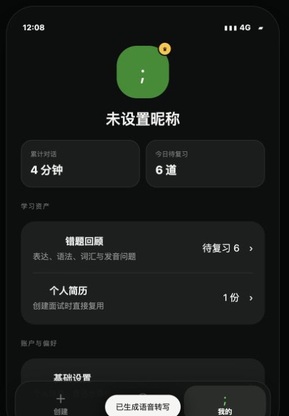
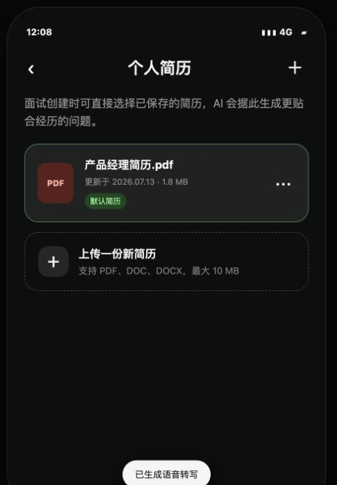
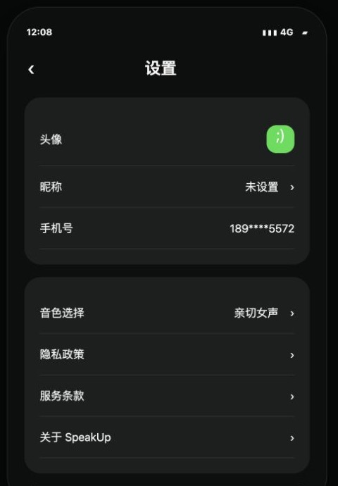
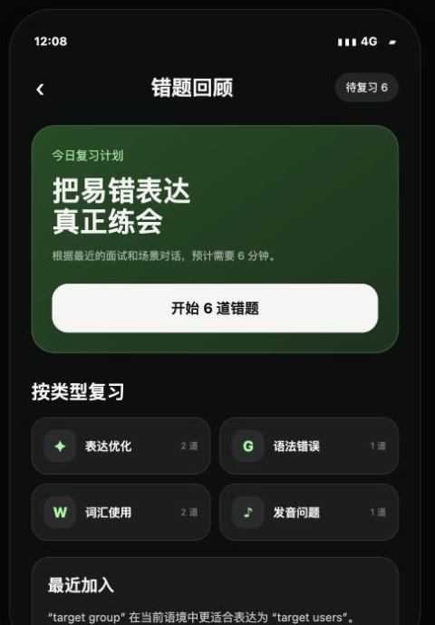
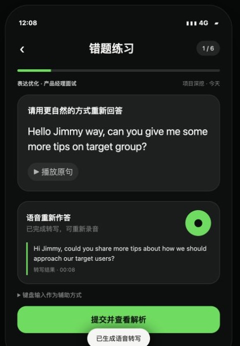
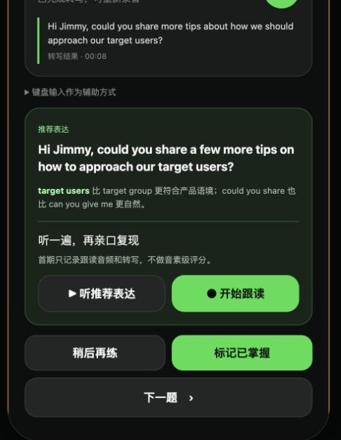

# SpeakUp 学习资产与个人中心功能设计（简版）

> 日期：2026-07-13  
> 范围：错题复练、简历复用、个人中心与基础设置  
> 首期不做：商业化与激励体系

## 一、目前定下来的功能链路

E 模块要解决的核心问题是：**一次面试练习结束后，用户如何把反馈真正练会，并让下一次练习更贴合自己。**

```text
面试练习暴露问题
  → 高价值问题自动进入错题本
  → 用户按类型选择错题
  → 用语音重新作答并查看转写
  → 查看推荐表达和问题解析
  → 播放并跟读推荐表达
  → 更新掌握状态，进入下一题
```

简历作为另一条个性化链路：

```text
上传并保存简历
  → 创建面试时直接复用
  → AI 围绕真实项目经历提问
  → 产生更贴合用户的错题与反馈
```

下图把 E 模块入口、简历资产和基础设置放在一组中展示。个人中心首期不展示会员、订单和奖励入口，避免商业化信息抢占学习主链路。

| E 模块入口 | 默认简历与上传 | 基础设置 |
|---|---|---|
|  |  |  |

*图 1：学习资产与个人中心主要页面。*

## 二、每个功能为什么做

### 1. 错题自动沉淀与分类

练习报告如果看完就结束，反馈仍然是一次性消费。因此，系统要把表达、语法、词汇和发音等高价值问题自动加入错题，并保留原面试、原问题和用户原句，让用户知道自己在什么语境下出了问题。分类和“今日待复习”则帮助用户快速决定先练什么。

错题分类、待复习数量和来源见图 2 左侧。

### 2. 语音作答与转写

SpeakUp 训练的是英文面试口语，而不是英文写作。用户必须用语音重新回答，才能验证自己是否真的能在压力下组织表达；转写文本用于帮助用户检查系统识别结果。文本输入只作为辅助方式，不能替代语音复练。

### 3. 推荐表达、解析与跟读

推荐表达回答“可以怎么说”，解析回答“为什么这样说”。在此基础上增加播放和跟读，让用户不只看懂答案，还能亲口复现更自然的表达，形成：

```text
自己先说 → 理解差距 → 听推荐表达 → 跟读模仿
```

首期跟读只做播放、录音和转写，不做音素级评分，避免把产品扩张成发音课程。

| 错题回顾与分类 | 语音作答与转写 | 答案解析、跟读与掌握 |
|---|---|---|
|  |  |  |

*图 2：从选择错题、语音重答到解析跟读和掌握状态的完整复练链路。*

### 4. 掌握状态与连续复练

用户完成一题后，需要知道该题是“待复习”还是“已掌握”，并能继续下一题。掌握状态把零散错题变成可持续训练任务，也让用户能够感知自己是否在进步。

### 5. 简历管理与复用

简历不是普通附件，而是面试个性化上下文。保存默认简历后，用户不需要每次重复上传；AI 也可以围绕真实项目、职责和技术取舍进行追问，减少通用问题和模板化反馈。

简历列表、默认简历和上传入口见图 1 中间。

### 6. 个人中心与基础设置

个人中心只集中承接用户身份、练习统计、简历入口和必要设置；设置中保留头像昵称、音色、隐私条款、退出和注销。它们用于保证产品可以正常、合规地使用，但不抢占错题复练主链路。

个人中心和基础设置见图 1 左侧与右侧。

## 三、首期范围结论

首期优先验证的不是功能数量，而是下面这条学习闭环是否成立：

> **用户能否把真实面试中的错误重新说一遍，通过解析和跟读完成纠正，并在下一次回答中表现得更好。**

因此，本期聚焦错题沉淀、语音作答、解析跟读、掌握状态和简历复用；商业化、激励、重游戏化、完整课程及音素级发音评分暂不进入 MVP。

## 四、本次不做的功能清单

下面尽可能完整地列出 E 模块未来可能承接、但本次 MVP **明确不实现**的能力。列入清单表示保留产品讨论空间，不代表已经进入后续排期。

### 1. 错题本与复练的进阶能力

- 不做复杂的间隔重复算法、遗忘曲线和自动排期。
- 不做基于正式面试日期倒排的每日复习计划与提醒。
- 不做错题搜索、高级筛选、自定义标签、自建文件夹和批量管理。
- 不做同类错题自动聚类、自动去重和跨场景知识图谱。
- 不做用户自建题库、导入外部题目和自定义评分标准。
- 不做完整的收藏夹、好句本、词汇本和术语库；首期只保留错题资产。
- 不做错题导出 PDF、分享图片、公开链接或跨设备离线包。
- 不做多人批改、老师点评、同伴互评和真人教练入口。
- 不做自动生成无限变式题；首期以原问题复练和受控推荐表达为主。
- 不做复练过程中的实时逐句打断纠错，避免破坏口语组织过程。
- 不做根据一次作答自动判定“永久掌握”；首期由用户标记并记录复练结果。
- 不做复杂的复发检测、掌握度概率和学习效果预测模型。

### 2. 发音、跟读与测评的进阶能力

- 不做音素级、重音、连读、语调等精细发音评分。
- 不做口型视频、舌位动画和逐音标发音课程。
- 不做多口音横向评分、母语者相似度和“像不像母语者”分数。
- 不做实时波形打分、跟读排行榜和发音挑战赛。
- 不做自动降噪、设备校准和专业录音棚级音频处理。
- 不做用户音频公开发布、作品广场和配音社区。

### 3. 学习进度与激励体系

- 不做积分、金币、星星、经验值和虚拟道具。
- 不做连续打卡、补签、每日任务和签到奖励。
- 不做勋章、等级、排行榜、好友 PK 和学习小组。
- 不做完整成长仪表盘、雷达图、长期趋势和周/月报告。
- 不做跨 Session 的自动进步结论，例如“上次缺少 STAR，本次已经完整”。
- 不做学习成果海报、社交分享和邀请裂变。
- 不做 Push、短信、邮件等复习催促通知。

### 4. 简历管理的进阶能力

- 不做简历字段级结构化解析和复杂信息抽取。
- 不做简历在线编辑器、模板库、排版美化和多语言翻译。
- 不做 AI 简历代写、润色、评分和 ATS 通过率预测。
- 不做简历与 JD 的匹配度分析、关键词补全和岗位推荐。
- 不做一键投递、职位收藏、投递进度和求职 CRM。
- 不做简历版本对比、多人协作批注和公开分享链接。
- 不做扫描件 OCR、图片简历和复杂表格版式还原。
- 不做按不同岗位自动维护多套默认简历；首期只支持保存、选择和设置默认。

### 5. 商业化与会员能力

- 不做会员套餐、权益分层和付费墙。
- 不做模拟面试次数包、场景包或简历额度售卖。
- 不做下单、支付、自动续费、退款和发票流程。
- 不做订单中心、优惠券、兑换码和促销活动。
- 不做邀请返利、分销、企业团购和学校授权。
- 不做付费内容商城或课程商城。

### 6. 个人中心与账户的扩展能力

- 不做复杂个人主页、公开学习档案和用户动态。
- 不做好友、关注、私信、社区和内容发布。
- 不做头像装扮、主题皮肤、数字人形象和虚拟角色资产。
- 不做多账号切换、家庭账号和团队空间。
- 不做复杂通知偏好中心；首期仅保留必要账号、音色、隐私与安全设置。
- 不做个人数据跨产品同步、第三方学习平台导入和云盘连接。

### 7. 内容与场景扩张

- 不做完整英语课程体系和课程路径。
- 不做雅思、托福、考研等考试题库。
- 不做旅游、社交、儿童英语等大规模生活场景库。
- 不做多语言学习和多语言简历训练。
- 不做自定义 Agent、多面试官数字人和视频面试官。

本次取舍的统一标准是：如果一个功能不能直接帮助用户完成“**真实面试错题重新开口—理解差距—跟读纠正—记录掌握**”，或不能直接支撑简历复用与必要账户设置，就不进入本期范围。
