# [提案] SpeakUp MS1 系统架构与技术选型

> 状态：待团队评审<br>
> 日期：2026-07-14<br>
> 版本：v2<br>
> 架构负责人：林锵<br>
> 评审参与：张思成、黄天宇、智铭威、覃迦迎<br>
> 产品输入：[SpeakUp MS1 面试主链路图文 PRD](../../superpowers/specs/2026-07-14-ms1-interview-prd-design.md)<br>
> 视觉基线：[SpeakUp 最新线上原型](https://speakup-product-prototype.wendymcdonald606998.chatgpt.site/)

建议同步到主仓 `1024XEngineer/XE3-ESL` 时使用以下信息：

- 主仓文档路径：`docs/architecture/2026-07-14-ms1-system-architecture-design.md`
- Issue 标题：`[提案] SpeakUp MS1 系统架构与技术选型`
- 父级关联：产品父 Proposal [#9](https://github.com/1024XEngineer/XE3-ESL/issues/9)，并关联反馈 [#10](https://github.com/1024XEngineer/XE3-ESL/issues/10)、简历 [#11](https://github.com/1024XEngineer/XE3-ESL/issues/11)、面试 [#12](https://github.com/1024XEngineer/XE3-ESL/issues/12) 和账户 [#14](https://github.com/1024XEngineer/XE3-ESL/issues/14)
- Milestone：`MS1：战略决策`
- 标签：沿用主仓现有 `产品` 标签；不新增主仓不存在的架构标签
- Issue 正文：只写决策摘要、评审清单和主仓文档链接，不复制整份架构文档；文档是技术内容的唯一事实来源，Issue 承载讨论、关联和结论
- 当前仓库用途：先完成评审稿和修订；评审通过后再同步主仓，本轮不直接写入主仓

## 0. 决策摘要

| 方向 | 正式决策 | MS1 边界 |
|---|---|---|
| 客户端 | Flutter 移动端 | 当前 Web 原型只用于本周 Mock Live Demo。 |
| 后端 | Go + Gin 模块化单体 | 不拆微服务。 |
| 数据与文件 | PostgreSQL + LocalFileStorage | 文件后续迁移对象存储，业务只保存稳定文件键。 |
| 通信 | 普通业务 REST JSON；实时语音 WebSocket | API Key 只在 Go 后端。 |
| AI 主供应商 | 千问云 | 火山引擎仅为备选，不实现双活和自动切换。 |
| 实时面试 | `qwen3.5-omni-plus-realtime` S2S | 不采用 ASR + LLM + TTS 串联作为实时主路径。 |
| 回答后转录 | `fun-asr-realtime` | 回答结束后由 Go 读取本地原音并通过 WebSocket 重放，生成评分转录和词级时间戳。 |
| 反馈 | 确定性语音指标 + 千问云文本模型 | 不让实时模型直接生成最终评分。 |
| TTS | MS1 不单独接入 | Omni 直接输出面试官语音；标准跟读音频后续再评估。 |
| RAG | MS1 不采用 | 当前只使用已确认的经历快照和当前面试上下文，不引入向量数据库。 |
| 发音评分 | MS1 不承诺音素/单词级专业评分 | 先交付语速、停顿、填充词等可解释指标；精确发音另立专项 Proposal。 |
| 本周交付 | Mock 优先 | 外部服务不稳定不能阻塞周五 Live Demo。 |

## 1. 文档目的

本文把已确认的产品 PRD 转换为可实施的系统架构，固定本阶段的系统边界、模块职责、数据归属、通信方式、运行时流程和关键技术决策。

本文解决以下问题：

1. 本周 Web 演示、目标 Flutter 客户端、Go/Gin 后端、PostgreSQL、本地文件和千问云如何协作。
2. 账户、简历、面试计划、实时场次、逐题反馈、复练和历史分别由哪个模块负责。
3. 普通 REST、实时 WebSocket、端到端语音、回答后 ASR 和评分流水线的边界如何划分。
4. 本周 Live Demo 的 Mock 实现与后续真实实现如何保持一致边界。
5. 出现断线、转录失败、反馈失败或文件删除失败时由谁恢复。

本文不重复 PRD 中的页面与产品文案，也不替代后续的数据库字段设计、完整 OpenAPI 文档、WebSocket 事件字段文档、评分算法说明和 Prompt 详细设计。

## 2. 架构目标与质量场景

### 2.1 架构目标

- 支撑“简历经历 → 面试计划 → 独立面试官 → 四问场次 → 逐题证据反馈 → 同题复练 → 历史追溯”的主链路。
- 保证每位面试官拥有独立场次、进度、报告和复练记录。
- 保证原回答、原音、反馈和每次复练都可追溯，不互相覆盖。
- 正式移动端使用 Flutter；当前 Web 原型只承担本周 Live Demo，不作为正式客户端工程基础。
- 千问云作为 MS1 唯一正式 AI 主供应商；火山引擎只保留为已评估备选，不建设双活或运行时切换。
- 实时面试使用端到端语音；回答后使用同一原始录音完成 ASR、确定性语音指标和内容反馈。
- 允许本周 Live Demo 不依赖外部模型稳定性，同时保持与正式系统一致的业务对象和状态。
- 让五名成员能够沿清晰模块边界并行工作，避免通过共享内部实现产生隐式耦合。

### 2.2 质量场景

| 优先级 | 质量属性 | 可验证场景 |
|---|---|---|
| P0 | 可恢复性 | WebSocket 断开后，已完成 Turn 保留；重新进入场次时只重试当前回答。 |
| P0 | 可追溯性 | 任意反馈证据可定位到对应 Turn 的转录；任意复练可定位到原 Turn 和原诊断缺口。 |
| P0 | 供应商隔离 | 将 Mock 替换为千问云实现时，面试场次、反馈和历史模块不修改业务规则；火山引擎未来迁移不要求业务层改写。 |
| P0 | Demo 稳定性 | 关闭所有真实模型配置后，固定演示数据仍能连续三次跑通主链路。 |
| P0 | 数据隔离 | 未认证用户及其他用户不能访问简历、音频、转录、反馈和历史。 |
| P0 | 评分可解释 | 流利度指标可回溯到原音和时间戳，内容诊断可回溯到转录原文；不展示没有证据来源的总分。 |
| P0 | 实时低耦合 | 获得可用实时转录且原音保存后即完成 Turn；回答后 ASR 或反馈失败不要求用户重新回答，可基于原音独立重试。 |
| P1 | 可演进性 | 本地文件切换为对象存储时，只替换 FileStorage 实现和配置，不修改 Resume、Turn、RetryAttempt。 |
| P1 | 可观测性 | 每场 Session、每个 Turn、每次 Provider 调用都能使用稳定 ID 串联日志。 |

## 3. 已确认约束

| 方向 | 本阶段约束 | 说明 |
|---|---|---|
| 本周演示 | 沿用当前 Web 原型修改 | 仅用于 Live Demo，不代表正式客户端技术栈。 |
| 正式客户端 | Flutter 移动端 | 承担录音、播放、本地停播、页面状态和历史浏览。 |
| 后端 | Go + Gin | 作为业务、实时会话和 Provider 编排入口。 |
| 数据库 | PostgreSQL | 保存账户、业务对象、状态、转录、反馈和文件元数据。 |
| 文件 | Go 服务本地目录 | 本周保存 PDF 和音频；后续通过 FileStorage 切换对象存储。 |
| 普通接口 | REST JSON | 负责非实时业务和资源读取。 |
| 实时接口 | WebSocket | Flutter 与 Go、Go 与千问云分别维护实时连接；负责音频、转录、AI 播放、打断、进度和恢复。 |
| 实时语音 | 千问云 `qwen3.5-omni-plus-realtime` | 使用 S2S 端到端链路，不采用 ASR + LLM + TTS 串联作为实时主路径。 |
| 回答后转录 | 千问云 `fun-asr-realtime` | 回答结束后通过 WebSocket 重放本地原音，生成评分用转录和词级时间戳。 |
| 文本能力 | 千问云 `qwen3.7-plus` 非思考模式 | 负责简历解析、内容证据反馈和复练比较的 JSON 输出；Go 必须执行 Schema 和业务校验。 |
| 独立 TTS | MS1 不接入 | 实时面试使用 Omni 输出语音；需要标准跟读音频时再评估 Qwen-TTS/CosyVoice。 |
| RAG | MS1 不接入 | 当前检索范围只有用户确认的经历快照和本场上下文，直接作为结构化输入；不引入 Embedding、向量数据库和检索流水线。 |
| 备选供应商 | 火山引擎 | 仅记录迁移触发条件，不进入 MS1 实现范围。 |
| 供应商隔离 | 窄能力接口 | 业务模块不直接依赖千问云事件和 SDK；首批只有 Mock 与千问云实现。 |
| Live Demo | Mock 优先 | 外部服务不可用时不影响周五汇报。 |
| 时间 | 周四冻结，周五汇报 | 周五不增加新架构和新功能。 |

## 4. 系统范围与上下文

### 4.1 业务上下文

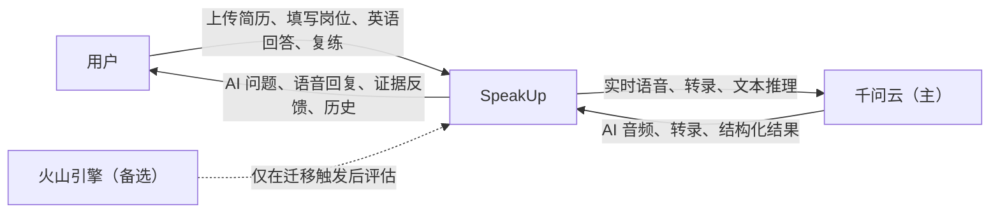

### 4.2 技术上下文

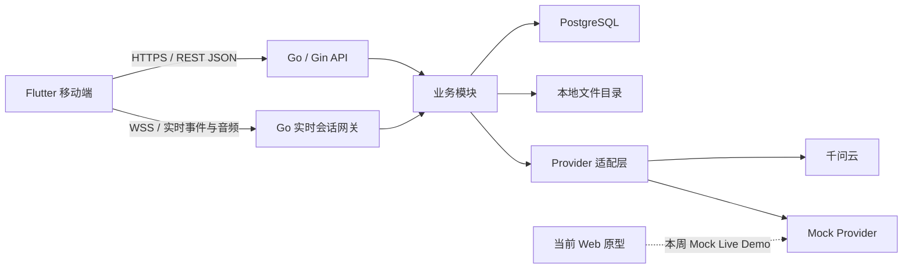

### 4.3 系统边界

SpeakUp 负责：

- 用户身份、个人数据隔离和账号注销。
- 简历文件、解析状态、经历确认和计划快照。
- 面试官配置、独立场次和四问进度。
- 原始音频资产、实时转录、评分转录、确定性语音指标、逐题反馈、复练和历史聚合。
- 模型请求编排、超时、取消、错误归一化和结果校验。

SpeakUp 不负责：

- 千问云内部的推理、端到端语音、语音识别和语音合成实现。
- MS1 的音素级、单词级专业发音评分；千问云公开能力尚未确认该能力，不将其包装成确定结论。
- 本阶段的支付、会员、社交分享和完整英语课程。
- 本阶段的多位面试官同时在线或完整四轮真实面试。
- 本周 Live Demo 中的生产级扩缩容、容灾和跨区域部署。

## 5. 总体解决策略

正式产品以 Flutter 为移动客户端。Flutter 负责麦克风采集、AI 音频播放和用户开口后的本地立即停播；非实时业务通过 REST JSON 调用 Go/Gin，实时面试通过 WebSocket 把音频和控制事件交给 Go 实时会话网关。当前 Web 原型只用于本周 Mock Live Demo，不作为正式客户端代码基础。

Go/Gin 后端按业务能力组织为模块化单体。实时主路径使用千问云 `qwen3.5-omni-plus-realtime` 完成语音输入到语音输出，不再串联独立 ASR、LLM 和 TTS。Go 在转发用户回答音频的同时保存同一份原始录音；回答结束后读取本地录音并通过 WebSocket 重放给 `fun-asr-realtime`，获得评分用转录与词级时间戳，再由确定性算法计算语速、停顿、填充词等指标，并由文本模型生成内容证据反馈。实时交互不等待回答后分析完成。

PostgreSQL 保存关系型业务数据、状态、转录版本、语音指标和结构化反馈；PDF 与音频保存到本地文件目录，数据库只保存文件键和元数据。实时语音、回答后转录、反馈生成、简历解析和文件存储均通过窄能力接口隔离具体实现。本周 Live Demo 使用 Mock 与固定数据；正式 MS1 只接入千问云，火山引擎不实现适配器。

### 5.1 模块化单体而非微服务

选择模块化单体的原因：

- 当前团队规模为五人，主要风险是边界不清和主链路不通，不是独立扩容能力不足。
- 账户、简历、计划、场次和反馈之间存在一致性要求，单体事务边界更直接。
- Go package 和 interface 足以表达模块职责与依赖方向。
- 后续只有实时会话出现明确独立扩容需求时，才考虑拆分部署，不提前设计分布式事务。

### 5.2 同一业务对象贯穿 Mock 与真实实现

Mock 不创建另一套页面专用数据结构。Live Demo、后端桩实现和正式实现统一使用 PRD 中的领域概念、稳定 ID 和状态枚举。真实能力替换 Mock 时，只改变 Provider、Repository 或 FileStorage 的实现，不改变页面对业务含义的理解。

## 6. 构建块与模块职责

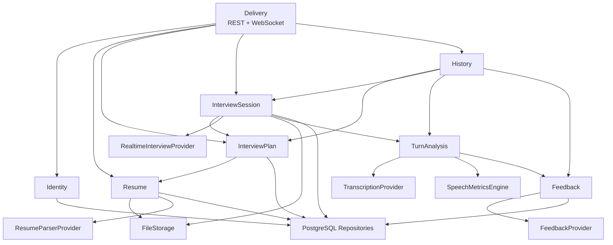

### 6.1 Delivery

| 项目 | 定义 |
|---|---|
| 职责 | HTTP 路由、Flutter WebSocket 建连、认证上下文、输入校验、错误映射和输出序列化。 |
| 不负责 | 业务规则、数据库查询细节和厂商事件解析。 |
| 输入 | REST JSON、WebSocket 事件、音频二进制或编码数据。 |
| 输出 | 标准 HTTP 响应、统一实时事件。 |
| 不变量 | Delivery 只依赖业务服务的公开接口，不直接访问数据库和厂商 SDK。 |

### 6.2 Identity

| 项目 | 定义 |
|---|---|
| 职责 | 邮箱注册、密码登录、认证身份、退出、注销编排。 |
| 不负责 | 简历、计划和历史的业务查询。 |
| 数据归属 | User、登录凭证和认证状态。 |
| 不变量 | 所有个人业务操作必须携带 User 身份；注销完成后该 User 的个人资源不可访问。 |

### 6.3 Resume

| 项目 | 定义 |
|---|---|
| 职责 | PDF 元数据、上传与解析状态、Experience 列表、默认经历、用户确认内容。 |
| 不负责 | 面试官生成和面试场次。 |
| 数据归属 | Resume、Experience，以及 PDF 文件键与元数据。 |
| 依赖 | FileStorage、ResumeParserProvider、Repository。 |
| 不变量 | 每个 User 最多保留 3 份 Resume；删除 Resume 不修改已创建 InterviewPlan 的经历快照。 |

### 6.4 InterviewPlan

| 项目 | 定义 |
|---|---|
| 职责 | 岗位信息、确认后的经历快照、默认 4 位面试官及其配置。 |
| 不负责 | 实时音频、Turn 和逐题反馈。 |
| 数据归属 | InterviewPlan、Interviewer。 |
| 依赖 | Resume 的只读确认结果、Repository。 |
| 不变量 | Plan 创建后保存独立文本快照；首次默认生成 4 位 Interviewer，用户编辑、增删后的最终配置至少 1 位、最多 4 位。 |

### 6.5 InterviewSession

| 项目 | 定义 |
|---|---|
| 职责 | 一位面试官的一场独立面试、四问顺序、当前题、有效回答、断线恢复和完成状态。 |
| 不负责 | 评价回答质量和管理其他面试官场次。 |
| 数据归属 | InterviewSession、Turn、实时状态，以及原回答音频引用。 |
| 依赖 | InterviewPlan、RealtimeInterviewProvider、TurnAnalysis、Repository、FileStorage。 |
| 不变量 | 一个 Session 只属于一位 Interviewer；完整 Session 固定 4 个有效 Turn；原音已保存且实时转录可用的回答不会因后续 ASR 或反馈失败要求用户重答。 |

### 6.6 TurnAnalysis

| 项目 | 定义 |
|---|---|
| 职责 | 基于 Turn 原始录音生成评分用转录、词级时间戳和确定性语音指标，并编排内容反馈。 |
| 不负责 | 实时提问、AI 音频播放、决定四问进度和给出无证据的主观总分。 |
| 数据归属 | Turn 的分析状态、评分转录、语音指标、算法版本和模型版本。 |
| 依赖 | TranscriptionProvider、SpeechMetricsEngine、Feedback、Repository、FileStorage。 |
| 不变量 | 分析输入始终是已归属 Turn 的原始录音；失败可独立重试；同一算法版本输出可复现。 |

`TurnAnalysis` 是架构内部持久化概念，用于拆开“用户已经完成回答”和“系统已经完成分析”两个状态，不改变 PRD 的用户信息层级。数据库可将其实现为独立表或受约束的 Turn 附属记录，但必须保存版本和状态。

### 6.7 Feedback

| 项目 | 定义 |
|---|---|
| 职责 | 合并内容证据、语言建议和确定性语音指标，形成逐题反馈、改进目标、复练缺口比较和版本历史。 |
| 不负责 | 决定 Session 当前处于第几问。 |
| 数据归属 | FeedbackItem、RetryAttempt，以及复练音频引用。 |
| 依赖 | FeedbackProvider、TurnAnalysis 只读结果、Turn 只读数据、Repository、FileStorage。 |
| 不变量 | 一个有效 Turn 对应一条当前 FeedbackItem；RetryAttempt 只追加不覆盖；文本证据必须能在评分转录中定位，语音结论必须能定位到指标或音频时间段；回答已满足目标时说明有效证据，不为制造改进项而虚构缺点。 |

### 6.8 History

| 项目 | 定义 |
|---|---|
| 职责 | 按 Plan 聚合 Interviewer、Session、报告、Turn、分析状态、FeedbackItem 和 RetryAttempt。 |
| 不负责 | 修改历史业务对象和重新生成报告。 |
| 依赖 | Plan、Session、Feedback 的只读查询接口。 |
| 不变量 | History 是聚合读取模型，不拥有源数据。 |

### 6.9 Provider、评分引擎与 FileStorage

| 能力 | 统一职责 | 首批实现 |
|---|---|---|
| RealtimeInterviewProvider | 实时建连、system prompt、当前题指令、音频输入、实时转录、AI 音频、取消回复、关闭会话、错误归一化。 | Mock、千问云 `qwen3.5-omni-plus-realtime`。 |
| TranscriptionProvider | 对已保存回答录音做回答后转录，输出评分文本和词级时间戳。 | Mock、千问云 `fun-asr-realtime` 重放实现。 |
| SpeechMetricsEngine | 基于原音、词级时间戳和转录计算语速、停顿、填充词、重复、自我修正和有效说话比例。 | SpeakUp 本地确定性算法。 |
| FeedbackProvider | 基于问题、经历快照、评分转录和语音指标生成结构化内容反馈；基于原缺口比较复练。 | Mock、千问云 `qwen3.7-plus`。 |
| ResumeParserProvider | 从 PDF 文本生成结构化 Experience 候选。 | Mock、千问云 `qwen3.7-plus`。 |
| FileStorage | 保存、读取、删除 PDF 与音频，返回稳定文件键。 | LocalFileStorage；后续对象存储。 |

火山引擎在 MS1 只作为决策记录中的备选，不出现在“首批实现”中。Provider 的目的首先是隔离 Mock、千问云协议和业务规则，不建设双厂商同时在线、运行时路由或自动故障转移。

## 7. 架构不变量

以下规则是系统边界的一部分，代码、数据库和接口设计都不得绕过：

1. 所有个人业务对象都直接或间接归属一个 User。
2. InterviewPlan 保存岗位与经历文本快照，不在运行时回查 Resume 当前内容。
3. Interviewer 是 Plan 的配置，InterviewSession 是一次真实进度；两者不能合并成一个对象。
4. 一场 Session 只有一位 Interviewer，并固定包含四个有效 Turn。
5. Turn 在问题关联、用户原始录音保存、回答结束边界确认且实时转录可用后标记为已采集；评分用 ASR 和反馈是可独立重试的后续状态。
6. 实时转录用于交互展示，评分转录用于报告证据；两者必须标记来源，不能静默覆盖。
7. SpeechMetricsEngine 只输出可计算指标，不使用不可解释的单一总分代替分维度结果。
8. FeedbackItem 只评价一个 Turn；整场总结只能聚合逐题反馈，不能替代逐题反馈。
9. RetryAttempt 追加新版本，不覆盖原 Turn、FeedbackItem 或先前 RetryAttempt。
10. AudioAsset 只保存文件元数据和归属，文件二进制不进入 PostgreSQL。
11. 业务模块只能依赖窄能力接口，不依赖千问云或火山引擎的具体事件类型。
12. WebSocket 断线不删除已完成 Turn；当前未完成回答允许从头重试。
13. Mock 和千问云实现返回相同的业务语义，不向 Flutter 暴露厂商事件。
14. History 只聚合读取，不通过历史页面修改源数据。
15. 火山引擎不是 MS1 运行时依赖，不为尚未实现的切换能力增加业务复杂度。

## 8. 核心领域关系与数据归属

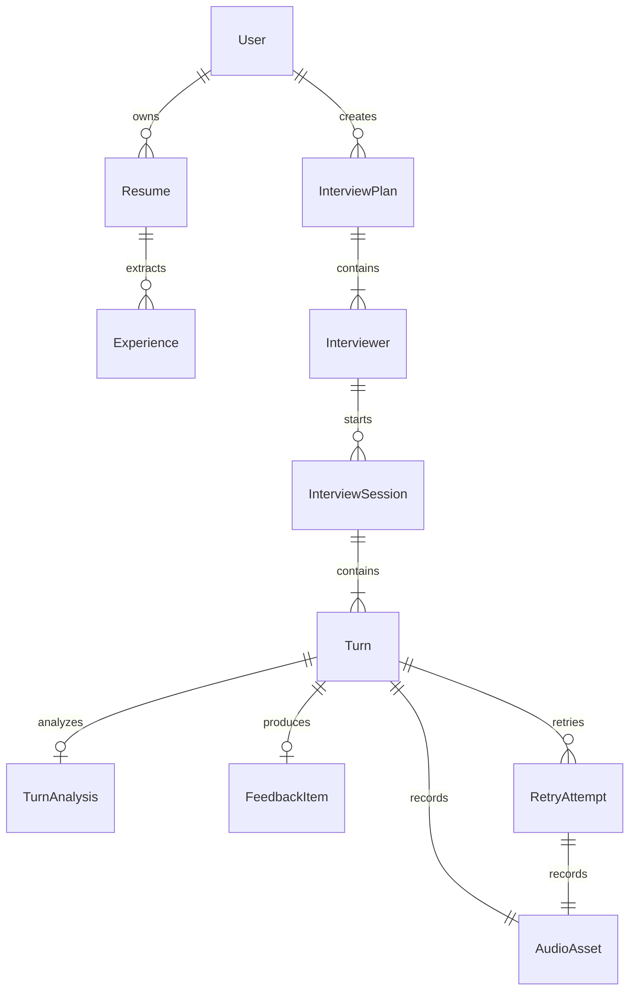

| 概念 | 写入模块 | 主要读取方 | 生命周期重点 |
|---|---|---|---|
| User | Identity | 所有受保护模块 | 注销触发全量个人数据删除。 |
| Resume | Resume | Plan、History | 最多 3 份，可删除。 |
| Experience | Resume | Plan | Plan 只复制确认后的快照。 |
| InterviewPlan | Plan | Session、History | 保留历史快照。 |
| Interviewer | Plan | Session、History | 1–4 位，可开始多场 Session。 |
| InterviewSession | Session | Feedback、History | 独立进度，可中断恢复。 |
| Turn | Session | Feedback、History | 完整场次固定 4 个有效版本。 |
| TurnAnalysis | TurnAnalysis | Feedback、History | 保存评分转录、语音指标、分析状态及版本；失败可重试。 |
| FeedbackItem | Feedback | History | 每个有效 Turn 仅一条原始反馈。 |
| RetryAttempt | Feedback | History | 只追加，不覆盖。 |
| AudioAsset | FileStorage 协作模块 | Session、Feedback、History | 原回答与复练分别保存。 |

数据库的物理表、字段类型、索引、级联策略和迁移方式由数据库详细设计承载；本节只固定领域关系、数据归属和不可破坏的生命周期规则。

## 9. 关键运行时视图

### 9.1 创建面试计划

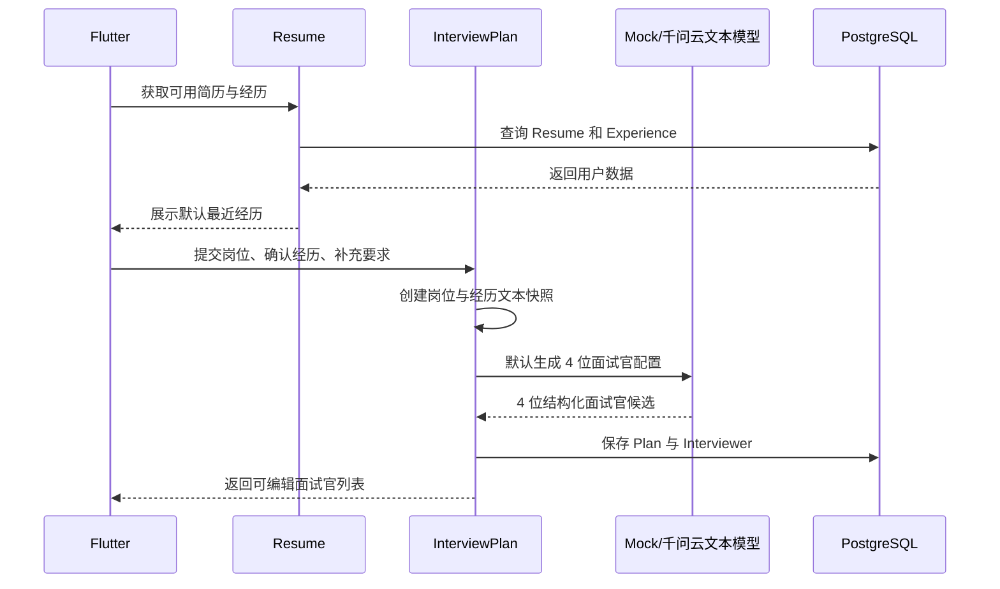

### 9.2 四问实时面试与逐题反馈

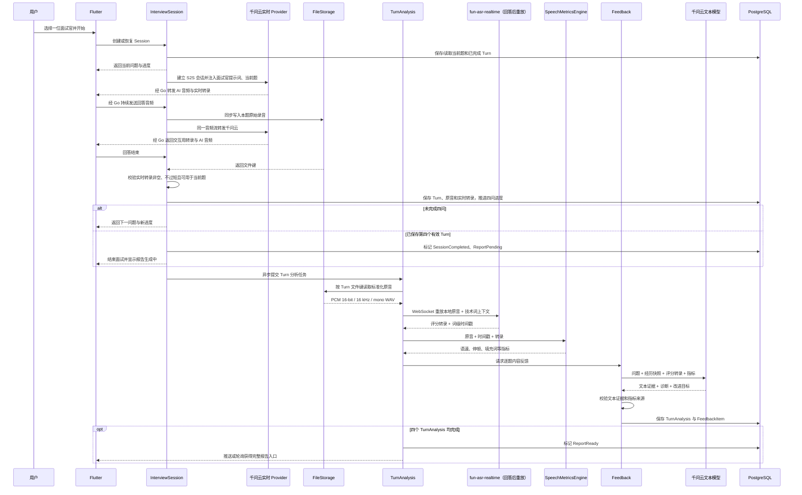

实时交互与回答后分析解耦：用户完成本题后即可进入下一题；`fun-asr-realtime`、指标计算或内容反馈失败时，系统直接基于已保存原音重试，不要求用户重答。第四个有效 Turn 保存后 Session 立即完成；完整报告在四个 Turn 的分析全部完成后可用。

### 9.3 用户打断 AI 播放

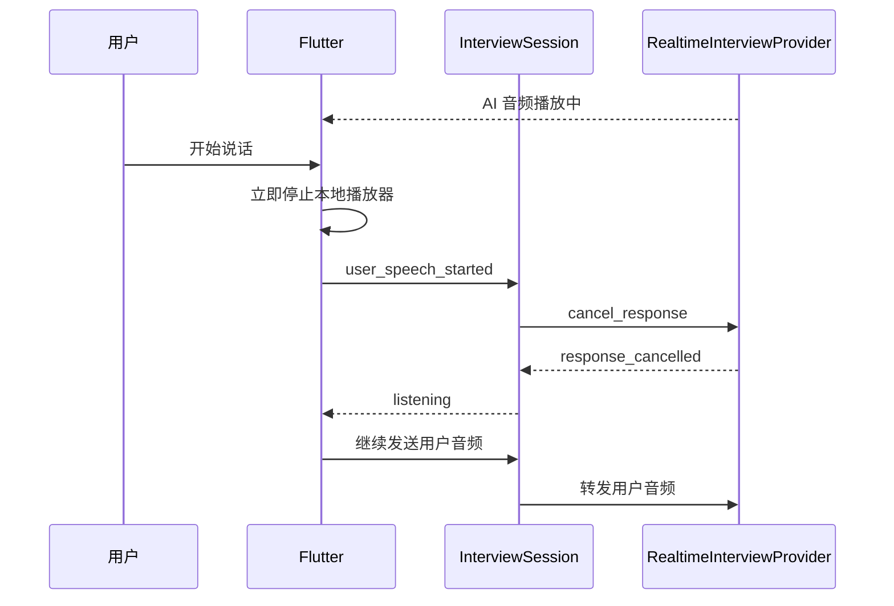

关键规则：停止本地播放不等待厂商确认；厂商取消失败不阻塞用户录音；被取消的 AI 音频不算用户 Turn。

### 9.4 断线与当前回答重试

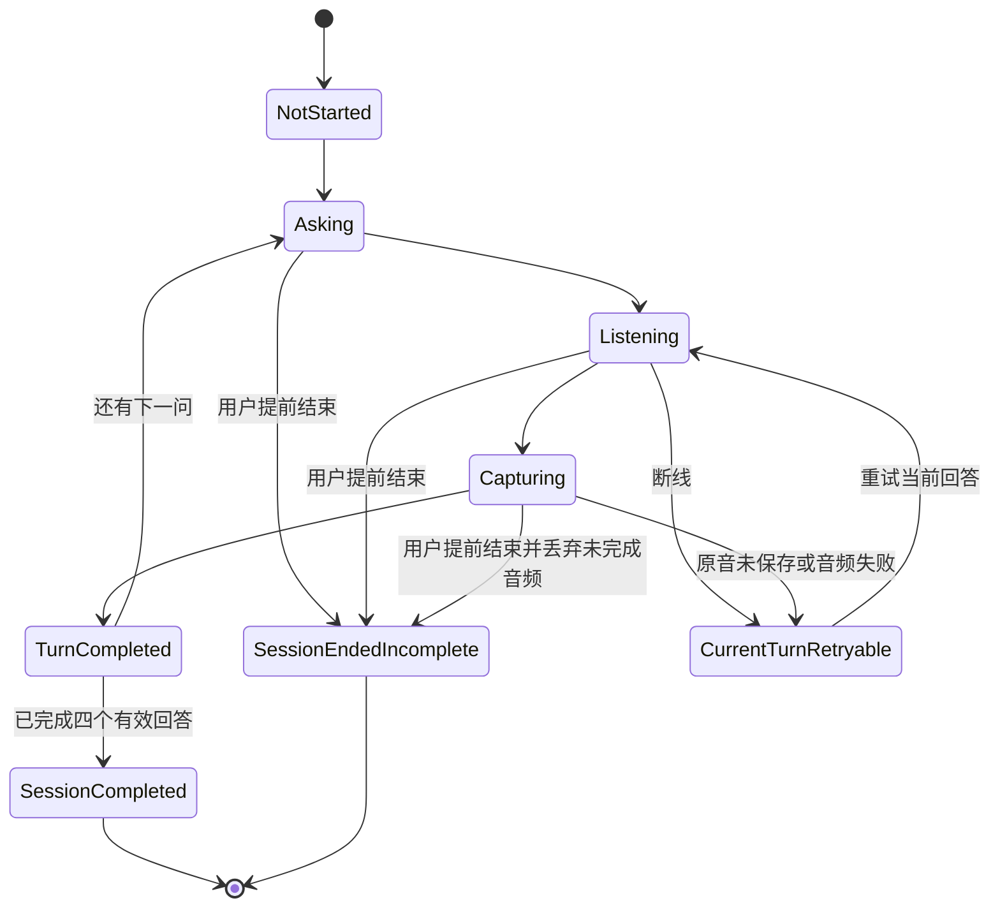

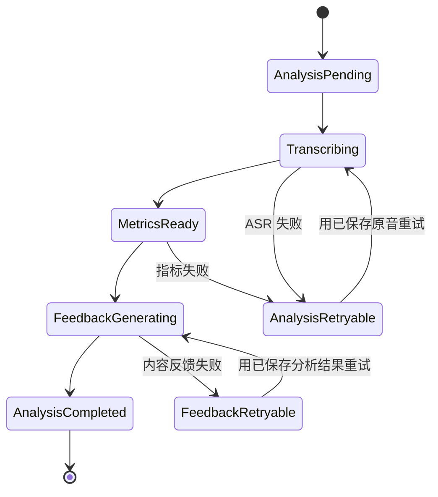

- 原音未成功保存或实时转录不可用时不增加四问进度。
- `TurnCompleted` 后用户可以进入下一题，分析在后台继续。
- ASR、指标或反馈失败时已完成 Turn 保留，只重试对应分析阶段。
- 用户重新进入 Session 时读取最后一个 `TurnCompleted` 位置；报告读取同时返回各题分析状态。
- Session 的对话完成条件是四个 Turn 均已完成；报告完成条件是四个 Turn 的 TurnAnalysis 均已完成。
- 用户主动提前结束时，当前未完成音频丢弃，Session 进入 `SessionEndedIncomplete`；系统只聚合已完成 Turn 形成未完成报告，不开放同题复练入口。

### 9.5 同题复练

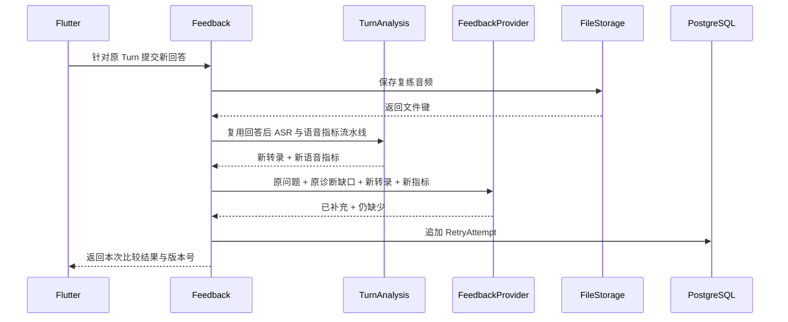

### 9.6 评分流水线与证据合并

MS1 的评分不是单一模型调用，而是三类结果的合并：

| 分析来源 | 首批输出 | 证据定位 |
|---|---|---|
| `fun-asr-realtime` | 评分转录、词级开始/结束时间、技术词转写 | 单词和时间戳。 |
| SpeechMetricsEngine | 回答时长、有效说话比例、语速、停顿次数/时长、填充词、重复和自我修正 | 计算公式、输入字段和音频时间段。 |
| 千问云文本模型 | 问题相关性、项目证据、个人贡献、方案取舍、验证结果、语法和表达建议 | 评分转录中的原文引用。 |

首批确定性指标至少保留以下原始值，不在 Provider 内部直接折算成不可追踪的总分：

```text
duration_ms
voiced_duration_ms
word_count
speaking_rate_wpm = word_count / duration_minutes
articulation_rate_wpm = word_count / voiced_duration_minutes
pause_count
long_pause_duration_ms
filler_count
repetition_count
self_correction_count
```

其中时长、有效说话比例、语速和停顿属于 P0，可由原音、VAD 和时间戳确定；填充词、重复和自我修正依赖 ASR 是否保留原始口语现象，属于 P1。若千问云结果发生顺滑或过滤，字段返回 `unavailable` 并记录原因，不能把“未检测到”伪装成 0。PoC 必须用包含 `um`、`uh`、重复和自我修正的录音验证这一点。

每份 TurnAnalysis 保存 `transcription_provider`、`transcription_model`、`metrics_algorithm_version`、`feedback_model` 和 `prompt_version`。阈值和权重属于评分算法详细设计；在没有人工评分样本校准前，FeedbackItem 展示分维度事实与建议，不对外输出综合总分。

音素、单词发音准确度、重音和连读不从 ASR 是否识别成功推导。需要这些能力时必须另立专项评测方案，并通过人工标注样本验证。

## 10. 接口边界

### 10.1 REST 资源边界

| 资源 | 主要操作 | 不通过 REST 承担的内容 |
|---|---|---|
| Auth | 注册、登录、退出、注销 | 实时会话认证事件。 |
| Resumes | 列表、上传确认、解析状态、经历确认、删除 | PDF 二进制长期中转。 |
| InterviewPlans | 创建、读取、更新面试官配置 | 实时四问音频。 |
| InterviewSessions | 创建、恢复摘要、结束、报告读取 | 音频流与播放流。 |
| Turns | 读取实时转录、评分转录、原音元数据、分析状态和反馈状态 | 实时转录增量。 |
| Retries | 创建复练任务、读取版本列表 | 实时复练音频流。 |
| History | 按 Plan 聚合读取 | 修改历史源数据。 |

REST 返回统一错误结构，至少区分：认证失败、权限不足、资源不存在、状态冲突、输入无效、外部能力暂不可用和内部错误。正式字段由 OpenAPI 设计固定。

### 10.2 WebSocket 生命周期边界

统一事件按语义分组，页面不消费厂商原始事件：

| 阶段 | 客户端语义 | 服务端语义 |
|---|---|---|
| 建连 | 认证、Session ID、能力声明 | 已连接、当前题、已完成进度。 |
| 输入 | 音频片段、开始说话、停止说话、取消、重试 | 已开始接收、输入状态。 |
| 转录 | 无 | 转录增量、最终转录。 |
| 回复 | 取消当前回复 | AI 文本增量、AI 音频增量、回复完成、回复取消。 |
| 进度 | 确认当前回答 | Turn 已完成、下一问、Session 已完成。 |
| 恢复 | 重连、恢复当前题 | 已完成 Turn、当前可重试状态。 |
| 错误 | 客户端设备错误 | 可重试错误、不可重试错误、建议动作。 |

### 10.3 Provider 与评分引擎边界

Provider 的统一结果使用 SpeakUp 领域语义：

- 厂商的连接 ID 只能作为元数据，不能成为 InterviewSession 主键。
- 厂商事件在适配层转换为统一实时事件。
- 厂商错误在适配层转换为统一错误分类。
- Provider 必须支持超时和取消；业务层决定是否重试。
- Provider 不直接写 PostgreSQL 和本地文件。
- 千问云 API Key 只存在于后端配置，不下发到 Flutter 或 Web 原型。
- RealtimeInterviewProvider 不负责评分，TranscriptionProvider 不负责生成面试回复。
- SpeechMetricsEngine 是本地确定性组件，不通过大模型猜测语速、停顿和填充词。
- 火山引擎事件只在未来迁移 PoC 中进入适配器，不提前污染统一事件。

### 10.4 Prompt 与硬状态边界

端到端模型支持提示词，但 Prompt 只控制 AI 的表达方式，不是业务状态机：

| 层级 | 负责内容 | 不负责内容 |
|---|---|---|
| 会话 Prompt | 面试官角色、岗位、经历快照、语言、语速、语气、一次只问一个问题。 | 四问计数、权限、持久化、断线恢复。 |
| 当前题指令 | 当前题序号、题目目标、允许的澄清范围、不要提前进入下一题。 | 判断 Turn 是否已保存、是否可以生成报告。 |
| 内容反馈 Prompt | 基于评分转录和经历快照输出固定结构的证据、诊断和改进目标。 | 计算语速、停顿、填充词和音频质量。 |
| 复练比较 Prompt | 只比较原诊断缺口的“已补充/仍缺少”。 | 覆盖原反馈或引入新评分维度。 |

Go 状态机硬性控制面试官归属、当前题、四问进度、回答是否已采集、分析状态和报告状态。即使用户通过语音要求模型忽略规则或跳过所有问题，模型回复也不能直接改变业务状态。

## 11. 数据一致性与事务边界

### 11.1 核心事务

| 操作 | 同一事务内完成 |
|---|---|
| 创建计划 | InterviewPlan 快照与初始 Interviewer。 |
| 完成回答 | Turn 问题关联、原始音频元数据、实时转录和进度推进。 |
| 保存分析 | TurnAnalysis 的评分转录、词级时间戳、语音指标、算法版本和状态。 |
| 保存反馈 | FeedbackItem、证据来源与 Turn 的反馈状态。 |
| 保存复练 | RetryAttempt、音频元数据和版本号。 |
| 注销业务数据 | 建立删除清单，将账号与业务数据置为删除暂存状态，并把用户文件目录移动到不可访问的隔离区。 |

文件系统与 PostgreSQL 无法共享事务，因此普通写入采用“先保存文件、再提交数据库；数据库失败则补偿删除文件”的顺序。

注销采用可回滚的分阶段流程：先校验完整删除清单并暂停该账号的新写入，再将本地用户目录原子移动到同文件系统的隔离区，随后在数据库事务中删除业务数据并撤销全部会话。暂存或数据库事务失败时，把文件目录移回并恢复账号，向用户显示失败与重试入口；只有文件已隔离、业务数据已删除且访问凭证已撤销后才返回注销成功。隔离区物理清理失败不恢复账号访问，进入最小权限的可重试清理任务并持续告警。对象存储阶段必须用删除清单和供应商删除结果重新设计同等语义，不能直接照搬本地目录重命名。

### 11.2 幂等与重复请求

- 创建 Plan、Session、Turn、分析任务和 RetryAttempt 的写操作携带客户端请求 ID。
- 同一用户、同一请求 ID 的重复提交返回首次结果，不生成重复版本。
- WebSocket 重连不能自动重复提交已经标记 `TurnCompleted` 的回答。
- Provider 回调或最终事件重复到达时，以业务对象状态和千问云事件 ID 去重。
- 同一 Turn、同一分析版本的重复任务只更新状态，不生成第二份正式反馈。

## 12. 文件存储设计

### 12.1 本周 LocalFileStorage

目录只表达逻辑分区，业务代码不拼接真实磁盘路径：

```text
data/
  users/{user-id}/
    resumes/{resume-id}/source.pdf
    sessions/{session-id}/turns/{turn-id}/answer.wav
    sessions/{session-id}/turns/{turn-id}/retries/{retry-id}.wav
```

数据库保存稳定文件键，例如：

```text
users/{user-id}/sessions/{session-id}/turns/{turn-id}/answer.wav
```

MS1 的评测原音统一保存为 `PCM 16-bit / 16 kHz / mono` 的 WAV，`AudioAsset` 同时记录原始客户端格式、标准化格式、采样率、声道、时长和字节数。Flutter 与千问云的实际音频参数必须在真机 PoC 中验证，但业务层只读取 `AudioAsset` 元数据，不依赖文件扩展名猜测编码。

`fun-asr` 录音文件转写要求千问云能够访问文件 URL，而 LocalFileStorage 不提供公网 URL，因此 MS1 不使用该路径。TranscriptionProvider 读取本地 WAV，并通过 `fun-asr-realtime` WebSocket 发送音频块；迁移到对象存储并具备短时签名 URL 后，再对比是否切换 `fun-asr` 文件转写。Go 不为绕过该限制把本地用户录音暴露为公共静态文件。

### 12.2 安全规则

- REST 和 WebSocket 在访问文件前验证文件归属用户。
- 文件下载不暴露任意磁盘路径，只使用受控文件键。
- 文件名、MIME 和大小均由服务端校验，不能信任浏览器声明。
- PDF 上限 10 MB；音频大小限制根据单题时长在实现计划中确定。
- Resume、原始音频、转录和反馈均按个人敏感数据处理；本地目录使用最小文件权限，跨进程和跨网络传输只允许 TLS 保护的受控通道。
- 本地目录不进入 Git，不作为备份方案。
- 周五 Live Demo 使用固定测试账户和非敏感演示文件。

### 12.3 后续对象存储迁移

迁移只替换 FileStorage 实现和配置。业务表继续保存文件键，必要时通过后台任务把本地文件复制到对象存储并更新存储位置元数据；Resume、Turn 和 RetryAttempt 的业务 ID 不改变。

## 13. 安全、隐私与访问控制

| 风险 | 架构措施 |
|---|---|
| 越权访问他人简历或音频 | Repository 查询必须包含当前 User ID；不能只按资源 ID 查询。 |
| 浏览器泄漏模型密钥 | 所有真实 Provider 请求经过 Go 后端。 |
| 历史链接在退出后仍可访问 | REST、WebSocket 和文件读取统一执行身份校验。 |
| 上传伪造 PDF | 校验 MIME、文件头、大小和解析结果；文件名不作为类型依据。 |
| Prompt 注入影响系统规则 | 简历与用户补充内容作为数据输入，不拼接为高优先级系统指令。 |
| 模型返回虚构证据 | Feedback 保存前校验证据文本能在评分转录中定位。 |
| 大模型生成无依据的语音分数 | 语速、停顿、填充词等由确定性算法计算；模型只解释指标和文本证据。 |
| 实时转录与评分转录不一致 | 分别保存来源和版本，报告只引用评分转录，不静默覆盖。 |
| 向模型发送超出任务所需的个人信息 | 简历解析只发送待解析文件内容；面试与反馈请求只发送当前计划的经历快照、当前问题、当前回答及必要指标，不重复发送完整简历和其他历史。 |
| 日志泄漏简历、录音、转录或 Prompt | 默认日志只记录稳定 ID、状态、耗时、错误分类和供应商请求 ID，不记录文件正文、音频字节、完整转录、访问令牌和完整 Prompt。 |
| 第三方平台保留训练数据 | 生产接入前核对千问云的数据保留、训练使用和删除条款；能关闭的持久化/训练选项必须关闭，不能满足团队数据策略时不得上线真实用户数据。 |
| 注销过程部分失败 | 本地文件先原子移动到隔离区，数据库事务失败时回滚目录并恢复账号；完成点之后撤销全部访问，隔离区物理清理由受控任务重试。 |

业务原音为支持历史回听而随用户数据保留，直到用户主动删除对应资源或注销账号。注销范围必须覆盖 Resume、Experience、InterviewPlan、Interviewer、InterviewSession、Turn、TurnAnalysis、FeedbackItem、RetryAttempt、AudioAsset、物理文件和可删除的供应商侧任务；访问日志与安全审计日志按独立的最短必要期限脱敏保留。用户可见的“注销成功”以账号和个人业务数据已不可访问为准，隔离区物理清理必须有可观测、可重试和最终完成记录，不能把隔离区当长期保留。具体日志期限、备份清理周期和供应商数据处理条款是生产上线门禁，未评审通过前只允许使用非敏感测试数据。

密码哈希算法、Token 形式和会话有效期在认证详细设计中确定；本架构只固定“凭证不明文保存、API Key 不下发、所有个人资源按 User 隔离”的边界。

## 14. 错误、恢复与降级

| 场景 | 负责模块 | 保存内容 | 用户恢复方式 |
|---|---|---|---|
| PDF 上传失败 | Resume | 不创建可用 Resume | 重新上传。 |
| PDF 解析失败 | Resume | 原文件、失败状态、错误分类 | 重试解析或手动填写经历。 |
| 生成面试官失败 | Plan | 岗位、经历快照、补充要求 | 重试生成，不重新填写。 |
| WebSocket 断线 | Session | 已完成 Turn、当前题 | 重连并重试当前回答。 |
| 用户提前结束 Session | Session | 已完成 Turn；丢弃当前未完成音频 | 生成未完成报告，不开放同题复练。 |
| AI 播放被打断 | RealtimeInterview | 不创建 Turn | Flutter 本地立即停播，后端取消千问云回复并接收用户回答。 |
| 回答录音未保存 | Session | 当前问题、临时错误 | 重试当前回答。 |
| 实时转录为空、过短或失败 | Session | 当前问题；失败录音仅用于排障并按保留策略清理 | 停留当前题并重新回答。 |
| 回答后 ASR 失败 | TurnAnalysis | 已保存 Turn、原始录音、实时转录 | 直接重试 ASR，不要求用户重答。 |
| 语音指标计算失败 | TurnAnalysis | 已保存原音与评分转录 | 重试确定性算法或标记部分分析失败。 |
| 音频保存失败 | Session/Feedback | 不推进 Turn 或 RetryAttempt | 重试当前回答或复练。 |
| 反馈生成失败 | Feedback | 已完成 Turn、评分转录和语音指标 | 只重试内容反馈生成。 |
| 反馈证据校验失败 | Feedback | 错误分类、证据定位失败项和 Provider 请求 ID，不记录完整敏感输入 | 重新生成或降级为“反馈生成中”。 |
| 真实 Provider 不可用 | Provider | 统一外部依赖错误 | 开发/Demo 可切 Mock；正式环境提示重试。 |
| 文件删除失败 | FileStorage | 删除任务和失败原因 | 后台重试，资源保持不可访问。 |
| 注销暂存或数据库事务失败 | Identity/FileStorage | 原账号和业务数据；回滚隔离目录 | 保持账号可用并提示重试，不显示注销成功。 |

## 15. 可观测性

### 15.1 关联标识

日志至少携带：

- `request_id`
- `user_id`
- `interview_plan_id`
- `interviewer_id`
- `session_id`
- `turn_id`
- `retry_attempt_id`
- `provider_name`
- `provider_session_id`（存在时）

### 15.2 首批指标

- REST 请求成功率和耗时。
- WebSocket 活跃连接数、异常断开数和重连数。
- 每题从服务端下发问题指令到收到首个 AI 音频的耗时。
- 用户开口到本地 AI 播放停止的耗时。
- 回答后 ASR 耗时与失败率、指标计算失败率、反馈生成失败率和 Provider 超时率。
- Session 完成四问的比例。
- 反馈证据校验失败次数。
- 实时转录与评分转录的差异率，作为技术术语识别质量的观测指标。

本周 Mock Demo 至少输出结构化日志；真实指标采集与告警在真实 Provider 接入时补充。

## 16. 部署视图

### 16.1 本周 Live Demo

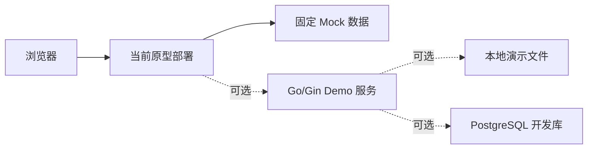

Live Demo 的硬性要求是主链路稳定表达产品行为；Go 服务、PostgreSQL 或真实模型未完成时，不阻塞 Mock 演示。Web 原型不承担 Flutter、真实录音链路或生产部署的架构验收。演示页面必须明确哪些结果为 Mock，不能把预置结果描述为真实模型生成。

### 16.2 目标部署

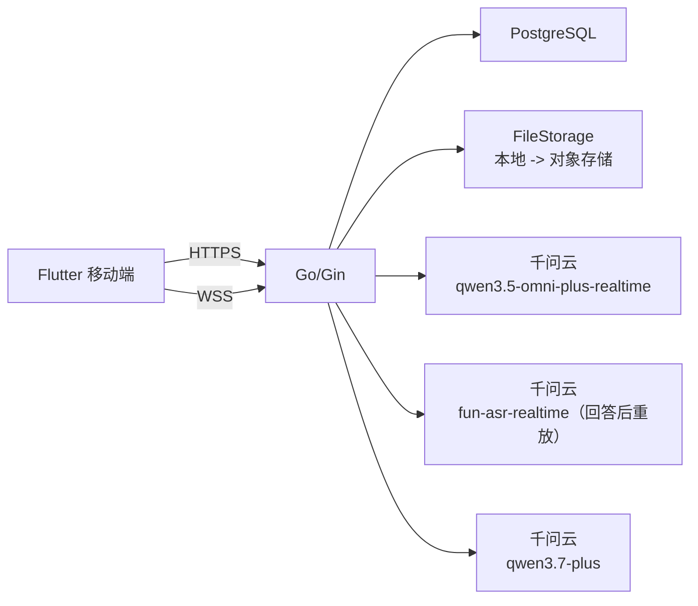

当前目标部署仍是单个 Go 服务。只有真实压测证明实时连接需要独立扩容时，才把 RealtimeInterview 从模块拆成独立部署单元。

## 17. Mock 与真实实现映射

| 能力 | 本周 Live Demo | 后续真实实现 | 业务边界是否改变 |
|---|---|---|---|
| 登录 | 固定演示用户 | 邮箱密码认证 | 否 |
| 简历 | 预置 PDF 与经历 | 上传、解析、确认 | 否 |
| 面试官 | 固定结构化结果 | 模型生成后编辑 | 否 |
| 四问 | 固定问题与进度 | 实时模型编排 | 否 |
| 语音 | 预置音频或浏览器本地模拟 | Flutter + Go WebSocket + 千问云 S2S | 否 |
| 实时转录 | 固定英文文本 | Omni 实时转录，仅用于交互 | 否 |
| 评分转录 | 固定带时间戳文本 | 原音 + `fun-asr-realtime` 回答后重放 | 否 |
| 语音指标 | 固定语速、停顿、填充词数据 | SpeechMetricsEngine 确定性计算 | 否 |
| 逐题反馈 | 固定结构化反馈 | 千问云文本模型 + 证据校验 | 否 |
| 复练 | 固定“已补充/仍缺少” | FeedbackProvider 比较 | 否 |
| 历史 | 固定聚合记录 | PostgreSQL 查询 | 否 |

## 18. 关键架构决策

### 18.1 使用模块化单体

| 项目 | 内容 |
|---|---|
| 状态 | 接受 |
| 备选 | 微服务、按功能独立部署。 |
| 决策 | Go/Gin 使用模块化单体，模块通过公开服务接口协作。 |
| 原因 | 团队小、周期短、业务事务强相关，优先降低联调和运维成本。 |
| 代价 | 单个部署单元故障影响面较大；后续独立扩容需拆模块。 |

### 18.2 使用 PostgreSQL

| 项目 | 内容 |
|---|---|
| 状态 | 接受 |
| 备选 | D1、SQLite、MongoDB。 |
| 决策 | PostgreSQL 作为正式业务数据库。 |
| 原因 | 核心对象关系明确，需要事务、约束、版本和历史查询。 |
| 代价 | 本地和部署环境需要管理数据库连接、迁移和备份。 |

### 18.3 REST 与 WebSocket 分工

| 项目 | 内容 |
|---|---|
| 状态 | 接受 |
| 备选 | 全部 WebSocket、JSON-RPC、WebRTC 直连厂商。 |
| 决策 | 普通业务使用 REST JSON，实时语音使用 WebSocket。 |
| 原因 | 两类交互生命周期不同；REST 易调试，WebSocket 适合双向增量事件。 |
| 代价 | 需要维护两套连接、认证和错误语义。 |

### 18.4 本周本地文件、后续对象存储

| 项目 | 内容 |
|---|---|
| 状态 | 接受 |
| 备选 | 立即接入 R2、OSS 或其他对象存储。 |
| 决策 | 本周使用 LocalFileStorage，同时固定可替换接口和稳定文件键。 |
| 原因 | 当前优先验证架构和 Demo，降低外部配置与网络依赖。 |
| 代价 | 不支持无状态多实例和生产级持久性，需要后续迁移。 |

### 18.5 千问云为主供应商，火山引擎为备选

| 项目 | 内容 |
|---|---|
| 状态 | 接受 |
| 备选 | 千问云与火山引擎同时实现；运行时自动切换；业务模块直接调用厂商 SDK。 |
| 决策 | MS1 只实现 Mock 与千问云；火山引擎作为已评估备选，不建设双活和运行时自动切换。 |
| 原因 | 一次落地一家能降低联调、计费、事件兼容和质量验证成本；千问云公开提供 S2S、Fun-ASR、文本结构化输出和 Prompt 能力，覆盖当前主链路。 |
| 代价 | 千问云故障时正式环境不能自动切换；未来迁移仍需实现火山适配器和回归验证。 |

火山引擎迁移评估仅在以下任一条件持续不达标时启动：英文技术词识别、用户打断延迟、Flutter 音频兼容性、可用性/限流、合规要求或成本预算。触发迁移评估不等于立即切换，必须先完成同一录音集的对照 PoC。

### 18.6 实时对话采用 S2S，不采用传统 Pipeline

| 项目 | 内容 |
|---|---|
| 状态 | 接受 |
| 备选 | 实时链路串联 ASR + LLM + TTS。 |
| 决策 | 实时面试使用千问云 `qwen3.5-omni-plus-realtime` 的语音到语音端到端能力。 |
| 原因 | 单模型链路延迟更低，并能保留语气、情绪和打断语义；当前产品不需要在实时路径定制独立 TTS。 |
| 代价 | 实时模型的内部识别与生成不可分别调参；必须保存原音并建设回答后分析链路。 |

### 18.7 回答后使用 ASR，不让实时会话承担正式评分

| 项目 | 内容 |
|---|---|
| 状态 | 接受 |
| 备选 | 直接把 Omni 实时转录作为唯一报告文本；实时会话同时生成评分。 |
| 决策 | Go 保存每个 Turn 原始录音，回答结束后通过 `fun-asr-realtime` WebSocket 重放原音，生成评分转录和词级时间戳，再执行语音指标和内容反馈。 |
| 原因 | 实时转录追求低延迟，评分需要稳定文本、时间戳、独立重试和版本追踪，两者质量目标不同。 |
| 代价 | 每题多一次 ASR 调用并增加报告等待时间；本地文件需要能被异步任务可靠读取。 |

### 18.8 评分采用多源证据，不由大模型直接给单一总分

| 项目 | 内容 |
|---|---|
| 状态 | 接受 |
| 备选 | 将整段录音交给大模型直接返回一个总分；用 ASR 是否识别成功代表发音准确。 |
| 决策 | SpeechMetricsEngine 计算语速、停顿、填充词、重复、自我修正和有效说话比例；文本模型评价内容、证据、结构和语言，并引用原文。MS1 展示分维度结果。 |
| 原因 | 确定性指标可解释、可复现；ASR 识别成功不等于音素发音正确，大模型主观总分无法作为稳定测量。 |
| 代价 | 需要维护指标口径、算法版本和人工校准样本；短期不提供一个看似精确的综合分。 |

MS1 不承诺音素级、单词级专业发音评分。若产品决定加入该能力，应新增专项 Proposal 和技术 PoC，明确参考文本、声学模型/评测服务、人工标注基准和误差边界，不在本架构中用 ASR 置信度替代。

### 18.9 Flutter 为正式客户端，Web 仅用于本周 Demo

| 项目 | 内容 |
|---|---|
| 状态 | 接受 |
| 备选 | 将当前 Web 原型工程化为正式 MVP 客户端。 |
| 决策 | 正式移动端使用 Flutter；当前 Web 原型继续服务本周 Live Demo。 |
| 原因 | 产品目标是移动端语音练习，Flutter 更符合最终交付形态；本周仍需要稳定展示已确认的产品功能。 |
| 代价 | Web Demo 代码不会直接沉淀为正式客户端，后续需按统一 REST/WS 语义实现 Flutter。 |

### 18.10 MS1 不采用轻量 RAG

| 项目 | 内容 |
|---|---|
| 状态 | 接受 |
| 备选 | 将简历和历史问答切片、Embedding 后写入向量数据库；每次问题前执行检索。 |
| 决策 | MS1 直接使用 InterviewPlan 中已确认的经历快照、当前问题和本场必要上下文，不建设 RAG。 |
| 原因 | 当前上下文规模小、来源单一且已经人工确认，直接输入更可控；RAG 会增加索引一致性、权限过滤、召回质量和运维成本，尚无明确收益。 |
| 代价 | 不支持跨大量简历、知识库或长期历史的语义检索；出现这类真实需求时需重新评估。 |

只有当单次上下文超过模型可控范围，或产品明确需要从多份资料、长期历史、岗位知识库中可解释地检索证据时，才新增 RAG Proposal，并要求检索结果携带来源、用户权限和版本。

## 19. 风险与技术债

| 优先级 | 风险/技术债 | 影响 | 缓解动作 |
|---|---|---|---|
| P0 | Web Demo 与 Flutter 正式端职责混淆 | Demo 代码可能被误当作正式客户端基础 | 在 Issue、汇报和验收中分别标记 Demo 与目标架构。 |
| P0 | 千问云 S2S 的取消和音频格式未经 Flutter 实机验证 | 打断延迟或播放兼容性可能不达标 | 用 Android/iOS 真机完成最小音频 PoC，记录首包、打断和重连数据。 |
| P0 | 技术术语转录准确率未验证 | 反馈证据可能基于错误文本 | 使用真实英文技术回答建立固定录音集，比较 Omni 实时转录与 `fun-asr-realtime` 评分转录。 |
| P0 | 模型可能返回转录中不存在的证据 | 反馈可信度受损 | 保存前执行证据定位校验。 |
| P0 | 把 ASR 识别结果误当作发音准确度 | 产品给出错误或过度确定的发音结论 | MS1 不承诺音素级评分，只展示有来源的流利度指标和内容反馈。 |
| P0 | ASR 顺滑或过滤填充词 | 填充词、重复和自我修正指标可能失真 | PoC 检查原始输出；不可用时返回 `unavailable`，不展示伪零值。 |
| P1 | 回答后分析增加报告等待时间 | 用户完成四问后可能等待报告 | 四问实时流程与分析解耦，展示逐题分析状态并允许单题重试。 |
| P1 | 评分算法缺少人工校准样本 | 不同指标无法组成可信总分 | 先保留原始指标和版本，不发布综合分；后续使用人工评分样本校准。 |
| P1 | 本地文件不适合无状态部署 | 重启或迁移可能丢文件 | 本周只用演示数据，后续迁移对象存储。 |
| P1 | WebSocket 断线恢复未经真实网络验证 | 用户可能重复回答或丢进度 | 用状态机和幂等 ID 做断网 PoC。 |
| P1 | PostgreSQL 与文件删除非同一事务 | 可能残留孤儿文件 | 补偿删除与可重试清理记录。 |
| P2 | 单体内实时连接与普通请求共享资源 | 后续高并发可能互相影响 | 先观测，再决定是否独立部署实时模块。 |

## 20. 团队职责与文档边界

| 负责人 | 本周方向 | 对本架构的输入 |
|---|---|---|
| 林锵 | 总体架构与项目推进 | 维护本文、裁决跨模块边界、组织评审和汇报。 |
| 覃迦迎 | 面试与反馈详细设计 | 四问规则、Prompt 分层、内容证据、反馈结构与复练比较语义。 |
| 张思成 | 数据库设计 | PostgreSQL 表、TurnAnalysis、转录版本、指标版本、索引、约束、迁移和删除方案。 |
| 黄天宇 | Go/Gin 后端 | REST、WebSocket、原音落盘、分析任务、Provider 和模块骨架的代码表达。 |
| 智铭威 | 原型与 Live Demo | Mock 数据、演示路径、演示部署和备用方案。 |

跨文档冲突时按以下优先级处理：

1. 产品行为以已确认 PRD 为准。
2. 系统边界、依赖方向和技术约束以本文为准。
3. 业务状态和 Prompt 细节以面试详细设计为准，但不得破坏本文架构不变量。
4. 物理字段和索引以数据库设计为准，但不得改变领域数据归属。
5. Demo 可以降级为 Mock，但不得改变用户看到的核心业务含义。

## 21. 本周交付与评审节奏

| 时间 | 目标 | 退出条件 |
|---|---|---|
| 周二下午 | 技术裁决与架构初稿 | Flutter/Web、千问云/火山、S2S/ASR/TTS 和评分边界完成团队走读。 |
| 周三中午 | 专项设计初稿 | 面试规则、数据库结构、后端边界和 Demo 数据可互相对照。 |
| 周三下午 | 架构冻结 | 不再改变核心概念、模块归属、REST/WS、S2S/分析和 Provider 边界。 |
| 周四上午 | 骨架与 Demo 串联 | Mock 主链路可运行，文档与实现命名一致。 |
| 周四下午 | 交付冻结 | PR 合并、风险登记、汇报材料和演示环境完成。 |
| 周五 | 演练与汇报 | 不新增功能，只修复阻塞汇报的问题。 |

## 22. 架构验收标准

1. PRD 中账户、简历、计划、面试官、场次、四问、反馈、复练、历史和注销均能映射到明确模块。
2. 每个模块写清职责、不负责内容、数据归属、依赖和架构不变量。
3. `User` 至 `AudioAsset` 的产品关系与数据库设计一致，内部 `TurnAnalysis` 能表达转录、指标、版本和独立重试。
4. Web Demo 与 Flutter 正式客户端边界明确，不能用 Web Demo 验收正式移动端架构。
5. 普通业务、S2S 实时语音、回答后 ASR、确定性评分、文本反馈和文件存储边界明确且不重叠。
6. 团队能够使用本文完整讲清一次四问面试、打断、原音保存、异步分析、断线恢复、反馈和复练流程。
7. Mock 与千问云实现共享相同业务语义，关闭真实供应商配置时 Live Demo 仍可运行。
8. 关键失败场景均有唯一负责模块、保留内容和用户恢复路径；原音已保存后分析失败不得要求重答。
9. 所有关键技术选择均记录备选、理由与代价，不只列技术名词。
10. 风险清单覆盖 Flutter 实机、千问云取消语义、技术词转录、评分误用、证据幻觉、本地文件和 WebSocket 恢复。
11. 火山引擎不进入 MS1 实现清单，只有明确触发条件和对照 PoC 后才启动迁移评估。
12. MS1 不引入 RAG 或向量数据库，面试上下文只使用已确认经历快照和当前场次必要数据。
13. 后续开发 Issue 能够从模块和运行时流程直接拆出，不需要重新讨论产品含义。

## 23. PRD 需求追踪

| PRD 能力 | 架构承接模块 | 关键数据 | 关键接口/流程 |
|---|---|---|---|
| 邮箱注册、登录、退出、注销 | Identity、Delivery | User | Auth REST；注销删除编排。 |
| 最多 3 份 PDF 简历 | Resume、FileStorage | Resume | Resumes REST；本地文件保存。 |
| 解析并确认项目/实习经历 | Resume、ResumeParserProvider | Experience | 解析状态与经历确认流程。 |
| 创建岗位与经历快照 | InterviewPlan | InterviewPlan | 创建计划运行时流程。 |
| 配置 1–4 位面试官 | InterviewPlan | Interviewer | Plans REST；面试官结构化生成。 |
| 每位面试官独立场次 | InterviewSession | InterviewSession | 创建或恢复 Session。 |
| 固定四次有效问答 | InterviewSession | Turn | WebSocket 进度事件与状态机。 |
| 提前结束只生成未完成报告 | InterviewSession、History | Session、已完成 Turn | `SessionEndedIncomplete`；不创建复练入口。 |
| AI 播放中用户开口自动停播 | Flutter、InterviewSession、RealtimeInterviewProvider | Session 实时状态 | Flutter 本地停播 + 后端取消回复。 |
| 断线只重试当前回答 | InterviewSession | Session、Turn | 恢复状态机与幂等请求。 |
| 每题独立证据反馈 | TurnAnalysis、Feedback、FeedbackProvider | TurnAnalysis、FeedbackItem | 原音 → `fun-asr-realtime` → 指标 → 内容反馈。 |
| 原音回听 | FileStorage、History | AudioAsset | 受保护文件读取。 |
| 同题重复复练并保留版本 | Feedback | RetryAttempt、AudioAsset | 复练运行时流程。 |
| 按计划、面试官、场次查看历史 | History | 聚合读取模型 | History REST。 |
| 注销后个人数据不可访问 | Identity 及各数据所有者 | 全部用户数据 | 先封禁访问、再删除业务数据与文件。 |

## 24. 后续 Issue 拆分入口

本文是架构 Proposal，不把所有实现工作塞进同一个 Issue。团队评审通过后，建议在主仓按以下可验收边界创建或补充子任务；每个实现 PR 只关联其中一个任务：

| 建议标题 | 范围 | 最小验收结果 |
|---|---|---|
| `[文档] PostgreSQL 领域模型与 TurnAnalysis 数据设计` | User 至 AudioAsset、TurnAnalysis、删除和版本规则 | ER 图、约束、状态、索引和删除策略可与本文逐项对照。 |
| `[功能] Go/Gin 模块化单体与 REST 骨架` | Identity、Resume、Plan、Session、Feedback、History 的公开服务接口 | 项目可编译，Mock Repository 下主资源可调用。 |
| `[功能] 实时面试 WebSocket 与四问状态机骨架` | 统一事件、原音写入、打断、四问进度、断线恢复 | Mock 音频事件可演示四问，断线只影响当前未保存回答。 |
| `[调研] 千问云 S2S 与回答后 ASR 最小 PoC` | 实时首包、打断、录音格式、`fun-asr-realtime` 本地录音重放、技术词 | 固定录音集和实测数据，明确是否触发火山引擎对照评估。 |
| `[文档] 面试 Prompt、反馈 Schema 与复练比较规则` | 会话 Prompt、当前题指令、结构化反馈和证据校验 | 四问固定 JSON 样例可由 Mock 跑通，字段无歧义。 |
| `[功能] Web 原型 Live Demo 主链路` | 当前原型、Mock 数据、演示部署和降级说明 | 连续三次跑通计划、四问、反馈、复练和历史，并明确标识 Mock。 |
| `[调研] Flutter 实时音频与本地打断 PoC` | 麦克风、播放、立即停播、WSS、Android/iOS 音频格式 | 至少一台真机跑通最小闭环，记录音频格式、打断耗时和已知限制。 |

这些任务可关联父架构 Issue，也应分别关联对应产品 Issue：反馈相关关联 #10，简历相关关联 #11，面试与实时语音关联 #12，账户相关关联 #14。

## 25. 参考实践

- [千问云：基于千问云构建应用](https://platform.qianwenai.com/docs/developer-guides/getting-started/introduction)：确认产品名称、OpenAI SDK 兼容和结构化输出能力。
- [千问云：语音到语音模型](https://platform.qianwenai.com/docs/developer-guides/speech/s2s-models)：用于 S2S 与 ASR + LLM + TTS Pipeline 的选型，以及 `qwen3.5-omni-plus-realtime` 能力边界。
- [千问云：实时语音识别](https://platform.qianwenai.com/docs/developer-guides/speech/asr-realtime)：用于 `fun-asr-realtime` WebSocket 和专业术语上下文边界。
- [千问云：录音文件转写](https://platform.qianwenai.com/docs/developer-guides/speech/asr)：用于核对词级时间戳，以及 `fun-asr` 文件 URL 约束。
- [千问云：语音能力常见问题](https://platform.qianwenai.com/docs/resources/faq-audio-speech)：用于确认端到端语音模型与专用 ASR 的职责差异。
- [千问云：结构化输出](https://platform.qianwenai.com/docs/developer-guides/text-generation/structured-output)：用于 JSON 输出与服务端 Schema 校验边界。
- [arc42 architecture documentation template](https://github.com/arc42/arc42-template)：用于组织目标、约束、上下文、构建块、运行时、部署、决策和风险。
- [rust-analyzer architecture](https://github.com/rust-lang/rust-analyzer/blob/master/docs/book/src/contributing/architecture.md)：借鉴鸟瞰图、API Boundary 和 Architecture Invariant 的表达。
- [Backstage architecture overview](https://github.com/backstage/backstage/blob/master/docs/overview/architecture-overview.md)：借鉴总览、模块边界和专项文档下钻。
- [Markdown Architectural Decision Records](https://github.com/adr/madr)：借鉴背景、备选、决策、理由与后果的记录方式。
